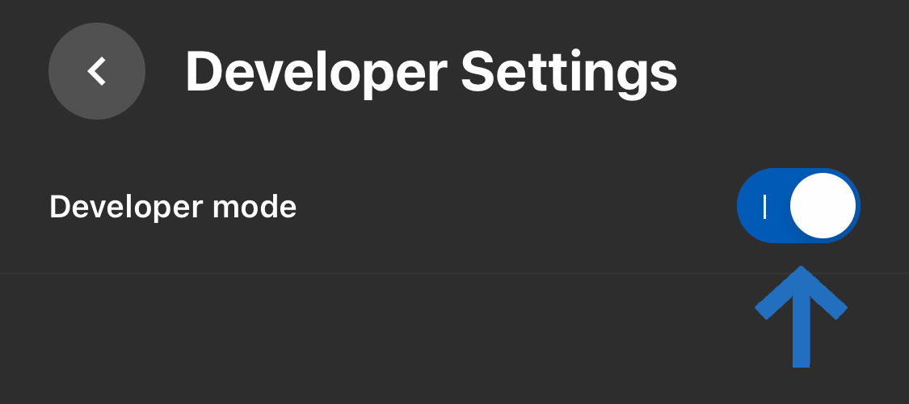

## Installer Unity
Commençons par installer Unity sur notre machine. Pour ce tutoriel, nous utiliserons `Unity 2021.2`. Le numéro de version complet comporte trois composants `####.#.##` qui signifient `YEAR.version.update`. Les chiffres importants ici sont `2021.2`. Le troisième numéro est la version de mise à jour/correction de bogues. Vous n'avez pas exactement la même version de `2021.2.##` que moi pour suivre ce tutoriel.

### Compte Unity
Unity est gratuit, mais nécessite un compte pour être téléchargé et configuré correctement. Allez sur [id.unity.com](https://id.unity.com/) et créez un compte. Ignorez les comptes `Pro` et même `Student`, en vous assurant que vous utilisez le compte `Personal` gratuit.


### Unity Hub
Installez toujours Unity sur votre ordinateur à l'aide de [Unity Hub](https://unity.com/unity-hub). Bien qu'il existe de rares exceptions à cette règle, l'idée générale est d'utiliser Unity Hub comme un "hub" central (d'où le nom) pour installer et suivre les mises à jour de Unity lui-même, démarrer et mettre à jour vos projets, installer et utiliser des "modèles" qui vous aident à démarrer rapidement différents *types* de projets, et enfin comme moyen de mettre à jour et d'installer divers composants que vous utiliserez pour publier votre jeu/expérience sur des plateformes telles que l'Oculus Quest.


### Se connecter
Une fois que vous avez installé Unity Hub dans votre dossier `Applications` (macOS) ou `Program Files` (Windows) sur votre ordinateur et que vous avez ouvert l'application, assurez-vous de vous connecter à l'aide de votre compte Unity. Cela facilitera l'installation de composants supplémentaires dans un chapitre ultérieur.


Par le grand `D` bleu, vous pouvez voir que je me suis connecté en tant que `Douglas` en regardant au-dessus de l'icône `Projets` à l'intérieur du hub Unity.

### Install Unity 2021.2
Ouvrez l'onglet `Installs` et sélectionnez le bouton `Install Editor`. Sélectionnez `Unity 2021.2.##`.


Dans l'illustration ci-dessus, vous pouvez voir qu'il existe plusieurs composants facultatifs que nous pouvons installer avec l'éditeur Unity de base. Assurez-vous d'installer `Visual Studio` car nous l'utiliserons pour écrire des scripts pour notre jeu. Vous devez également installer `Android` et les deux sous-options : `Android SDK & NDK Tools` et `OpenJDK`. Les casques Oculus sont en fait des appareils Android avec un processeur intégré, une puce graphique intégrée et un écran. Vous portez essentiellement un petit ordinateur portable sur votre visage.

Vous pouvez ajouter les autres modules de votre choix, par exemple WebGL, iOS, etc. Si vous le souhaitez, vous pouvez utiliser Unity Hub pour installer ou supprimer ultérieurement l'un de ces composants supplémentaires.

### Installer Oculus
Installons maintenant les différents outils de développement qui vont nous permettre d'envoyer nos jeux directement sur notre casque Oculus.

Ce didacticiel suit checklist fournie par Oculus sur son site de développeur: [developer.oculus.com/.../unity-gs-overview](https://developer.oculus.com/documentation/unity/unity-gs-overview/). Ce checklist est assez longue et vous n'avez pas besoin de suivre toutes les étapes. Je vais énumérer ici les éléments les plus importants. Si vous rencontrez des problèmes, vous pouvez toujours revenir en arrière et suivre la liste de contrôle complète étape par étape et, espérons-le, trouver la source de votre problème.

Dans les documents [Setup Development Environment](https://developer.oculus.com/documentation/unity/book-unity-gsg/) et [Enable Device for Development and Testing](https://developer.oculus.com/documentation/unity/unity-enable-device/), ils suggèrent les étapes suivantes :

1. Téléchargez et installez l'application mobile Oculus depuis Google Play ou l'App Store.
2. Suivez les instructions de l'application pour vous connecter avec les informations d'identification de votre compte de développeur.
3. Associez votre casque.
4. Portez votre casque et suivez les instructions du casque pour terminer la configuration.

D'après notre expérience, nous n'avons pas trouvé ce processus aussi facile que suggéré ci-dessus.

### Installer Oculus App
La partie délicate de ce processus est l'application. Vous devez télécharger une application iOS/Android sur votre téléphone (cf. oculus.com/setup) afin de placer votre casque en mode développeur (`developer mode`). Dans l'application, vous trouverez ce bouton `developer mode` dans `Menu` > `Devices` > `My Quest #` > `Connect` > `Developer Mode`. Voici quelques captures d'écran avec (espérons-le) les boutons pertinents pour vous aider :


### WIFI
Pour compléter ces options, votre appareil Oculus doit être allumé et connecté au même réseau Wi-Fi que votre téléphone.

Vous aurez également besoin du même compte Facebook sur votre téléphone et dans votre casque pour terminer ce processus. Oui, vous avez bien lu : vous avez besoin d'un compte Facebook pour activer ce `developer mode` magique. Oui, Facebook vous demandera d'utiliser une carte de crédit (vous pouvez dire non) ou d'utiliser un téléphone (votre autre carte de crédit) pour « confirmer » votre identité. C'est le monde dans lequel nous vivons.

**Attention**: Si vous ne voyez pas l'option pour ajouter votre numéro de téléphone dans l'application `Oculus`, il suffit d'aller sur l'app Facebook et ajouter votre numéro là-bas. Par contre, Oculus est tout à fait content de vous laisser entrer un numéro de carte bleu quelque soit l'application : faites bien attention.

### Eduroam


À la [Head – Genève](https://www.hesge.ch/head/), nous avons un wifi sophistiqué. Bâtiments chic, wifi chic. Plus précisément, notre wifi fait partie du réseau [Eduroam](https://eduroam.org), ce qui nous permet de nous connecter immédiatement au wifi dans les universités et les centres de recherche du monde entier. C'est plutôt cool et ça donne l'impression d'être un Internet à l'ancienne. Quelque chose quelque chose quelque chose… partager… des connaissances. Vous connaissez l'ambiance.


L'astuce du wifi sophistiqué est de connecter correctement l'Oculus au réseau. Voici les paramètres que nous avons utilisés pour connecter l'Oculus au wifi Eduroam :

- Wifi: Eduroam
- Method EAP : TTLS
- Authenfication Phase 2 : PAP
- Certificate : "DO NOT VALIDATE"
- Identity : firstname.familyname@hes-so.ch
- Anonymous : 
- Password : AAI password

### Pairing Code
Un problème que nous avons rencontré lors du couplage de notre casque Oculus à notre application Oculus a été de trouver le %$*# code d'appariement. Il est placé dans un endroit follement obscur : `Quick Settings` > `Settings` > `System` > `About` > `Pairing Code: #####`.


### Developer Mode
Ce que vous cherchez, c'est ce bouton bleu en mode développeur (cf. ci-dessus). Si ce bouton est actif, votre application est associée à notre casque et vous devriez être prêt•e à jouer.



### Activer Bluetooth
Un détail curieux que nous avons découvert en essayant de coupler avec votre Oculus : *vous devez avoir le Bluetooth actif dans votre téléphone pour que l'application trouve le casque*. Apparemment, Oculus utilise Bluetooth pour trouver tous les appareils Oculus à proximité.

### scrcpy
* Pour les utilisateurs avancés *

Ceci est une installation facultative - * avertissement jargon technique * - mais recommandée : [scrcpy](https://github.com/Genymobile/scrcpy) ("Screen Copy") est un petit outil génial pour afficher le contenu de n'importe lequel de vos périphériques Android sur votre ordinateur. Pourquoi est-ce pratique ? Eh bien, puisque l'Oculus n'est qu'un ordinateur Android étrange assis sur votre visage. Il est donc pratique de pouvoir voir ce que l'Oculus voit depuis une fenêtre de votre ordinateur.

Si vous utilisez un Mac et que vous avez déjà installé `brew` et que vous savez ce qu'est le `Terminal`, vous pouvez rapidement installer `scrcpy` avec les commandes suivantes :

```
brew install android-platform-tools
brew install scrcpy
```

Une fois cet outil installé sur votre machine, tapez simplement `scrcpy` dans votre terminal et il ouvrira une fenêtre affichant le contenu de votre casque Oculus.