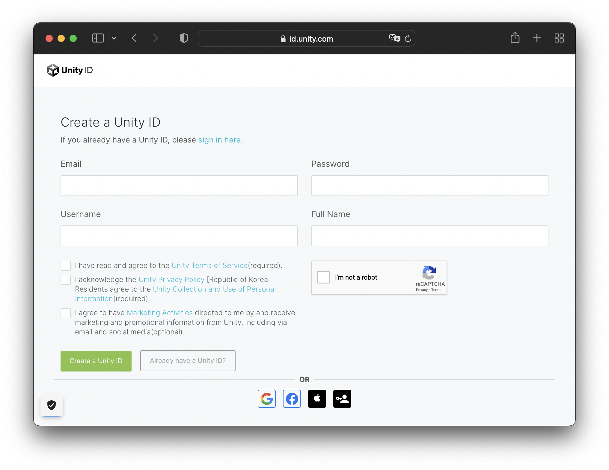
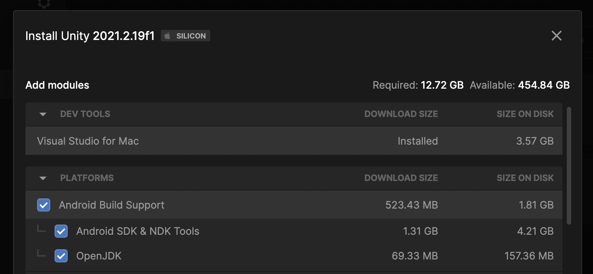
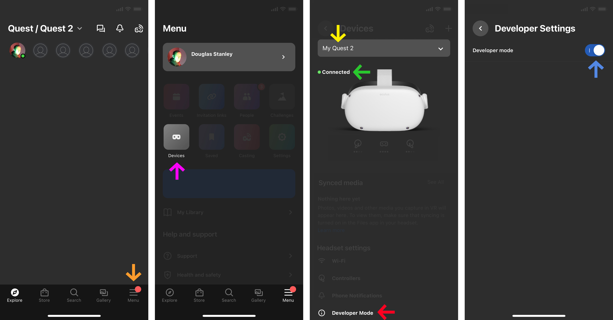

## Install Unity
Let's start by installing Unity to our machine. For this tutorial we will be using `Unity 2021.2`. The full version number has three components `####.#.##` that stand for `YEAR.version.update`. The important numbers here are `2021.2`. The third number is the update/bugfix version. You do not have the have the exact same version of `2021.2.##` as me in order to follow this tutorial.

### Unity Account
Unity is free, but requires an account to download and configure correctly. Go to [id.unity.com](https://id.unity.com/) and create an account. Ignore the `Pro` and even `Student` accounts, making sure you are using the free `Personal` account.

### Unity Hub
Always install Unity on your computer using the [Unity Hub](https://unity.com/unity-hub). While there are rare exceptions to this rule, the general idea is to use the Unity Hub as a central "hub" (hence the name) for installing and tracking updates to Unity itself, starting and updating your projects, installing and using "templates" that help you quickly start various *types* of projects, and finally as a means of updating and installing various components you will use to publish your game/experience to platforms such as the Oculus Quest.

### Sign In
Once you have installed the Unity Hub into your `Applications` (macOS) or `Program Files` (Windows) folder and opened up the application, make sure you sign in using your Unity account. This will make installing additional components easier in a later chapter.

By the large blue `D`, you can see that I have signed in as `Douglas` by looking above the `Projects` icon inside the Unity Hub.

### Install Unity 2021.2
Open the `Installs` tab, and select the `Install Editor` button. Select `Unity 2021.2.##`.

In the above illustration you can see that there are several optional components we can install along with the base Unity editor. Make sure you install `Visual Studio` as we will use this to write scripts for our game. You also need to install `Android` and both sub-options: `Android SDK & NDK Tools` and `OpenJDK`. Oculus headsets are actually Android devices with a built-in processor, and integrated graphics chip, and screen. You are basically wearing a small portable computer on your face.

You can add whatever other modules you want, for example WebGL, iOS, etc. If you want, you can use the Unity Hub to install or remove any of these additional components at a later date.

### Install Oculus
Now let's install the various development tools that will allow us to send our games directly to our Oculus headset.

This tutorial follows the checklist Oculus provided on their developer site: <https://developer.oculus.com/documentation/unity/unity-gs-overview/>. That checklist is pretty long and you don't need to follow all of the steps. I will list here the most important bits. If you run into problems, you can always go back and follow the complete checklist step-by-step and hopefully find the source of your problem.

In the documents [Setup Development Environment](https://developer.oculus.com/documentation/unity/book-unity-gsg/) and [Enable Device for Development and Testing](https://developer.oculus.com/documentation/unity/unity-enable-device/), they suggest the following steps :

1. Download and install the Oculus mobile app from Google Play or the App Store.
2. Follow the in-app instructions to sign in with your developer account credentials.
3. Pair your headset.
4. Wear your headset and follow the instructions in the headset to finish the setup.

In our experience, we didn’t find this process as easy as suggested above.

### Install Oculus App
The fiddly bit in this process is the app. You have to download an iOS/Android app to your phone (cf. [oculus.com/setup](https://www.oculus.com/setup/)) in order to place your headset into `developer mode`. Inside the app you will find this `developer mode` button from `Menu` > `Devices` > `My Quest #` > `Connect` > `Developer Mode`. Here are some screenshots with (hopefully) the relevant buttons to help you:

### WIFI
In order to complete these options your Oculus device needs to be on, and connected to the same wifi as your phone.

You will also need the same Facebook account on your phone and in your headset in order to complete this process. Yes, you read that correctly: you need a Facebook account to activate this magical `developer mode`. Yes, Facebook will ask you to use a credit card (you can say no) or to use a telephone (your other credit card) to "confirm" your identity. This is the world we live in.

At the [Head – Genève](https://www.hesge.ch/head/) we have fancy wifi. Fancy buildings, fancy wifi. Specifically, our wifi is part of the [Eduroam](https://eduroam.org) network, allowing us to immediately connect to wifi in universities and research facilities all over the world. It's kinda cool and feels sorta old skool Internet. Something something something… sharing… knowledge. You know the vibe.

The trick though of fancy wifi is getting the Oculus connected correctly to the network. Here are the settings we used for connecting the Oculus to Eduroam wifi:

- Wifi: Eduroam
- Method EAP : TTLS
- Authenfication Phase 2 : PAP
- Certificate : "DO NOT VALIDATE"
- Identity : firstname.familyname@hes-so.ch
- Anonymous : 
- Password : AAI password

### Pairing Code
One problem we had when pairing our Oculus headset to our Oculus app was finding the %$*# `pairing code`. It is placed in a crazily obscure spot: `Quick Settings` > `Settings` > `System` > `About` > `Pairing Code: #####`.

### Developer Mode
The thing you are looking for is this blue button in developer mode (cf. above). If this button is active, then your app is paired with our headset and you should be good to go.

