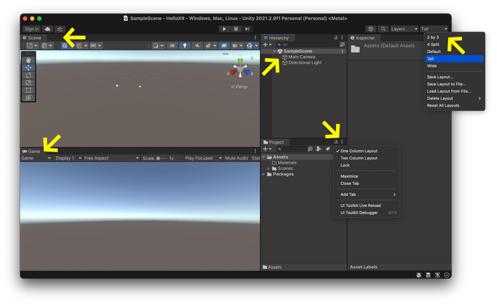

L'éditeur Unity peut être un peu intimidant au début. Il existe plusieurs espaces qui jouent chacun un rôle important dans le développement de votre jeu.

### Personalize Editor
Vous pouvez configurer cet éditeur comme bon vous semble. Si votre interface ne ressemble pas exactement à la mienne et que vous êtes confus, ne paniquez pas. C'est parfaitement normal. J'ai sélectionné la disposition `Tall` dans le coin supérieur droit de l'éditeur et j'ai sélectionné `One Column Layout` dans l'onglet `Project`. J'ai également sélectionné l'onglet "Jeu" et l'ai fait glisser vers le bas de l'éditeur pour créer une vue partagée entre la vue "Scène" et la vue "Jeu". Je trouve que cette disposition générale aide les débutants à comprendre ce qui est quoi. Si vous n'aimez pas cette mise en page, vous pouvez toujours vous en tenir à la vue de mise en page "Par défaut" (cf. coin supérieur droit de l'éditeur).

