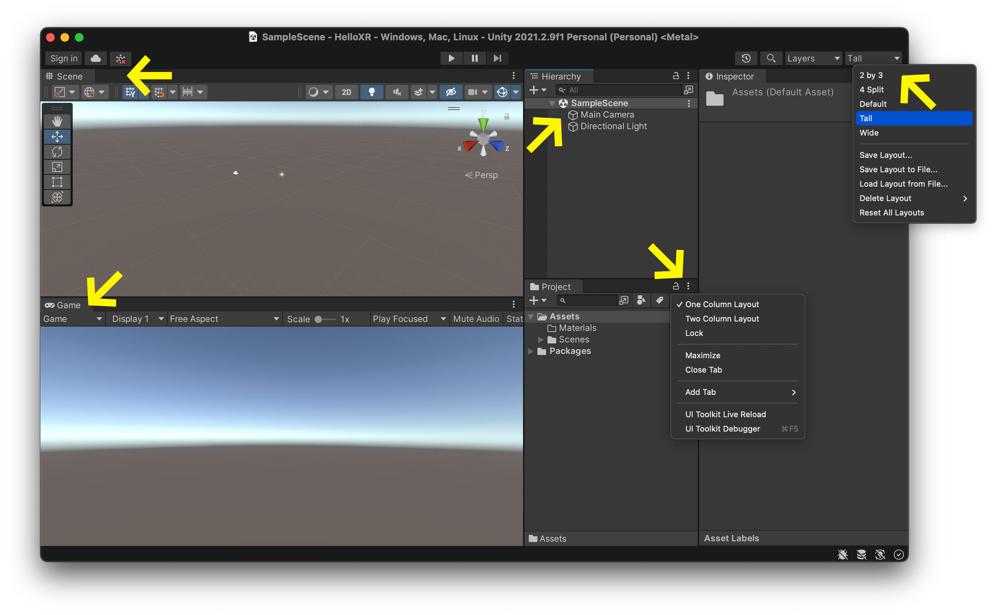

The Unity Editor can be a bit daunting at first. There are several spaces that each play an important role in developing your game.

### Personalize Editor
You can setup this editor however you like. If your interface doesn't look exactly like mine and you are confused, don't panic. This is perfectly normal. I have selected the `Tall` layout in the top right corner of the editor and I selected `One Collumn Layout` in the `Project` tab. I also selected the `Game` tab and dragged it to the bottom of the editor to make a split view between the `Scene` view and the `Game` view. I find this overall layout helps beginners understand what is what. If you do not like this layout, you can always stick with the `Default` layout view (cf. top right corner of the editor).

