### Time To VR
Let's put some triangles into our Oculus headset. Loosely inspired by Mark Cerny's [Time to triangle](https://www.youtube.com/watch?v=ph8LyNIT9sg&t=162s) measurement, let's see how quickly we can get some triangles into an immersive virtual reality world.

We're going to keep this as simple as possible, with the goal of getting a (red) cube on the screen as quickly as possible. For art direction we'll use as our influence the supercool VR game [Superhot](https://superhotgame.com).

(youtube: A1jothqmqHw)

### New Project
Open up the Unity Hub on your macOS, Windows, or Linux machine. Go into the `Projects` tab and press the `New project` button. You will see a series of choices. Make sure you are using `Unity 2021.2.##`. Make sure that you are using the `3D Core` template, which configures your Unity project to the standard 3D rendering system which is a good starting point for any virtual reality project. Inside the `Project Settings` section, you can give your project a name, and determine the location where it will be saved. Finally, when you are happy with these settings, click `Create project` to open your project in the Unity editor.

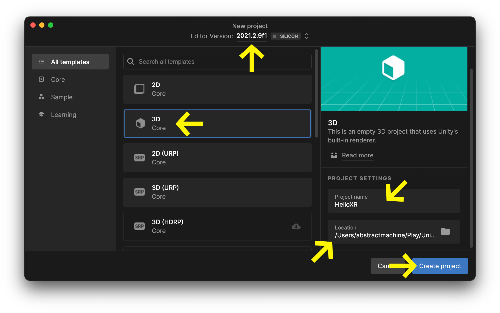

### Sample Scene
Your project should open up with a `SampleScene` in the `Hierarchy`.

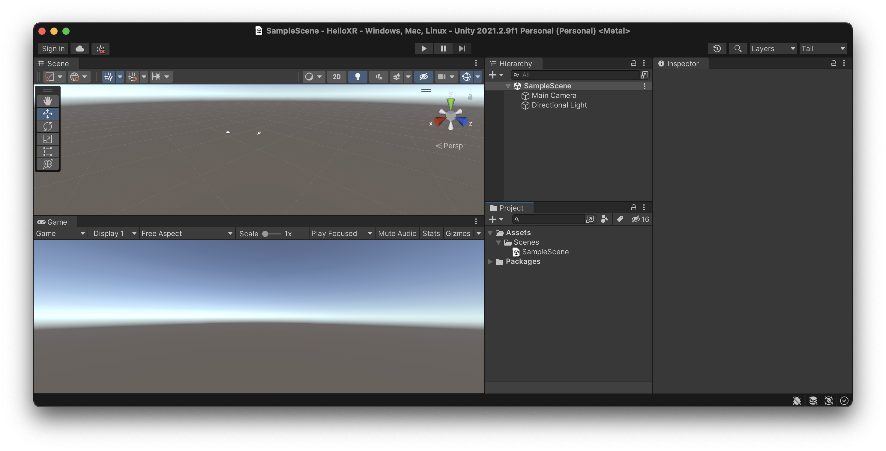

If your project doesn't look like my screenshot, it is because I have configured my editor to use the `Tall` layout by default (cf. Unity Editor).

### Inifinity Room
Let's add a floor and a cube to our `Scene`. At the top of the `Hierarchy` tab, you'll find a `+` button; select `+` > `3D Object` > `Plane` to create a flat plane in the middle of the scene.

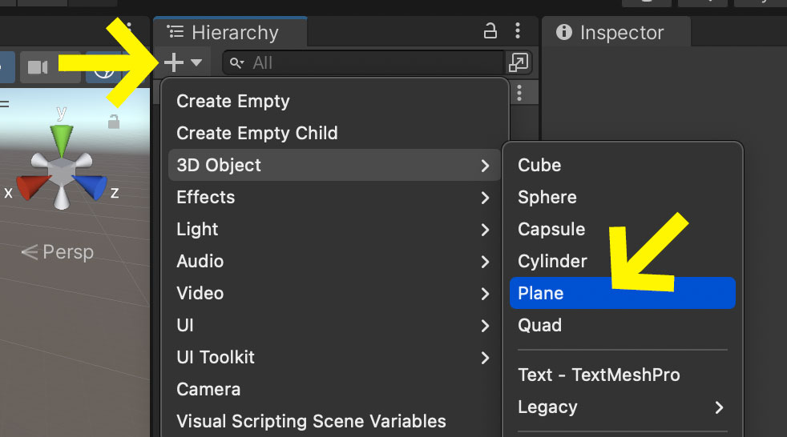

Select that plane, look at it's values inside the `Inspector` tab. You should see the `Transform` values, which describe the `x`, `y`, and `z` position, the rotation, and the scale of the plane.

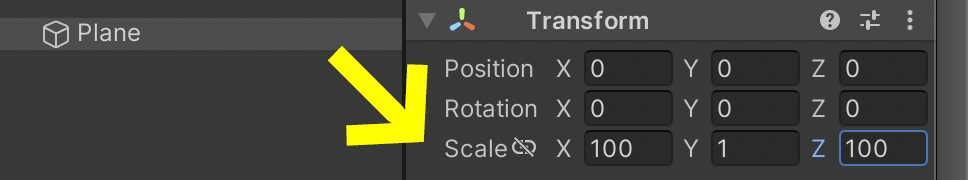

Let's stretch out our plane to give it a larger size in the `x` and `z` directions. In my example, I've given it a scale multiplier of `100` units.

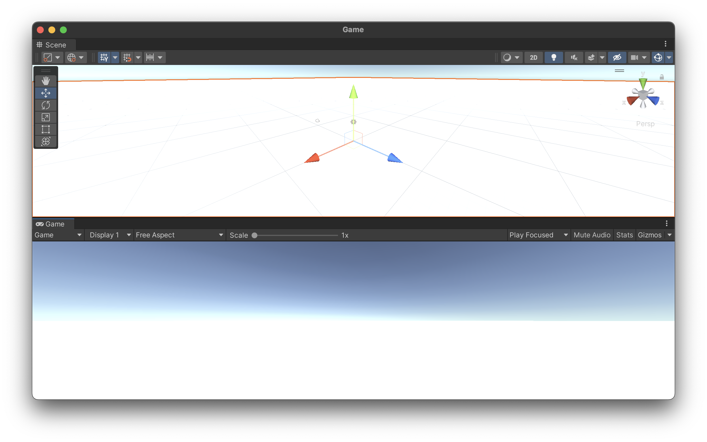

This should create the impression of an infinite white floor spreading off into the distance, similar to the infinite white room in [THX 1138](https://www.youtube.com/watch?v=nkQAhpLBok8).

### Red Cube
Now let's put a red cube in the middle of this abstract room. Before we create the cube, let's create a new folder to hold all our color materials. In the `Project` tab, select the `+` button and create a new `Folder` in your `Project` named `Materials`. It is good practice to name your folders using simple words, and keep your Uppercase and Lowercase names consistent. In Unity, the tradition is to start folder names with a capital letter and to use plural names where appriopriate.

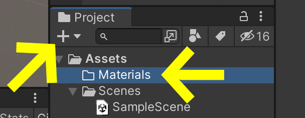

Now let's create our `Red` color material in this new folder. Right-click on the folder, or alternatively select the folder name and click on the `+` button to create a new `Material`. Name that material "`Red`". Give it a red color, and drag the `Smoothness` slider down to `0` for a more *flat* look.

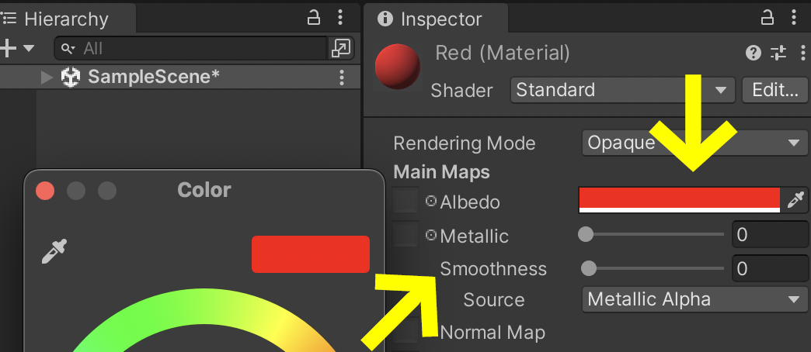

We now have a red material to paint our 3D scene with.

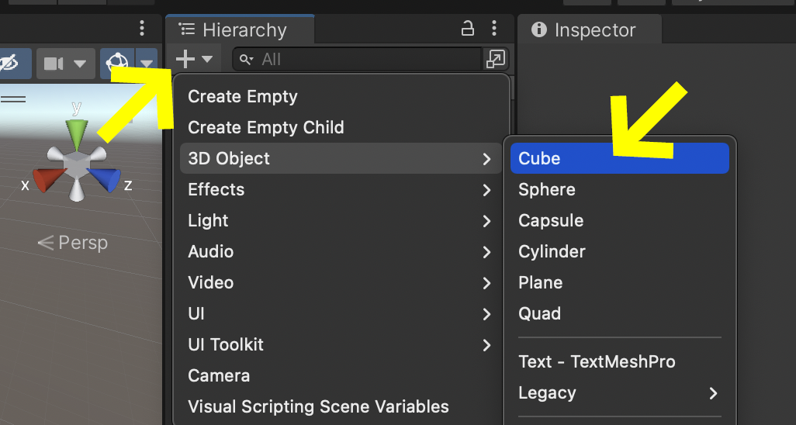

Go back to the `Scene` tab and create a `+` > `3D Object` > `Cube`.

This should inject a 3D Cube into your scene, but unfortunately the cube is stuck in the floor. Let's lift the cube into the air and give it a little rotation using the following settings in the `Cube` object's `Inspector`:

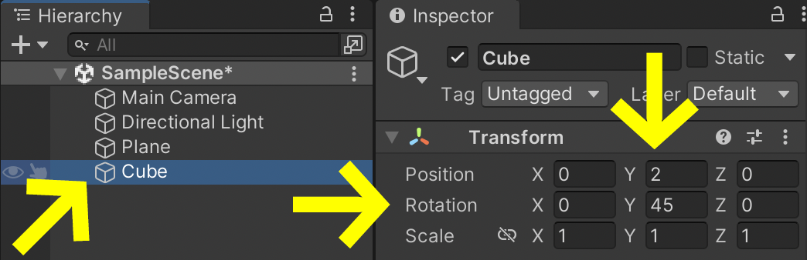

Here, we've set the Cube's position to `2` units on the `Y` axis, and rotated the cube `45°` *around* the `Y` axis.

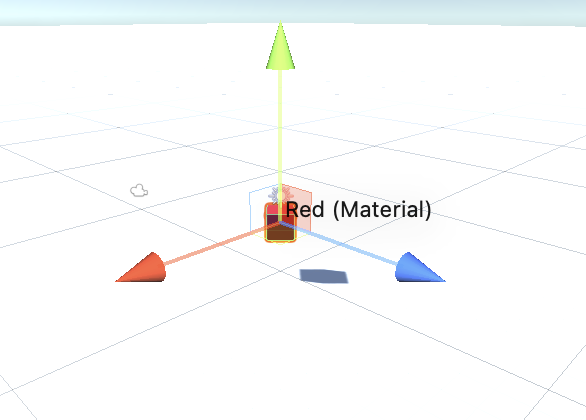

Finally, let's drag out `Red` material from the `Project` tab, directly onto the object in the `Scene` tab in order to give it the color red.

You should now have a `Game` view that shows a red cube hovering in the air.

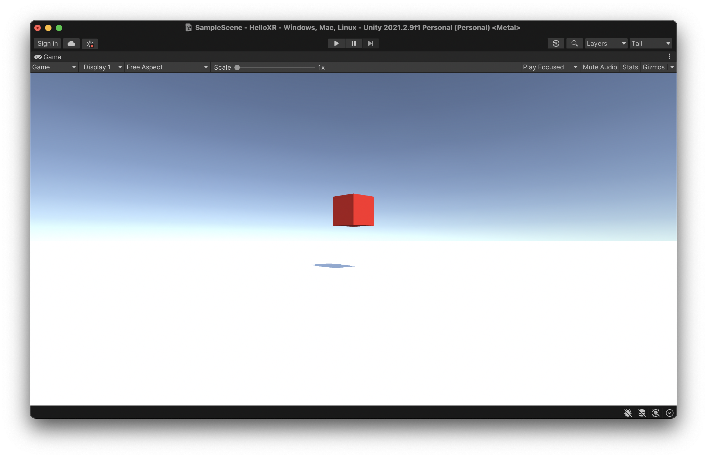

### Export to Headset
In order to export to our headset, we need to change several settings in the `Build Settings` window. In your menu bar, go to `File` > `Build Settings` to open this window.

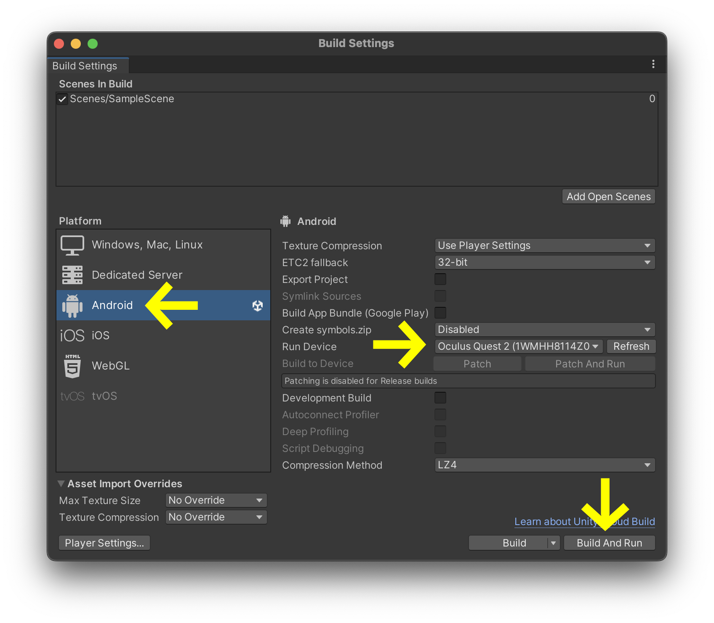

### Change Camera to XR Camera

... To be continued ...