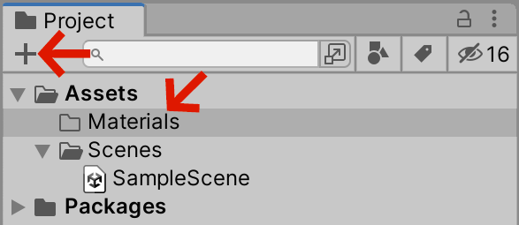
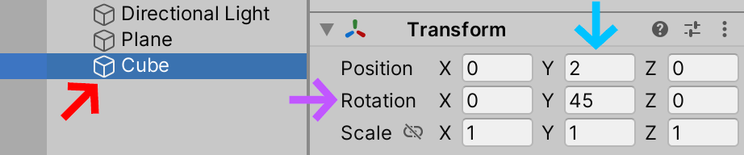

### Time To VR
Mettons quelques triangles dans notre casque Oculus. Librement inspiré de la mesure [Time to triangle](https://www.youtube.com/watch?v=ph8LyNIT9sg&t=162s) de Mark Cerny, voyons à quelle vitesse nous pouvons intégrer des triangles dans un monde de réalité virtuelle immersif.

Nous allons garder cela aussi simple que possible, dans le but d'obtenir un cube (rouge) à l'écran le plus rapidement possible. Pour la direction artistique, nous utiliserons comme influence le jeu VR super cool [Superhot] (https://superhotgame.com).

(youtube: A1jothqmqHw)

### New Project
Ouvrez le Unity Hub sur votre machine macOS, Windows ou Linux. Allez dans l'onglet "Projets" et appuyez sur le bouton "Nouveau projet". Vous verrez une série de choix. Assurez-vous que vous utilisez `Unity 2021.2.##`. Assurez-vous que vous utilisez le modèle "3D Core", qui configure votre projet Unity sur le système de rendu 3D standard, ce qui constitue un bon point de départ pour tout projet de réalité virtuelle. Dans la section "Paramètres du projet", vous pouvez donner un nom à votre projet et déterminer l'emplacement où il sera enregistré. Enfin, lorsque vous êtes satisfait de ces paramètres, cliquez sur "Créer un projet" pour ouvrir votre projet dans l'éditeur Unity.

### Sample Scene
Votre projet devrait s'ouvrir avec un `SampleScene` dans `Hierarchy`.

Si votre projet ne ressemble pas à ma capture d'écran, c'est que j'ai configuré mon éditeur pour qu'il utilise par défaut la mise en page `Tall` (cf. Unity Editor).

### Chambre infini
Ajoutons un étage et un cube à notre `Scene`. En haut de l'onglet "Hiérarchie", vous trouverez un bouton "+" ; sélectionnez `+` > `Objet 3D` > `Plane` pour créer un plan plat au milieu de la scène.

Sélectionnez ce plan, regardez ses valeurs dans l'onglet "Inspecteur". Vous devriez voir les valeurs `Transform`, qui décrivent les positions `x`, `y` et `z`, la rotation et l'échelle du plan.

Étirons notre plan pour lui donner une plus grande taille dans les directions `x` et `z`. Dans mon exemple, je lui ai donné un multiplicateur d'échelle de `100` unités.

Cela devrait créer l'impression d'un sol blanc infini s'étendant au loin, semblable à la salle blanche infinie dans [THX 1138](https://www.youtube.com/watch?v=nkQAhpLBok8).

### Cube rouge
Maintenant, plaçons un cube rouge au milieu de cette pièce abstraite. Avant de créer le cube, créons un nouveau dossier pour contenir tous nos matériaux de couleur. Dans l'onglet `Project`, sélectionnez le bouton `+` et créez un nouveau `Folder` dans votre `Project` nommé `Materials`. C'est une bonne pratique de nommer vos dossiers en utilisant des mots simples et de garder vos noms en majuscules et minuscules cohérents. Dans Unity, la tradition est de commencer les noms de dossier par une majuscule et d'utiliser des noms au pluriel le cas échéant.

Créons maintenant notre matériau de couleur "Rouge" dans ce nouveau dossier. Faites un clic droit sur le dossier, ou bien sélectionnez le nom du dossier et cliquez sur le bouton `+` pour créer un nouveau `Material`. Nommez ce matériau "`Red`". Donnez-lui une couleur rouge et faites glisser le curseur "`Smoothness`" jusqu'à `0` pour un aspect plus *plat*.

Nous avons maintenant un matériau rouge pour peindre notre scène 3D.

Revenez à l'onglet `Hierarchy` et créez un `+` > `3D Object` > `Cube`.

Cela devrait injecter un cube 3D dans votre `Scene`, mais malheureusement le cube est coincé dans le sol. Levons le cube dans les airs et donnons-lui une petite rotation en utilisant les paramètres suivants dans l'inspecteur de l'objet `Cube` :

Ici, nous avons défini la position du cube sur `2` unités sur l'axe `Y` et fait pivoter le cube de `45°` *autour* de l'axe 'Y'.

Enfin, faisons glisser le matériau `Red` de l'onglet `Project`, directement sur l'objet dans l'onglet `Scene` afin de lui donner la couleur rouge.

Vous devriez maintenant avoir une vue `Game` qui montre un cube rouge planant dans les airs.

### Exporter vers le casque
Afin d'exporter vers notre casque, nous devons modifier plusieurs paramètres dans la fenêtre "Configurer les paramètres". Dans votre barre de menu, allez dans `File` > `Build Settings` pour ouvrir cette fenêtre. Assurez-vous de `Switch Platform` sur `Android`, puis sélectionnez votre appareil Oculus dans le menu Android `Run Device`, et enfin `Build and Run`. Si vous ne voyez pas votre appareil dans la liste, vous devrez peut-être "Actualiser" cette liste ; vérifiez également que votre casque est branché, allumé et que vous avez activé le « `Developer Mode` », comme expliqué dans le didacticiel « `Installation` ».

Lorsque Unity a fini d'exporter votre projet, vous devriez voir votre jeu dans votre casque Oculus. Youpi ! Ummm, attendez une minute. Regardez votre casque. Que vois-tu? Est-ce normal? Qu'est-ce que le %$@#& se passe. Ce n'est pas du tout cool Unity ! Il n'y a rien d'immersif dans cette expérience.

Le problème est que nous n'avons pas activé le mode "réalité virtuelle" dans notre jeu. Par conséquent, Oculus considère que Unity nous a envoyé un jeu traditionnel qui doit être joué sur un téléviseur à écran plat. Ainsi, il construit un téléviseur à écran plat pour vous à l'intérieur de votre casque. Peut-être que regarder des téléviseurs à écran plat n'est qu'un entraînement pour notre ~~futur~~ paysage d'enfer dystopique actuel, mais ce n'est probablement pas ce que vous vouliez.

### Plugin XR
Nous devons activer le "mode de réalité virtuelle" spécial dans votre projet Unity. Ouvrez le menu `Edit` > `Project Settings`, recherchez la section (highlight:blue text:`XR Plugin Management`) et sélectionnez (highlight:orange text:`Install XR Plugin Management`).

Une fois le plugin installé, sélectionnez l'onglet (highlight:green text:`Android`) (cf. icône du petit robot) dans cet outil et activez l'option (highlight:sky text:`Oculus`).

### Convertir en appareil XR
Si vous reconstruisez et exécutez votre application dans votre casque, vous devriez maintenant être immergé dans un monde à 360°, mais le casque ne tournera pas ou ne bougera pas avec les mouvements de votre tête car il utilise une caméra 3D classique. C'est une expérience étrange. Essayez-le si vous le souhaitez, mais ne bougez pas la tête. Intéressant, mais encore une fois, pas vraiment ce à quoi on s'attendait dans un casque de réalité virtuelle.

Pour *convertir* notre caméra de jeu classique en "rig" compatible avec le casque VR, sélectionnez le bouton (highlight:fuchsia text:`+`), choisissez (highlight:red text:`XR`) > (highlight:red text:`Convert Main Camera to XR Rig`) ; c'est-à-dire « Convertir la caméra principale en XR Rig ».

*Maintenant, enfin*, vous pouvez recréer votre application et l'exécuter sur votre appareil. Vous devriez maintenant voir votre charmant cube 3D rouge flotter dans une réalité virtuelle immersive.

### Regardez derrière vous!
Un bon exercice pour *réfléchir* à la façon de concevoir en réalité virtuelle consiste à commencer par placer un deuxième objet *derrière* votre `XR Rig`. Créez un deuxième matériau (ici, j'ai choisi bleu) et placez-le "derrière" le `XR Rig`.

Maintenant, lorsque je "construis et exécute" mon application dans mon casque, je devrais avoir deux objets à regarder.

La prochaine étape évidente serait de continuer cette méthode [greyboxing](https://www.youtube.com/watch?v=dYBOBgfcTgY) en construisant une ville directement à l'intérieur de Unity, puis de commencer à animer des éléments dans cette scène. Hé, sonne comme une bonne idée pour un tutoriel.