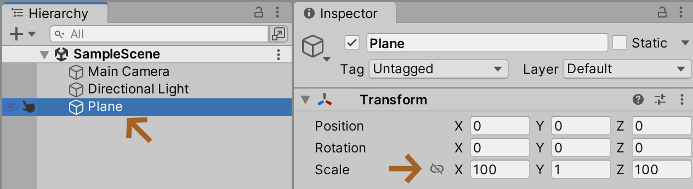
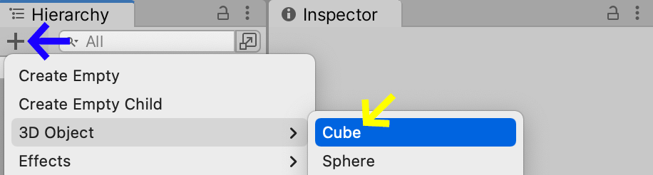
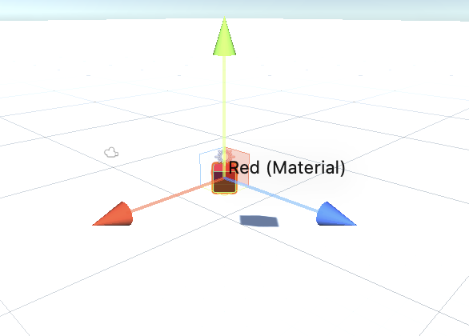
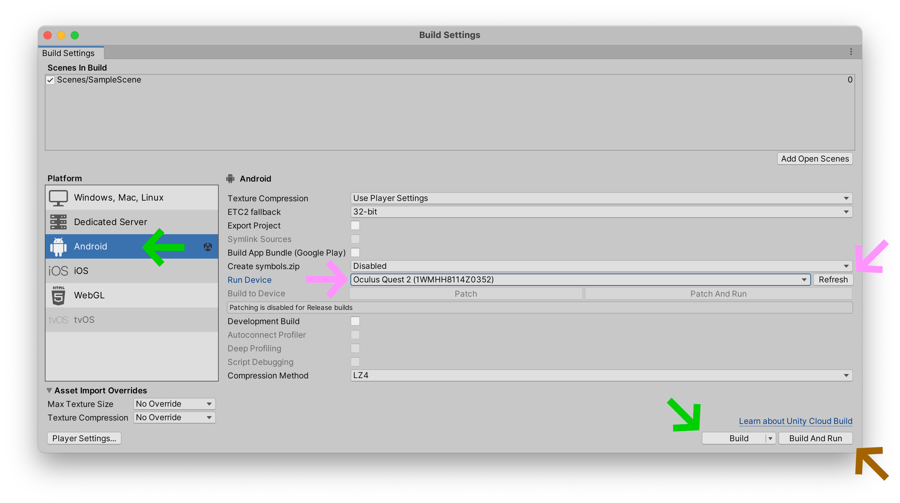
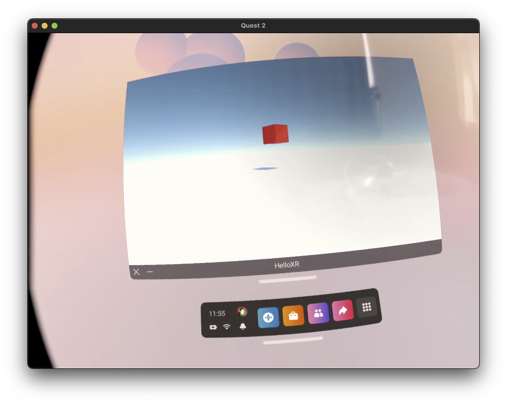
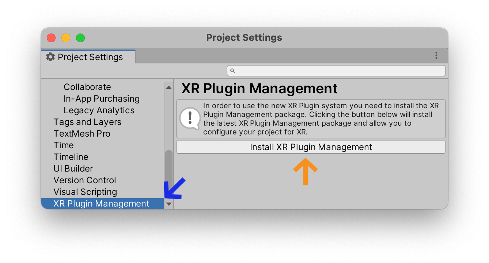
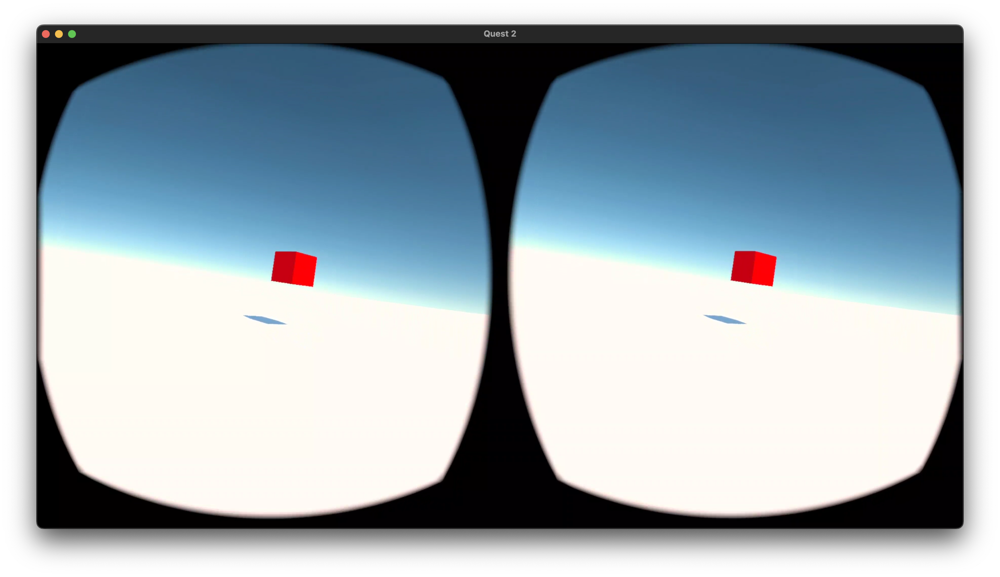
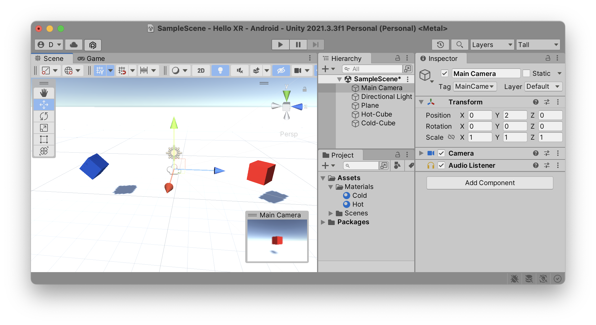

### Time To VR
Let's put some triangles into our Oculus headset. Loosely inspired by Mark Cerny's [Time to triangle](https://www.youtube.com/watch?v=ph8LyNIT9sg&t=162s) measurement, let's see how quickly we can get some triangles into an immersive virtual reality world.

We're going to keep this as simple as possible, with the goal of getting a hot red cube on the screen as quickly as possible. For art direction we'll use as our influence the supercool VR game [Superhot](https://superhotgame.com).

(youtube: A1jothqmqHw)

### New Project
Open up the Unity Hub on your macOS, Windows, or Linux machine. Go into the `Projects` tab and press the `New project` button. You will see a series of choices. Make sure you are using at least (orange:`Unity 2021.2.##`) or later. These tutorials make use of the new `Visual Scripting` system which was introduced in `Unity 2021.2`. Make sure also that you are using the (green: 3D Core) template, which configures your Unity project to the standard 3D rendering system: this is a good starting point for any virtual reality project. Inside the `Project Settings` section, you can give your project a (cyan: name), and determine the (fuchsia: location) where it will be saved. Finally, when you are happy with these settings, click (yellow: Create project) to open your project in the Unity editor.

### Sample Scene
Your project should open up with a `SampleScene` in the `Hierarchy`.

If your project doesn't look like my screenshot in the rest of this tutorial, it is because I have configured my editor to use the (red:Tall) layout by default (cf. (tutorial:Unity Editor link:unity-vr/editor)). Also, I selected (blue:One Collumn Layout) in the (blue:…) menu of the `Project` tab.

### Inifinity Room
Let's add a floor and a cube to our `Scene`. At the top of the `Hierarchy` tab, you'll find a (purple:+) button; select (purple:+)&nbsp;> `3D Object`&nbsp;> (sky:Plane) to create a flat plane in the middle of the scene.

Select that plane, look at it's values inside the `Inspector` tab. You should see the `Transform` values, which describe the `x`, `y`, and `z` position, the rotation, and the scale of the plane.

Let's stretch out our plane to give it a larger size in the (brown:x) and (brown:z) directions. In my example, I've given it a scale multiplier of (brown:100) units.

This should create the impression of an infinite white floor spreading off into the distance, similar to the infinite white room in [THX 1138](https://www.youtube.com/watch?v=nkQAhpLBok8).

### Hot Cube
Now let's put a hot cube in the middle of this abstract room. Before we create the cube, let's create a new folder to hold all our color materials. In the `Project` tab, select the (mud:+) button and create a new `Folder` in your `Project` named (mud:Materials). It is good practice to name your folders using simple words, and keep your Uppercase and Lowercase names consistent. In Unity, the tradition is to start folder names with a capital letter and to use plural names where appriopriate.

Now let's create our `Hot` color material in this new folder. Right-click on the folder, or alternatively select the folder name and click on the (fuchsia:+) button to create a new `Material`. Name that material "`Hot`". Give it a (green:red) color. I also usually like to drag the (orange:Smoothness) slider down to (orange:0) for a more *flat* look.

We now have a hot red material to paint our 3D scene with.

Go back to the (blue:Hierarchy) tab and create a (blue:+) > (yellow:3D Object) > (yellow:Cube).

This should inject a 3D Cube into your `Scene`, but unfortunately the cube is stuck in the floor. Let's lift the cube into the air and give it a little rotation using the following settings in the (red:Cube) object's `Inspector`:

Here, we've set the Cube's position to (sky:2) units on the (sky:Y) axis, and rotated the cube (purple:45°) *around* the (purple:Y) axis.

Finally, let's drag out `Hot` material from the `Project` tab, directly onto the object in the `Scene` tab in order to give it the hot color.

You should now have a `Game` view that shows a red cube hovering in the air.

### Export to Headset
In order to export to our headset, we need to change several settings in the `Build Settings` window. In your menu bar, go to `File` > `Build Settings` to open this window. Make sure you (green:Switch Platform) to (green:Android), then select your Oculus device in the Android (pink:Run Device) menu, and finally (brown:Build and Run). If you don't see your device listed, you might need to (pink:Refresh) this list; also, double-check that your headset is plugged in, turned on, and that you have activated `Developer Mode` as explained in the (tutorial:Installation link:unity-vr/installation) tutorial.

When Unity is finished exporting your project, you should see your game inside your Oculus headset. Yipee! Ummm, wait a minute. Look at your headset. What do you see? Is this normal? What the %$@#& is going on. That is totally uncool Unity! There is nothing immersive about this experience.

The problem is that we have not activated the "virtual reality" mode in our game. Therefore, Oculus considers that Unity sent us a traditional game that needs to be played on a flatscreen TV. So it builds a flatscreen TV for you inside your headset. Maybe watching flatscreen televisions is just training for our ~~future~~ present dystopic hellscape, but it's probably not what you wanted.

### XR Plugin
We need to activate the special "virtual reality mode" inside your Unity project. Open the menu `Edit` > `Project Settings`, find the (blue: XR Plugin Management) section and select (orange:`XR Plugin Management`).

Once the plugin has been installed, select the (green: Android) (cf. little robot icon) tab inside this tool and activate the (sky: Oculus) option.

### Convert To XR Rig
If you re-build and run your application in your headset, you should now be immersed in a 360° world, but the headset won't rotate or move with the movements of your head because it is using a classical 3D camera. This is an odd experience. Try it if you like, just don't move your head. Interresting, but again, not really what you were expecting in a virtual reality headset.

To *convert* our classical game camera to VR-headset "rig", select the (fuchsia: +) button, choose (red: XR) > (red: Convert Main Camera to XR Rig).

*Now, finally*, you can build your application again and run it on your device. You should now see your lovely Red 3D Cube floating in immersive virtual reality.

### Look Behind You!
A good exercise for *thinking* about how to design in virtual reality, is to start by putting a second object *behind* your `XR Rig`. Create a second material (here I've chosen blue), and place it "behind" the `XR Rig`.

Now when you (brown:Build and Run) your application in your headset, you should have two objects to look at. A "hot" red one in front of you, and a "cold" blue one behind you.

The next obvious step would be to continue this [greyboxing](https://www.youtube.com/watch?v=dYBOBgfcTgY) method by building an entire blocked-out city directly inside of Unity, and then to start animating elements within this scene. Hey, sounds like a good subject for a tutorial.