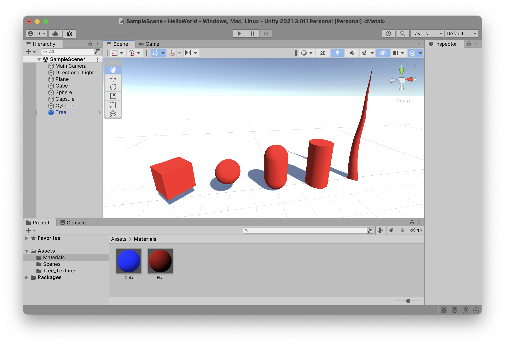
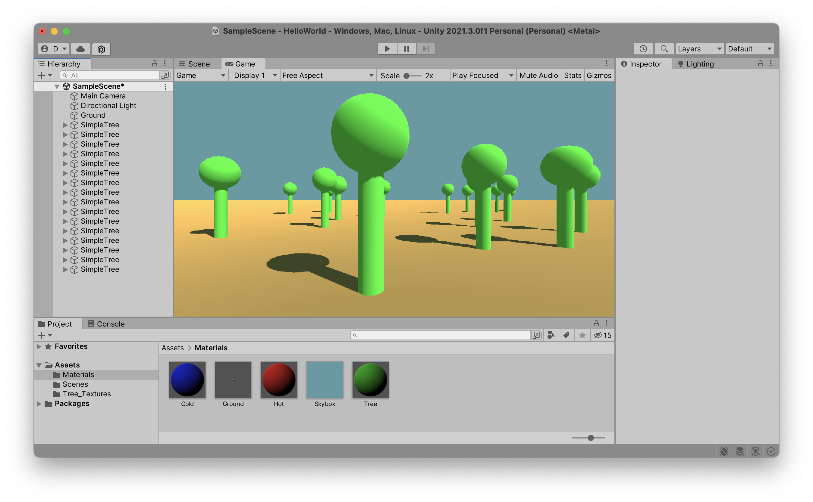
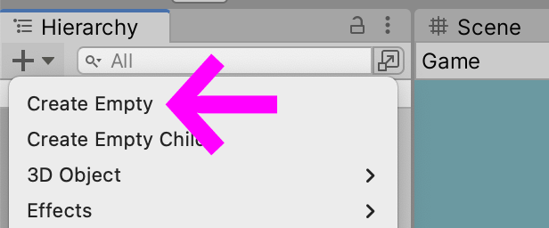
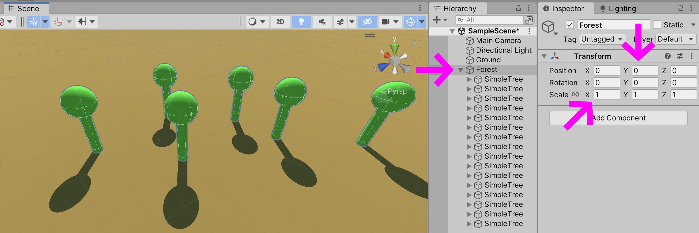

### Greyboxing
Building a game can be a complex process. It can also be a laborious process, especially when working in 3D. As a result, many methods have emerged over the years for designing games and virtual environments quickly, but more importantly as a modular system that can (more) easily be adapted to the gameplay as it emerges.

Videogames are not just an audiovisual medium, they are [affordant](https://en.wikipedia.org/wiki/James_J._Gibson) spaces that you have to interact with to perceive. As a consequence you often want to begin designing a virtual space using simple, easily modifiable basic shapes that you can start interacting with, before investing time and energy into the long and complex modelling workflow. By designing the world using simple boxes, spheres, cylinders, and planes you can quickly get a feel for your game before you've even determined the look of it.

This process is called "greyboxing", because of all the gray boxes you spread about your `Scene` as you build your game.

Here is a 2022 conference from Guerrilla’s Blake Rebouche, one of the designers of a popular Playstation game (wikipedia:Horizon Forbidden West keyword:Horizon_Forbidden_West). In this conference he breaks down all the various steps he and his collaborators went through when designing one of the quests in the game. Note how he moves quickly from a paper prototype (cf. 05:10) to a simplified greyboxed level that players can interact with using reduced gestures and puzzles. Only after these basic fundamentals have been worked out did the team start building complex models, lighting, or cinematics. Also note how they made extensive use of recorded playsessions with players commenting on their experiences with the levels (cf. 50:00), and went back a redesigned various aspects of their game based on this feedback.

(youtube: KxcXUYx3eLQ?t=311)

We've already seen how easy it is to build out your scene in Unity: open a new project or a new scene, click on the `+` button in the `Heirarchy` window, and start adding basic shapes. You don't need to code anything, or even understand much about modelling software, textures, shaders, photogrammetry, retopology, or whatever other nutty-sounding jargon YouTuber 3D bros throw at you.

Here are a few of the basic shapes thay you can quickly use to build out the world of your game. Sometimes all you need to get a feel for the size of your forest is to place a few green cylinders with spheres on top.

Make sure to use the six tools inside the `Scene` window to move, rotate, and scale your shapes. Also, try dragging a shape "inside" of another shape inside of the `Hierarchy` in order to understand what happens when you change the `Position`, `Rotation`, and especially the `Scale` values in the inspector of these `parent` or `child` shapes. Watch what happens to the `child` object when you change the size of the `parent`. Then try temporarily removing the `child` object from its parent, change the `parent`'s `Scale` and then place the `child` back inside of the influence of the `parent`'s `transform` property. What happens? Do the values of the `child` game object stay the same?

### Empty Object
Once your `Scene` starts getting even slightly complex, it's a good idea to create a few `Empty Object`s and to place your collection of characters, buildings, obstacles, and whatevers inside of their `Hierarchy`.

Be careful though with the `Position`, `Rotation`, and `Scale` properties of these empty objects. It is often easier to understand how all these game objects influence each other by starting with an `Empty Object` at coordinate `0,0,0` and with a `scale` of `1,1,1` before you start adding children to it.

### ProBuilder
Once you get tired of these simplistic shapes, but still want to quickly build out the basic shapes of your world, you can activate the `ProBuilder` tool that is built directly into the `Unity Editor`. This tool is both simple and extremely powerful, and most importantly fast. When the *costs* to building 3D shapes are low, you don't really hesitate to try new and weird things, tear them all down, and then rebuild them differently in a completely other direction. For this reason, `ProBuilder` is also a great tool for students who are just getting started with 3D modelling and are not yet familiar with the logic of thinking in 3D.

(youtube: TYAYFfXg6tg)

And here is a more comprehensive tutorial from the Unity team on how to quickly get started with the integrated `ProBuilder` tools.

(youtube: dYBOBgfcTgY)