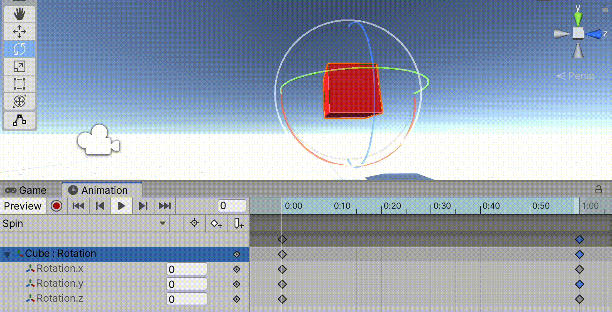

Commençons à animer nos objets de jeu dans Unity.

### Physique | Scénarios | Animation
Il existe de nombreuses façons de faire bouger nos objets de jeu. Nous pouvons ajouter de la physique à un objet de jeu. Ou nous pouvons déplacer un objet via des scripts en utilisant soit le code `C #` ou via `script visuel`. Et enfin, nous pouvons faire bouger notre objet en utilisant des animations basées sur des images clés. La plupart des projets Unity utilisent une combinaison de ces trois moyens pour déplacer les choses. Les deux premiers sujets (physique et script) seront couverts dans de futurs tutoriels ; ce qui signifie que ce tutoriel est dédié aux animations basées sur des images clés.

### Images clés
Le concept d'images clés a émergé lors de la phase d'industrialisation de la production de films d'animation au début du XXe siècle. Au fur et à mesure que les groupes d'équipes d'animation devenaient de plus en plus grands, permettant de produire des récits plus complexes, différents rôles ont été attribués à différents types d'animateurs. Des jobs d'animation de niveau supérieur ont été créés (histoire, conception de personnages) avec des jobs de niveau inférieur prenant en charge les aspects les plus fastidieux, d'où une terminologie péjorative telle que la "feuille de dope". De cet état d'esprit tayloriste est né le concept de "keyframes".

Comme l'explique le documentaire suivant sur le studio de Max Fleicher des années 1930, il y a deux premières étapes importantes dans la production de films d'animation : (a) la création de ce qu'ils appellent ici des « key pictures » (images clés), et (b) la création de « in-between drawings » (dessins intermédiaires) que le documentaire appelle aussi « in-betweeners » ou « in-betweens » (entre-deux) :

(youtube: RxJOw5O0h8o)

Dans ce type d'animation, les images « clés » sont les images importantes au début et à la fin de la séquence d'animation, ainsi que les points visuels clés qui marquent les pics de divers changements de mouvement de chaque personnage et des objets de la scène. . Ces images « clés » ne représentent pas toutes les images du mouvement, juste les points *clés* du mouvement. Si vous avez ces points clés, vous pouvez plus facilement combler les lacunes des images * entre les deux * en complétant les positions intermédiaires du personnage lorsqu'il déplace son corps de l'image clé A à l'image clé B, puis à l'image clé C , et ainsi de suite. Les clés ne contiennent pas toutes les images animées, les changements réels image par image * entre * ces images clés sont dessinées par les "intermédiaires" qui s'assurent que chaque étape du mouvement est correctement dessinée pour qu'elle arrive précisément à l'image "clé" souhaitée à la fin du mouvement.

Si vous souhaitez une ventilation plus détaillée du fonctionnement de ce système, voici une vidéo YouTube qui s'ouvre avec un tableau pratique :

(youtube: d418iMMxfl8)

De nombreux outils logiciels utilisent ce concept d'images clés pour animer un objet, un personnage ou un objet graphique. [AfterEffects](https://en.wikipedia.org/wiki/Adobe_After_Effects), [Blender](https://www.blender.org), [Cinema4D](https://www.maxon.net/en/ cinema-4d), [DaVinci Resolve](https://www.blackmagicdesign.com/products/davinciresolve/) – pour ne citer que quelques programmes dont vous avez peut-être déjà entendu parler – utilisent intensivement les images clés dans leur flux de travail.

Aujourd'hui, nous les appelons toujours des images clés, mais au lieu de "intermédiaires", nous utilisons le terme "interpolation" pour décrire les positions intermédiaires créées * entre * chaque image clé.

Bien que cela puisse ne pas sembler évident au premier abord, même les systèmes de capture de mouvement intègrent ce concept d'images clés, mais étendent le concept pour définir chaque point individuel que le système suit dans l'espace 3D au fil du temps. Ainsi, le système décompose à la fois les * articulations physiques clés * et les attributs (bras, jambes, pieds, mains, doigts, mais aussi mâchoire, yeux, bouche, joues, etc.) en leurs parties distinctes, ainsi que le suivi de leur * clé Positions 3D dans le temps*. Des logiciels tels que Unity interpolent alors automatiquement toutes les positions *intermédiaires* ou *intermédiaires* de chaque articulation extraites de l'enregistrement de capture de mouvement. Cette approche est plus modulaire et permet de modifier en temps réel différentes parties via l'interactivité. C'est à dire. en décomposant leurs différentes parties, les personnages peuvent évoluer et passer d'un ensemble d'images clés capturées par mouvement à un autre, en fonction de l'entrée interactive du joueur. Les images clés sont essentielles à cette modularité. Cela peut sembler un processus trop compliqué, mais tout est construit sur ce concept très simple d'"images clés" et "d'images intermédiaires".

(youtube: djvDGel7nf0?t=54)

### Animer un cube
Ok, assez d'histoire d'animation. On va animer un cube.

Placez un cube dans votre scène et donnez-lui une couleur pour le rendre facilement identifiable. Nous voulons maintenant créer un `Animation Clip` et l'attacher à ce cube. Mais avant cela, créons un nouveau dossier `Animations` (majuscule `A`, pluriel `s` à la fin) dans notre dossier `Assets` dans la fenêtre `Project`. Nous enregistrerons dans ce dossier tous nos fichiers liés à l'animation.

Ouvrons maintenant deux nouvelles fenêtres et attachons-les à notre éditeur Unity. Ouvrez les fenêtres `Window` > `Animation` > `Animation` et `Window` > `Animation` > `Animator` et attachez-les à notre éditeur.

C'est ainsi que j'ai configuré ma configuration, mais vous pouvez la configurer comme vous le souhaitez.

Comme vous pouvez le voir, j'ai ancré ma fenêtre `Animator` à côté de l'onglet `Scene` et `Animation` à côté de l'onglet `Game`. Cette configuration me permet de regarder la `Scene` tout en ajustant les valeurs `Animation` en dessous lors de l'édition du jeu, puis d'observer quelle séquence `Animator` est en cours de lecture lorsque mon `Game` est actif dans cette fenêtre. Encore une fois, ce ne sont que des préférences et vous pouvez les configurer comme vous le souhaitez.

Comme vous pouvez le voir dans l'illustration ci-dessus, en sélectionnant l'objet de jeu `Cube` dans notre `Hierarchy`, l'éditeur Unity vous expliquera qu'il peut créer un `Animation Clip` et un `Animator` de ce clip pour vous en en cliquant sur un seul bouton "Créer". C'est très pratique, alors allez-y et faites-le en veillant à enregistrer vos fichiers dans le dossier "Animations" de votre "Projet". J'ai décidé d'appeler le nom de mon animation "`Spin`", ou si vous affichez vos fichiers avec leurs extensions: "`Spin.anim`".

Lorsque vous cliquez sur ce bouton, l'éditeur Unity fait beaucoup de choses complexes pour vous faciliter la vie. Jetez un œil à toutes les choses qu'il vient de connecter. Dans votre dossier "Assets", vous devriez maintenant voir deux fichiers : l'un avec le nom que vous avez donné à votre nouveau "Clip d'animation" et l'autre le nom de l'objet de jeu que vous avez sélectionné lorsque vous avez appuyé sur le bouton "Créer". Ce deuxième fichier est le `Animation Controller` qui contrôlera quelle animation est en cours de lecture (ou non). Le clip a également été automatiquement ajouté à un nouveau composant d'objet de jeu que vous devriez maintenant voir sur votre objet de jeu `Cube`, intitulé `Animator`. Regardez à l'intérieur de la fenêtre "Inspecteur" et vous devriez voir que cette nouvelle relation. Si vous gardez votre `Cube` sélectionné et ouvrez la fenêtre `Animator`, vous verrez également que Unity a automatiquement ajouté votre nouveau clip `Spin.anim` au fichier `Cube.controller` et a été configuré comme votre animation par défaut qui commencera automatiquement à jouer lors de l'entrée dans le jeu. Et enfin, avec votre `Cube` toujours sélectionné, vous devriez voir que `Animation` vous attend pour commencer à animer les différentes propriétés de votre animation `Spin`.

C'est tout un tas de connexions et de relations simplifiées en un seul bouton. Puisque vous débutez probablement avec Unity, cela signifie qu'il y a beaucoup de choses que vous ne comprenez probablement pas avec toutes ces fenêtres, fichiers, composants et objets. Plus loin dans ce tutoriel, nous tenterons de décomposer la signification de chacun de ces composants d'animations.

### Propriété animée
Mais avant d'expliquer les relations de tous ces différents composants, animons simplement l'une des propriétés de notre cube. Assurez-vous que votre cube est sélectionné dans la hiérarchie et que le clip d'animation "Spin" est sélectionné dans le coin supérieur gauche de la fenêtre "Animation", juste en dessous du bouton "Aperçu". Sélectionnez maintenant la ou les propriétés que vous souhaitez animer. Ici, j'ai décidé d'animer `Transform` > `Rotation` du cube.

Notez que tous les différents composants à l'intérieur de votre objet de jeu peuvent être animés à l'aide de cette fenêtre "Animation".

### Modifier les images clés
Dès que nous avons ajouté une propriété à animer, la fenêtre `Animation` ajoute automatiquement une image clé `begin` et `end` pour chacune des valeurs possibles que nous pouvons animer. En cliquant sur les flèches dans cette fenêtre, nous pouvons placer le curseur blanc "Timeline" au moment exact de chacune de ces images clés. Nous pouvons alors saisir les valeurs exactes que nous souhaitons dans cette fenêtre, modifier l'objet du jeu directement dans la `Scene` ou via ses valeurs dans l'`Inspector`.

Dans l'exemple ci-dessus, vous pouvez voir que j'ai déplacé le curseur temporel vers la dernière image clé de mon `Clip d'animation` et modifié la rotation de l'axe `Y` à la valeur de `360`°. Si vous rembobinez le curseur temporel au début de mon clip, la valeur de rotation 'Y' a commencé à '0'°, ce qui signifie que toutes les images intermédiaires seront des *interpolations* entre ces deux valeurs, selon l'endroit où se trouve le curseur temporel à l'intérieur du clip d'animation. Notez également que les valeurs d'images clés en forme de losange (et les valeurs parentes) que j'ai * modifiées * à ce moment précis ont été colorées en bleu.

Vous pouvez prévisualiser temporairement l'animation en appuyant sur le bouton triangulaire "Jouer" dans la fenêtre "Animation". Cela jouera votre animation en boucle. Comme vous pouvez le remarquer, l'animation s'accélère et ralentit, à chacune des extrémités de l'image clé. En effet, les "courbes" de vos images clés sont configurées pour lisser les modifications à chaque point de l'image clé.

Si vous voulez un mouvement de rotation linéaire plus robotique, sélectionnez la `Property` spécifique que vous souhaitez corriger (ici, j'ajuste la valeur `Rotation.y`), sélectionnez le bouton `Curves` en bas de la fenêtre `Animation`, et définissez chacun de vos côtés d'image clé (côté `Left`, côté `Right` ou `Both`) sur `Linear`.

Une fois que vous êtes satisfait de la rotation de votre cube, vous pouvez arrêter la lecture temporaire dans la fenêtre "Animation" et appuyer sur le bouton "Play" en haut de l'éditeur Unity lui-même. Cela démarrera votre jeu et jouera et toutes les animations configurées.

### Système d'animation
Au début, Unity a commencé avec un système d'animation très simple, facile à comprendre, mais très limité. On pouvait facilement créer des animations à l'aide d'images clés dans la fenêtre `Animation`, puis placer un sélecteur d'animation sur votre `Game Object` afin de basculer entre differentes animations — par exemple entre `Run`, `Jump`, `Idle`, `Swim`, etc. L'actuel éditeur d'images clés "Animation" est toujours le même, mais il a maintenant été intégré dans un système beaucoup plus sophistiqué qui permet des transitions plus élégantes entre différents états d'animation.

Voici quelques points clés à définir lorsque vous essayez d'expliquer le fonctionnement du système d'animation Unity dans son ensemble :

- Pour animer dans Unity, vous devez avoir des propriétés `Game Object` à animer. Assurez-vous d'avoir sélectionné le bon `Game Object` dans la `Hierarchy` avant de commencer à l'animer.
- Un `Animation Clip` est une séquence d'images clés. C'est un peu comme une chanson qui attend d'être jouée. Ce `Clip` décrit les différentes valeurs d'images clés des propriétés de l'objet de jeu et comment elles sont modifiées au fil du temps. Il est linéaire, mais peut être joué en boucle et est souvent conçu pour boucler de manière transparente.
- Un `Animatorr` garde les clips organisés et peut les démarrer et les arrêter au moment voulu. De cette façon, il agit un peu comme un juke-box qui peut lire n'importe lequel clip à la demande. Cet `Animator` est un composant d'un `Game Object`. Pour y accéder, sélectionnez un objet de jeu et regardez dans l'`Inspector`.
- Un `Animation Controller` est la liste réelle des chansons en attente d'être jouées par `Animator`. Il est chargé dans `Animator` avec tous les `Clips`. Si le `Animator` est comme un juke-box, le `Animation Controller` est comme sa liste de lecture. Ce `Controller` indique à l'`Animator` quel clip lire et quand. Si vous souhaitez modifier cette playlist, sélectionnez le fichier `Animation Controller` dans la fenêtre `Project` et ouvrez la fenêtre `Animator`. Vous verrez le contenu de cette liste de lecture et pourrez commencer à la modifier.

### Les Animations et l'Animator
Pour simplifier davantage cette relation, la chose la plus importante à retenir est qu'il y a des `Animation` contenant des images clés, puis il y a un `Animator` avec son contrôleur qui contient la liste de ces `Animations` à jouer et quand.

C'est pourquoi il y a deux fenêtres distinctes. Même si vous n'avez qu'une seule chanson, vous avez toujours besoin d'un juke-box pour la jouer. Plus tard dans un futur didacticiel, nous explorerons les contrôleurs plus complexes avec plusieurs clips d'animations qui peuvent changer en temps réel l'animation en cours de lecture, parfois sur la base d'un diagramme de conditions assez complexe.