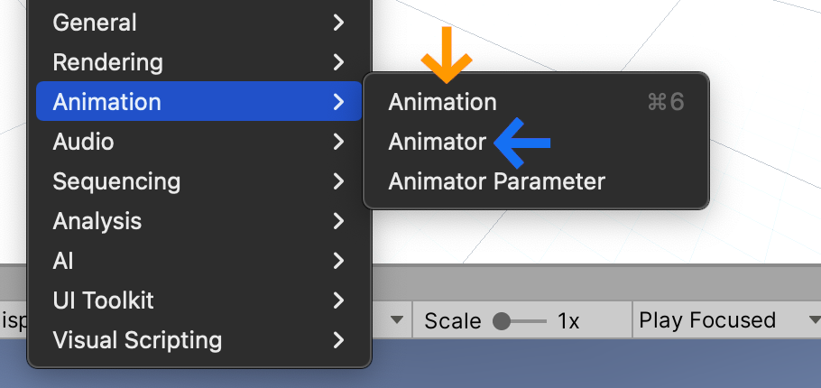
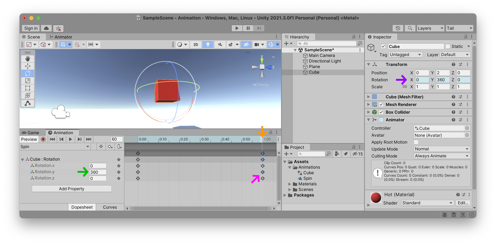
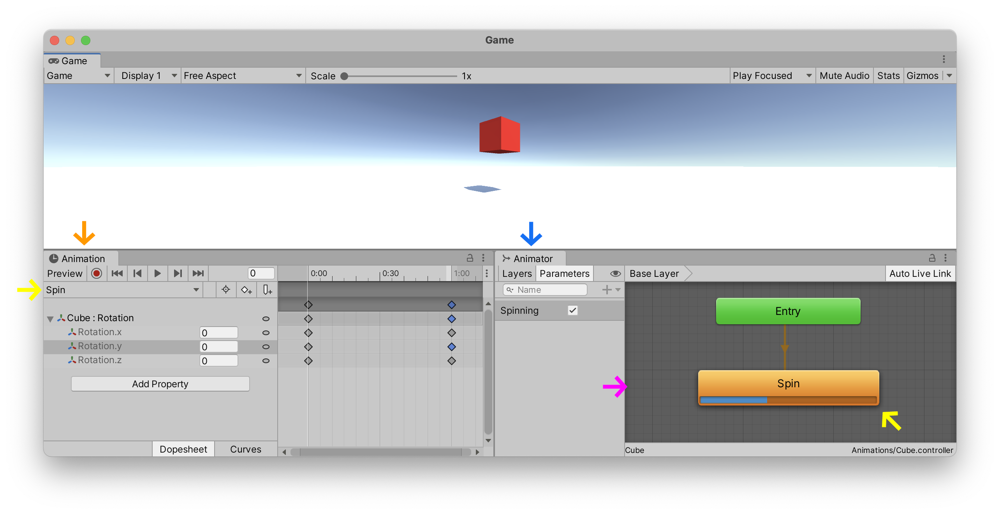

Commençons à animer nos objets de jeu dans Unity.

### Physique | Scripts | Animation
Il existe de nombreuses façons de faire bouger nos « game objects » dans Unity. Nous pouvons ajouter de la physique à un game object. Ou nous pouvons déplacer un objet via des instructions — appelé les « scripts » — en utilisant soit le code `C#` ou via `Visual Scripting`. Et enfin, nous pouvons faire bouger notre objet en utilisant des animations basées sur des images clés. La plupart des projets Unity utilisent une combinaison de ces trois moyens pour déplacer les choses. Les deux premiers sujets (physique et script) seront couverts dans de futurs tutoriels ; ce qui signifie que ce tutoriel est dédié aux animations basées sur des images clés.

### Images clés
Le concept d'images clés a émergé lors de la phase d'industrialisation de la production de films d'animation au début du XXe siècle. Au fur et à mesure que les groupes d'équipes d'animation devenaient de plus en plus grands, permettant de produire des récits plus complexes, différents rôles ont été attribués à différents types d'animateurs. Des jobs d'animation de niveau supérieur ont été créés (histoire, conception de personnages) avec des jobs de niveau inférieur prenant en charge les aspects les plus fastidieux, d'où une terminologie péjorative telle que le « dope sheet ». De cet état d'esprit tayloriste est né le concept des « keyframes » (images clés).

Comme l'explique le documentaire suivant sur le studio de Max Fleicher des années 1930, il y a deux premières étapes importantes dans la production de films d'animation : (a) la création de ce qu'ils appellent ici des « key pictures » (images clés), et (b) la création de « in-between drawings » (dessins intermédiaires) que le documentaire appelle aussi « in-betweeners » ou « in-betweens » (entre-deux) :

(youtube: WVsw0rb5LpM)

Dans ce type d'animation, les images « clés » sont les images importantes au début et à la fin de la séquence d'animation, ainsi que les points visuels clés qui marquent les pics de divers changements de mouvement de chaque personnage et des objets de la scène. Ces images « clés » ne représentent pas toutes les images du mouvement, juste les points *clés* du mouvement. Si vous avez ces points clés, vous pouvez plus facilement combler les lacunes des images * entre les deux * en complétant les positions intermédiaires du personnage lorsqu'il déplace son corps de l'image clé A à l'image clé B, puis à l'image clé C , et ainsi de suite. Les clés ne contiennent pas toutes les images animées. L'ensemble des images *entre* ces images clés seront dessinées plus tard par l'équipe qui s'occupe des « intermédiaires ». Cette équipe s'assurent que chaque image intermédiare du mouvement est correctement dessinée pour que l'ensemble arrive sans accoup à l'image « clé » souhaitée.

Si vous souhaitez une explication plus détaillée du fonctionnement de ce système, voici une vidéo YouTube qui s'ouvre avec un tableau assez pratique :

(youtube: d418iMMxfl8)

De nombreux outils logiciels utilisent ce concept d'images clés pour animer un objet, un personnage ou un objet graphique. [AfterEffects](https://en.wikipedia.org/wiki/Adobe_After_Effects), [Blender](https://www.blender.org), [Cinema4D](https://www.maxon.net/en/cinema-4d), [DaVinci Resolve](https://www.blackmagicdesign.com/products/davinciresolve/) – pour ne citer que quelques programmes dont vous avez peut-être déjà entendu parler – utilisent intensivement les images clés dans leur flux de travail.

Aujourd'hui, nous les appelons toujours des « images clés », mais au lieu d'« intermédiaires », nous utilisons le terme « interpolation » pour décrire les positions intermédiaires créées *entre* chaque image clé.

Bien que cela puisse ne pas sembler évident au premier abord, même les systèmes de capture de mouvement intègrent ce concept d'images clés, mais étendent le concept pour définir chaque point important que le système doit surveiller dans l'espace 3D. Ainsi, le système décompose à la fois les * articulations physiques clés * et les attributs (bras, jambes, pieds, mains, doigts, mais aussi mâchoire, yeux, bouche, joues, etc.) en leurs parties distinctes, ainsi que le suivi de leur * clé Positions 3D dans le temps*. Des logiciels tels que Unity interpolent alors automatiquement toutes les positions *intermédiaires* de chaque articulation extraites de la capture du mouvement. Cette approche est plus modulaire et permet de modifier en temps réel les différentes parties via l'interactivité. C'est-à-dire qu'en décomposant leurs différentes parties, les personnages peuvent évoluer et passer d'un ensemble d'images clés à un autre, en fonction des interactions du joueur. Les images clés sont essentielles à cette modularité. Cela peut sembler un processus trop compliqué, mais tout est construit sur ce concept très simple d'« images clés » et d'« images interpolées ».

(youtube: djvDGel7nf0?t=54)

### Animer un cube
Ok, assez d'histoire d'animation. On va animer un cube.

Placez un cube dans votre scène et donnez-lui une couleur pour le rendre facilement identifiable. Nous allons maintenant créer un `clip d'animation` et l'attacher à ce cube. Mais avant cela, créons d'abord un nouveau dossier (green: Animations) (majuscule `A`, pluriel `s` à la fin) dans notre dossier `Assets` que nous trouverons à l'intérieur de la fenêtre `Project`. Nous enregistrerons ici tous nos fichiers liés à l'animation.

Ouvrons maintenant deux nouvelles fenêtres et attachons-les à notre éditeur Unity. Ouvrez les fenêtres `Window` > `Animation` > (orange: Animation) et `Window` > `Animation` > (blue: Animator) et attachez-les à notre éditeur.

C'est ainsi que j'ai configuré ma configuration, mais vous pouvez la configurer comme vous le souhaitez :

Comme vous pouvez le voir, j'ai ancré ma fenêtre (blue: Animator) à côté de l'onglet de la fenêtre `Scene`, et (orange: Animation) à côté de l'onglet de la fenêtre `Game`. Cette configuration me permet de regarder la `Scene` tout en ajustant les valeurs (orange: Animation), puis d'observer quelle séquence (blue: Animator) est en cours de lecture lorsque mon jeu (`Game`) est actif. Encore une fois, ce ne sont que mes préférences personnelles et vous pouvez les configurer comme vous le souhaitez.

Comme vous pouvez le voir dans l'illustration ci-dessus, en sélectionnant l'objet de jeu (purple: Cube) dans notre `Hierarchy`, l'éditeur Unity vous expliquera qu'il peut automatiquement créer un (green: Animation Clip) et un (green: Animator) pour jouer ce clip en cliquant sur un seul bouton (green: Create). C'est très pratique, alors allez-y et faites-le, en veillant à enregistrer vos fichiers dans le dossier (fuchsia: Animations) de votre `Project`. J'ai décidé d'appeler le nom de mon animation « (pink: Spin.anim) ».

<<<<<<< HEAD
Lorsque vous cliquez sur ce bouton, l'éditeur Unity fait beaucoup de choses complexes pour vous faciliter la vie. Jetez un œil à toutes les choses qu'il vient de connecter. Dans votre dossier `Assets`, vous devriez maintenant voir deux fichiers : l'un avec le nom que vous avez donné à votre nouveau (pink: `Animation Clip`) et l'autre le nom de l'objet de jeu que vous aviez sélectionné lorsque vous avez appuyé sur le bouton (green: Create). Ce deuxième fichier est le (blueish: Animation Controller) qui listera tous les clips d'animation possibles que votre `game object` peut lire. Le clip a également été automatiquement ajouté à un nouveau composant du `game object` que vous devriez maintenant voir sur votre `Cube` : ce composant s'appelle (brown: Animator). Regardez dans la fenêtre `Inspector` et vous devriez voir cette nouvelle relation. Si vous gardez votre `Cube` sélectionné et ouvrez la fenêtre (cyan: Animator), vous verrez également que Unity a automatiquement ajouté votre nouveau clip (pink: Spin.anim) au fichier (blueish: Cube.controller). Ce clip a été configuré comme votre animation par défaut qui commencera automatiquement à jouer dès l'entrée (« Entry ») dans le jeu. Et enfin, avec votre `Cube` toujours sélectionné, vous devriez voir que l'`Animation` vous attend pour commencer à animer les différentes (yellow: Propriétés) de votre (red: Spin) animation.
=======
Lorsque vous cliquez sur ce bouton, l'éditeur Unity fait beaucoup de choses complexes pour vous faciliter la vie. Jetez un œil à toutes les choses qu'il vient de connecter. Dans votre dossier `Assets`, vous devriez maintenant voir deux fichiers : l'un avec le nom que vous avez donné à votre nouveau (highlight:pink text: `Animation Clip`) et l'autre le nom de l'objet de jeu que vous aviez sélectionné lorsque vous avez appuyé sur le bouton (highlight:green text:`Create`). Ce deuxième fichier est le (highlight:blueish text:`Animation Controller`) qui listera tous les clips d'animation possibles que votre `game object` peut lire. Le clip a également été automatiquement ajouté à un nouveau composant du `game object` que vous devriez maintenant voir sur votre `Cube` : ce composant s'appelle (highlight:brown text:`Animator`). Regardez dans la fenêtre `Inspector` et vous devriez voir cette nouvelle relation. Si vous gardez votre `Cube` sélectionné et ouvrez la fenêtre (cyan: Animator), vous verrez également que Unity a automatiquement ajouté votre nouveau clip (highlight:pink text:`Spin.anim`) au fichier (highlight:blueish text:`Cube.controller`). Ce clip a été configuré comme votre animation par défaut qui commencera automatiquement à jouer dès l'entrée (« Entry ») dans le jeu. Et enfin, avec votre `Cube` toujours sélectionné, vous devriez voir que l'`Animation` vous attend pour commencer à animer les différentes (yellow: Propriétés) de votre (highlight:red text:`Spin`) animation.
>>>>>>> 36299d3

C'est tout un tas de connexions et de relations simplifiées en un seul bouton. Puisque vous débutez probablement avec Unity, cela signifie qu'il y a beaucoup de choses que vous ne comprenez probablement pas avec toutes ces fenêtres, fichiers, composants et objets. Plus loin dans ce tutoriel, nous tenterons de décomposer la signification de chacun de ces composants d'animations.

### Animer propriété
Avant d'expliquer toutes ces relations, animons simplement l'une des propriétés de notre cube. Assurez-vous que votre cube est sélectionné dans la hiérarchie et que le clip d'animation `Spin` est sélectionné dans le coin supérieur gauche de la fenêtre `Animation`, juste en dessous du bouton `Preview`. Sélectionnez maintenant la ou les propriétés que vous souhaitez animer. Ici, j'ai décidé d'animer le (fuchsia: Transform) > (fuchsia: Rotation) du cube.

Notez que tous les différents composants à l'intérieur de votre `game object` peuvent être animés à l'aide de cette fenêtre `Animation`.

### Modifier les images clés
Dès que nous avons ajouté une propriété à animer, la fenêtre `Animation` ajoute automatiquement une image clé `begin` et `end` pour chacune des valeurs possibles que nous pouvons animer. En cliquant sur les flèches dans cette fenêtre, nous pouvons placer le curseur blanc (orange: Timeline) sur le moment exact de chacune de ces images clés. Nous pouvons alors entrer les valeurs exactes que nous souhaitons dans cette fenêtre, modifier l'objet du jeu directement dans la `Scene` ou via ses valeurs dans l’(purple: Inspector).

Dans l'exemple ci-dessus, vous pouvez voir que j'ai déplacé le curseur temporel vers l'image clé finale de mon (orange: Animation Clip) et modifié la rotation de l'axe (green: Y) à la valeur de (green: 360)°. Si vous rembobinez le curseur temporel au début de mon clip, la valeur de rotation (green: Y) a commencé à `0`°, ce qui signifie que toutes les images intermédiaires seront des *interpolations* entre ces deux valeurs, selon l'endroit où se trouve le curseur temporel à l'intérieur du clip d'animation. Notez également que les valeurs en forme de losange (fuchsia: Keyframe) (et leurs valeurs parentes) que j'ai *modifiées* à ce moment précis ont été colorées en bleu.

### Courbes
Vous pouvez prévisualiser temporairement l'animation en appuyant sur le bouton triangulaire `Play` dans la fenêtre `Animation`. Cela jouera votre animation en boucle. Comme vous pouvez le remarquer, l'animation s'accélère et ralentit, à chacune des extrémités de l'image clé. En effet, les (blue: Curves) de votre animation sont configurées pour lisser les transitions autour de chaque image clé. Regardons un instant ces courbes de notre animation.

> *Conseil de pro : si vous ne voyez pas toute la courbe de votre animation, essayez d'agrandir la (purple: barre de défilement verticale) pour remplir toute la fenêtre. Chaque extrémité de cette barre peut être étirée et rétrécie et vous permet de vous concentrer sur différentes parties de vos courbes.*

Dans l'animation traditionnelle, cet effet *d'accélération* au début et de *ralentissement* à la fin est appelé (fuchsia: ease-in ease-out). C'est un principe célèbre qui est maintenant activé par défaut dans la plupart des logiciels basés sur des images clés. Il a été popularisé en tant que règle n°6 des [12 principes de base de l'animation](https://en.wikipedia.org/wiki/Twelve_basic_principles_of_animation) dans le livre de 1981 « The Illusion of Life: Disney Animation » qui relate les pratiques des animateurs à Disney Studios datant des années 1930.

(youtube: yiGY0qiy8fY?t=69)

Si vous souhaitez un mouvement de rotation linéaire plus robotique, sélectionnez le (green: Property) spécifique que vous souhaitez corriger (ici, j'ajuste la valeur (green: Rotation.y)), sélectionnez le bouton (blue: Curves) en bas de la fenêtre `Animation` et définissez chacun des « côtés » (orange: Keyframe) (côté `gauche`, `droit` ou `les deux`) avec (red: Linear). Pour voire cette option, il faut faire un clic-droit sur l'image clé.

Une fois que vous êtes satisfaite de la rotation de votre cube, vous pouvez arrêter la lecture temporaire dans la fenêtre `Animation` et appuyer sur le bouton `Jouer` en haut de l'éditeur Unity lui-même. Cela démarrera votre jeu et jouera toutes les animations configurées sur vos `game object`.

### Système d'animation
Au début, Unity a commencé avec un système d'animation très simple, facile à comprendre, mais très limité. On pouvait facilement créer des animations à l'aide d'images clés dans la fenêtre `Animation`, puis placer un sélecteur d'animation sur votre `Game Object` afin de basculer entre differentes animations — par exemple entre `Run`, `Jump`, `Idle`, `Swim`, etc. L'actuel éditeur d'images clés `Animation` est toujours le même, mais il a maintenant été intégré dans un système beaucoup plus sophistiqué qui permet des transitions plus élégantes entre différents états d'animation.

Voici quelques concepts clés pour mieux saisir le fonctionnement du système d'animation Unity dans son ensemble :

- Pour animer dans Unity, vous devez avoir des propriétés `Game Object` à animer. Assurez-vous d'avoir sélectionné le bon `Game Object` dans le `Hierarchy` avant de commencer à l'animer.
- Un `Animation Clip` est une séquence d'images clés. C'est un peu comme une chanson qui attend d'être jouée. Ce `Clip` décrit les différentes valeurs d'images clés des propriétés du `game object` et comment elles sont modifiées au fil du temps. Il est linéaire mais peut être joué en boucle. Souvent il est conçu pour boucler de manière transparente.
- Un `Animator` garde les clips organisés et peut les démarrer et les arrêter au moment voulu. De cette façon, il agit un peu comme un juke-box qui peut lire n'importe lequel clip à la demande. Cet `Animator` est un composant d'un `Game Object`. Pour y accéder, sélectionnez un objet de jeu et regardez dans l'`Inspector`.
- Un `Animation Controller` est la liste réelle des chansons en attente d'être jouées par `Animator`. Il est chargé dans `Animator` avec tous les `Clips`. Si l'`Animator` est comme un juke-box, l'`Animation Controller` est comme sa liste de lecture. Ce `Controller` indique à l'`Animator` quel clip lire et quand. Si vous souhaitez modifier ce playlist, sélectionnez le fichier `Animation Controller` dans la fenêtre `Project` et ouvrez la fenêtre `Animator`. Vous verrez le contenu de cette liste de lecture et pourrez commencer à la modifier.

### Les animations et l'animateur
<<<<<<< HEAD
Pour simplifier davantage cette relation, la chose la plus importante à comprendre est qu'il y a des (orange: Animations) contenant des images clés, puis il y a un (blue: Animator) avec son (fuchsia: Controller) qui contient la liste des (yellow: Animations) à jouer et quand. C'est pourquoi il y a deux fenêtres distinctes.

Ainsi (orange: Animation) est comme une chanson, le (fuchsia: Controller) est comme une liste de lecture, et l'(blue: Animator) se comporte comme son juke-box. Même si vous n'avez qu'une seule chanson dans votre liste de lecture, vous avez toujours besoin d'un juke-box pour la lire. Plus tard dans un futur tutoriel, nous explorerons les contrôleurs avec plusieurs (yellow: Animation Clip) qui peuvent facilement changer en temps réel l'animation en cours de lecture, parfois sur la base d'un diagramme de conditions assez complexe.
=======
Pour simplifier davantage cette relation, la chose la plus importante à comprendre est qu'il y a des (highlight:orange text:`Animations`) contenant des images clés, puis il y a un (highlight:blue text:`Animator`) avec son (highlight:fuchsia text:`Controller`) qui contient la liste des (yellow: Animations) à jouer et quand. C'est pourquoi il y a deux fenêtres distinctes.

Ainsi (highlight:orange text:`Animation`) est comme une chanson, le (highlight:fuchsia text:`Controller`) est comme une liste de lecture, et l'(highlight:blue text:`Animator`) se comporte comme son juke-box. Même si vous n'avez qu'une seule chanson dans votre liste de lecture, vous avez toujours besoin d'un juke-box pour la lire. Plus tard dans un futur tutoriel, nous explorerons les contrôleurs avec plusieurs (yellow: Animation Clip) qui peuvent facilement changer en temps réel l'animation en cours de lecture, parfois sur la base d'un diagramme de conditions assez complexe.
>>>>>>> 36299d3

(youtube: 3mIwTWGOMY0)