Let's start animating our game objects in Unity.

### Physics | Scripts | Animation
There are many ways to get our game objects to move about. We can add physics to a game object. Or we can move an object via scripts using either `C#` code or via `visual scripting`. And finally, we can get our object to move using keyframe-based animations. Most Unity projects use some combination of these three means of moving things around. The first two subjects (physics & scripting) will be covered in future tutorials; meaning that this tutorial is dedicated to keyframe-based animations.

### Keyframes
The concept of keyframes emergerd during the industrialisation phase of animated film production in the early 20th century. As groups of animation teams became larger and larger, allowing for more complex narratives to be produced, different roles were assigned to different types of animators. Higher-level animation jobs were created (story, character design) with lower-level jobs taking care of the more tedious aspects, hence derogatory terminology such as the "dope sheet". From this taylorist mindset emerged the concept of "keyframes".

As the following documentary of Max Fleicher's studio from the 1930s explains, there are two important early stages in animated film production: (a) the creation of what they here call « key pictures », and (b) the creation of « in-between drawings » which the documentary also calls « in-betweeners » or « in-betweens »:

(youtube: WVsw0rb5LpM)

In this type of animation, the « key » frames are the important frames at the beginning and the end of the animation sequence, as well as the key visual points that mark the peaks of various movement changes of each character and the objects in the scene. These « key » images do not represent every frame of movement, just the *key* points of the movement. If you have these key points, you can more easily fill in the gaps of images *in-between* by completing the intermediary positions of the character as they move their body from key frame A to key frame B and then on to key frame C, and so on and on. The keys do not contains all animated images, the actual image-by-image changes *in-between* these key frames are drawn by the "in-betweeners" who make sure that each step of the movement is correctly drawn so that it arrives precisely at the desired "key" frame at the end of the movement.

If you want a more detailed breakdown of how this system works, here is a YouTube video that opens with a handy chart:

(youtube: d418iMMxfl8)

Many software tools use this concept of keyframes for animating an object, a character, or a graphical object. [AfterEffects](https://en.wikipedia.org/wiki/Adobe_After_Effects), [Blender](https://www.blender.org), [Cinema4D](https://www.maxon.net/en/cinema-4d), [DaVinci Resolve](https://www.blackmagicdesign.com/products/davinciresolve/) — to name just a few programs you might already have heard of — make heavy use of keyframes in their workflow.

Today we still call them keyframes, but instead of "in-betweeners" we use the term "interpolation" to describe the intermediary positions created *in between* each keyframe.

While it might not seem obvious at first, even motion capture systems integrate this concept of keyframes, only they expand it to include key individual points that the system needs to track in 3D space. In other words, the system is breaking down both the *key physical joints* and attributes (arms, legs, feet, hands, fingers, but also jaw, eyes, mouth, cheeks, etc) into their separate parts, as well as tracking their *key 3D positions over time*. Software such as Unity then interpolates automatically all the *intermediary* or *in-between* positions of each joint taken from the motion capture recording. This approach is more modular and means that different parts can be modified in real-time via interactivity. I.e. by breaking down the various parts, the characters can evolve and transition from one motion-captured set of keyframes to another, based on interactive input from the player. Keyframes are essential to this modularity. It might seem like an overly complicated process, but it is all built up atop this very simple concept of "keyframes" and "in-between frames".

(youtube: djvDGel7nf0?t=54)

### Animating A Cube
Ok, enough animation history. Let's animate a cube.

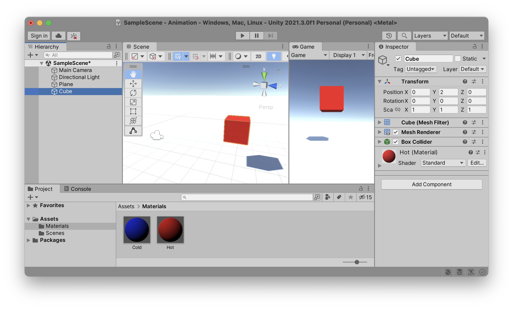

Place a cube in your scene and give it a color to make it easily identifiable. Now let's create an `animation clip` and attach it to this cube. But before we do so, let's create a new (green: Animations) folder (capital `A`, plural `s` at the end) inside our `Assets` folder in the `Project` window. We will save all our files related to animation in here.

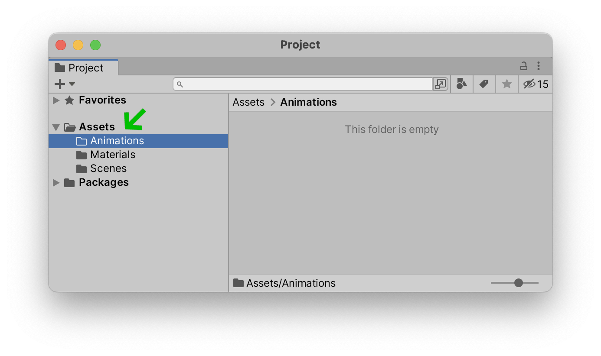

Let's now open two new windows and attach them to our Unity editor. Open up both the `Window` > `Animation` > (orange: Animation) and the `Window` > `Animation` > (blue: Animator) windows and attach them to our editor.

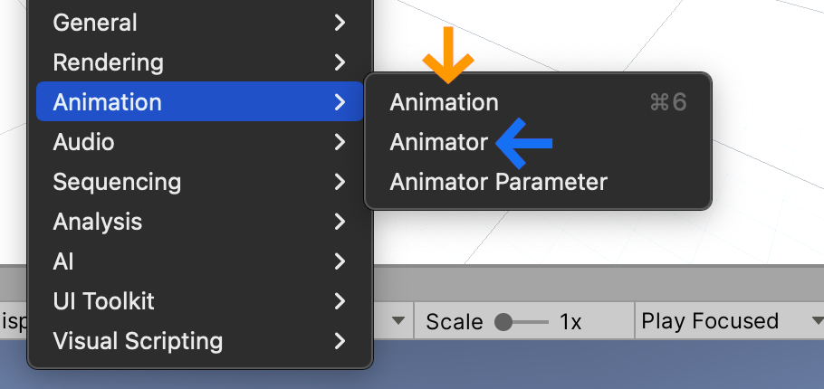

This is how I have configured my setup but you can set it up however you like.

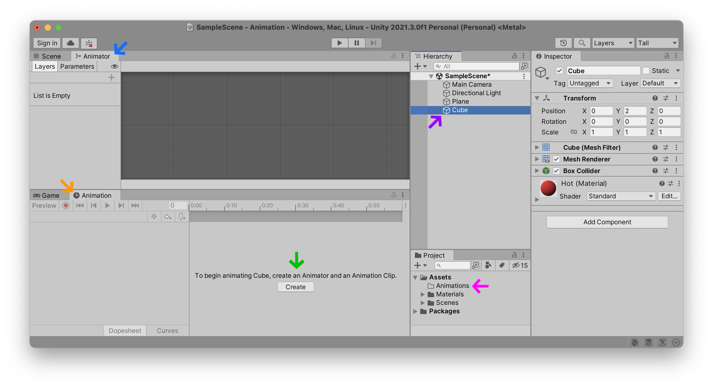

As you can see, I have docked my (blue: Animator) window next to the `Scene` window tab, and (orange: Animation) next to my `Game` window tab. This configuration allows me to look at the `Scene` while ajusting (orange: Animation) values, and then observe which (blue: Animator) sequence is playing when my `Game` is active in that window. Again, these are just preferences, and you can configure it however you like.

As you can see in the above illustration, by selecting the (purple: Cube) game object in our `Hierarchy`, the Unity editor will explain that it can create an `Animation Clip` and an `Animator` of that clip for you by clicking on one single (green: Create) button. This is very handy, so go ahead and do that, making sure to save your files in the (fuchsia: Animations) folder in your `Project`. I have decided to call the name of my animation "(pink: Spin.anim)".

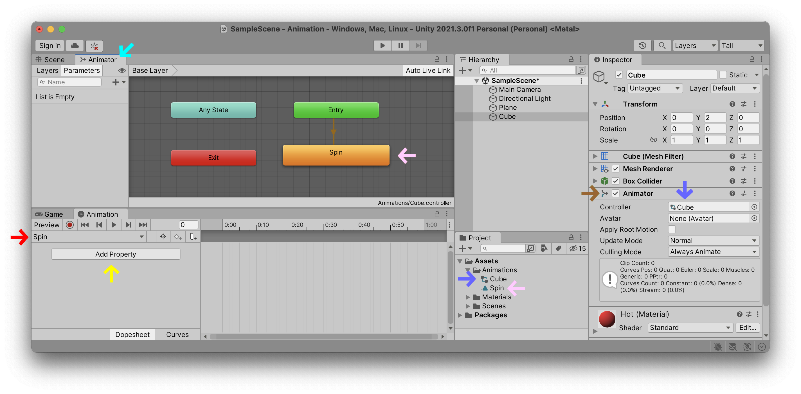

<<<<<<< HEAD
When you click that button, the Unity editor does a lot of complex things for you to make your life easier. Take a look at all the things it just connected up. Inside your `Assets` folder you should now see two files: one with the name you gave your new (pink: Animation Clip) and the other the name of the game object you had selected when you pushed the 'Create' button. This second file is the (blueish: Animation Controller) which will list all the possible animation clips your `Game Object` can play. The clip has also automatically been added to a new game object component that you should now see on your `Cube` game object, entitled (brown: Animator). Look inside the `Inspector` window and you should see this new relationship. If you keep your `Cube` selected and open the (cyan: Animator) window, you will also see that Unity has automatically added your new (pink: Spin.anim) clip to the `Cube.controller` file and has been setup as your default animation that will automatically start playing upon `Entry` into the game. And finally, with your `Cube` still selected you should see that the `Animation` is waiting for you to begin animating the various (yellow: Properties) of your (red: Spin) animation.
=======
When you click that button, the Unity editor does a lot of complex things for you to make your life easier. Take a look at all the things it just connected up. Inside your `Assets` folder you should now see two files: one with the name you gave your new (highlight:pink text:`Animation Clip`) and the other the name of the game object you had selected when you pushed the 'Create' button. This second file is the (highlight:blueish text:`Animation Controller`) which will list all the possible animation clips your `Game Object` can play. The clip has also automatically been added to a new game object component that you should now see on your `Cube` game object, entitled (highlight:brown text:`Animator`). Look inside the `Inspector` window and you should see this new relationship. If you keep your `Cube` selected and open the (cyan: Animator) window, you will also see that Unity has automatically added your new (highlight:pink text:`Spin.anim`) clip to the `Cube.controller` file and has been setup as your default animation that will automatically start playing upon `Entry` into the game. And finally, with your `Cube` still selected you should see that the `Animation` is waiting for you to begin animating the various (yellow: Properties) of your (highlight:red text:`Spin`) animation.
>>>>>>> 36299d3

That's a whole lot of connections and relations all simplified into one single button. Since you are probably beginning with Unity, this means that there are a lot of things that you probably don't understand with all of these windows, files, components and objects. Further in this tutorial, we will attempt to break down the meaning of each of these animations components.

### Animate Property
Before we explain all these relationships, let's just animate one of the properties of our cube. Make sure your Cube is selected in the hierarchy, and that the "Spin" animation clip is selected in the `Animation` window's top left corner, just underneath the `Preview` button. Now select which `Property`, or properties, you wish to animate. Here I have decided to animate the cube's (fuchsia: Transform) > (fuchsia: Rotation).

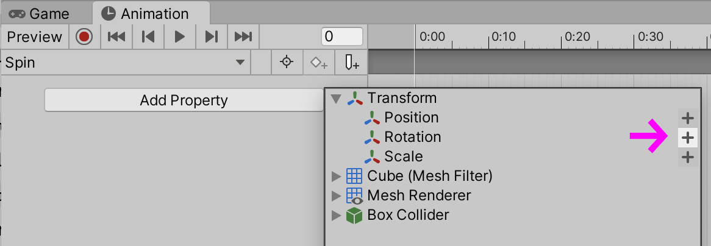

Note that all of the various components inside of your game object can be animated using this `Animation` window.

### Modify Keyframes
As soon as we have added a property to animate, the `Animation` window automatically adds a `begin` and an `end` keyframe for each of the possible values we can animate. By clicking the arrows in this window we can the white (orange: Timeline) cursor to the exact moment in time of each of these keyframes. We can then enter the exact values we wish into this window, modify the game object directly in the `Scene` or through its values in the (purple: Inspector). 

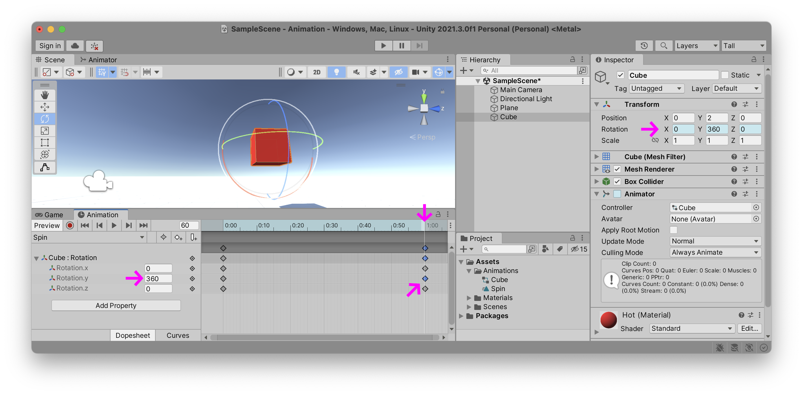

In the above example you can see that I have moved the time cursor to the final keyframe of my (orange: Animation Clip), and modified the (green: Y) axis rotation to the value of (green: 360)°. If you rewind the time cursor to the beginning of my clip, the `Y` rotation value began at `0`°, meaning that all of the intermediary frames will be *interpolations* between these two values, depending on where the time cursor is inside of the animation clip. Also note that the lozenge-shaped (fuchsia: Keyframe) values (and parent values) that I have *changed* at that specific point in time have been colored blue.

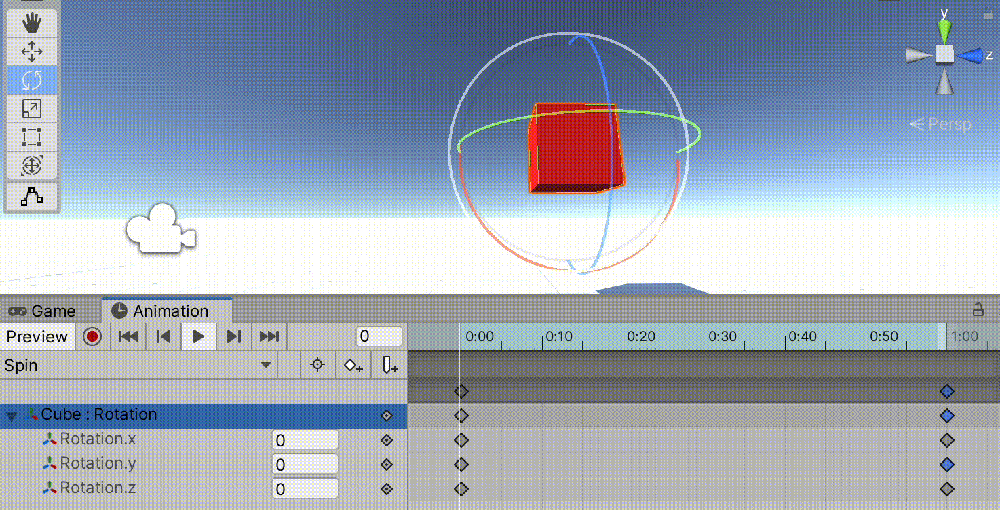

### Curves
You can temporarily preview the animation by pressing the triangle `Play` button inside the `Animation` window. This will play your animation in a loop. As you may notice, the animation speeds up and slows down, at each of the keyframe extremities. This is because the (blue: Curves) of your animation are configured to smooth out the transitions around each keyframe. Let's look for an moment at these curves of our animation.

> *Pro-tip: if you don't see the entire curve of your animation, try expanding the (purple: vertical scrollbar) to fill the entire window. Each extremity of this bar can be stretched and shrunk and allows you to focus in on various parts of your curves.*

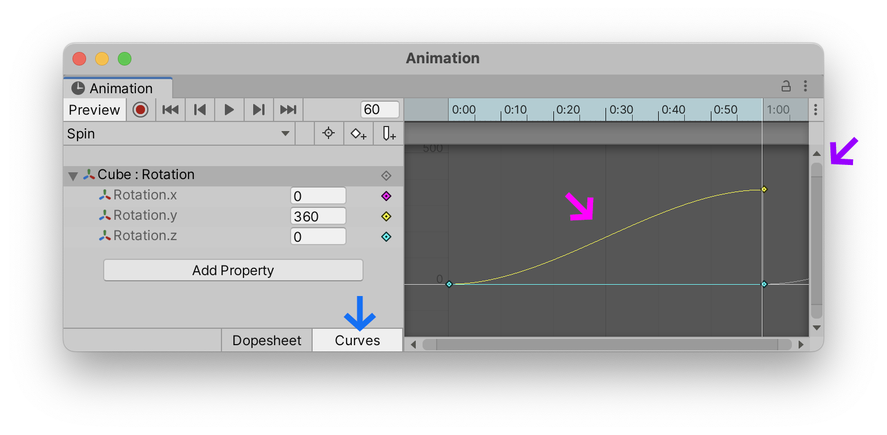

In traditional animation, this *speed-up* effect at the beginning and *slow-down* effect at the end is called (fuchsia: ease-in ease-out). It is a famous principle that is now activated by default in most keyframe-based software. It was popularized as rule #6 of the [12 Basic Principles of Animation](https://en.wikipedia.org/wiki/Twelve_basic_principles_of_animation) in the 1981 book "The Illusion of Life: Disney Animation" which chronicles animator practices at Disney Studios dating all the way back to the 1930s.

(youtube: yiGY0qiy8fY?t=69)

If you want a more robotic, linear rotation movement, select the specific (green: Property) you want to fix (here I am adjusting the `Rotation.y` value), select the (blue: Curves) button at the bottom of the `Animation` window, and set each of your  (orange: Keyframe) sides (`left` side, `right` side or `both`, depending on the keyframe position) to (red: Linear). To see this option, you need to right-click on the keyframe.

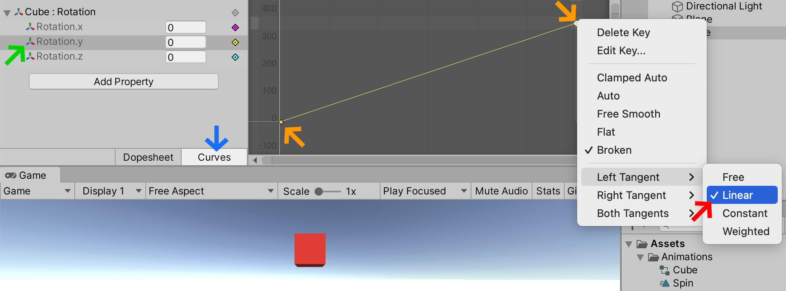

One you are happy with the rotation of your cube you can stop the temporary playback within the `Animation` window and press the `Play` button at the top of the Unity editor itself. This will start your game, and play and and all of the configured animations.

### Animation System
In the early days, Unity started with a very simple animation system that was easy to understand, but severely limited. You could easily create animations using keyframes in the `Animation` window, and then place an animation selector on your game object to switch between animations, for example `Run`, `Jump`, `Idle`, `Swim`, etc. This `Animation` keyframe editor is still the same, but the it has now been integrated into a far more sophisticated system that allows for more elegant transitions between various animation states.

Here are a few key points to define when trying to explain how the Unity animation system works as a whole:

- To animate in Unity, you need to have some `Game Object` properties to animate. Make sure you have selected the right `Game Object` in the `Heirarchy` before starting to animate it.
- An `Animation Clip` is a sequence of keyframes. It is a bit like a song waiting to be played. This `Clip` describes the various keyframe values of the game objet's properties, and how they are modified over time. It is linear, but can be played in a loop and is often designed to loop seemlessly.
- An `Animator` keeps clips organised, and can start and stop them whenever necessary. In this way it acts a bit like a jukebox that can play any one of the clips whenever requested. This `Animator` is a component of a `Game Object`. To access it, select a game object and look in the `Inspector`.
- An `Animation Controller` is the actual list of songs waiting to be played by the `Animator`. It is loaded into the `Animator` along with all the `Clips`. If the `Animator` is like a jukebox, the `Animation Controller` is like its playlist. This `Controller` tells the `Animator` which clip to play, and when. If you wish to modify this playlist, select the `Animation Controller` file in the `Project` window and open the `Animator` window. You will see the contents of this playlist and can start modifying it.

### Animations and the Animator
<<<<<<< HEAD
To further simplify this relationship, the most important thing to understand is that there are (orange: Animations) containing keyframes, and then there is an (blue: Animator) with its (fuchsia: Controller) that contains the list of which of these (yellow: Animations) to play and when. This is why there are a two separate windows.

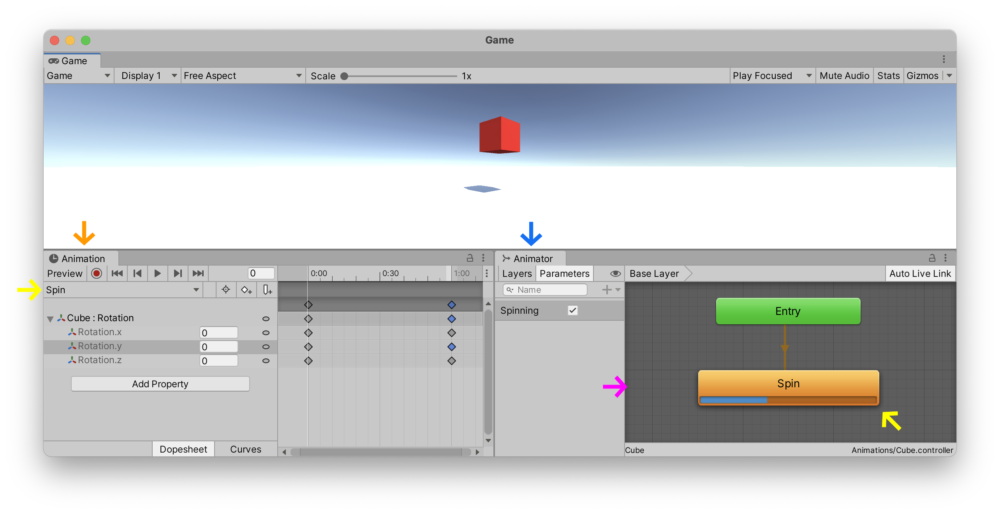

So (orange: Animation) is like a song, the (fuchsia: Controller) is like a playlist, and the (blue: Animator) behaves like its jukebox. Even if you only have one song in your playlist, you still need a jukebox to play it. Later on in a future tutorial we will explore controllers with multiple (yellow: Animation Clips) that can easily switch in real-time between animations, sometimes based on a fairly complex visual diagram of conditions.
=======
To further simplify this relationship, the most important thing to understand is that there are (highlight:orange text:`Animations`) containing keyframes, and then there is an (highlight:blue text:`Animator`) with its (highlight:fuchsia text:`Controller`) that contains the list of which of these (yellow: Animations) to play and when. This is why there are a two separate windows.

So (highlight:orange text:`Animation`) is like a song, the (highlight:fuchsia text:`Controller`) is like a playlist, and the (highlight:blue text:`Animator`) behaves like its jukebox. Even if you only have one song in your playlist, you still need a jukebox to play it. Later on in a future tutorial we will explore controllers with multiple (yellow: Animation Clips) that can easily switch in real-time between animations, sometimes based on a fairly complex visual diagram of conditions.
>>>>>>> 36299d3

(youtube: 3mIwTWGOMY0)