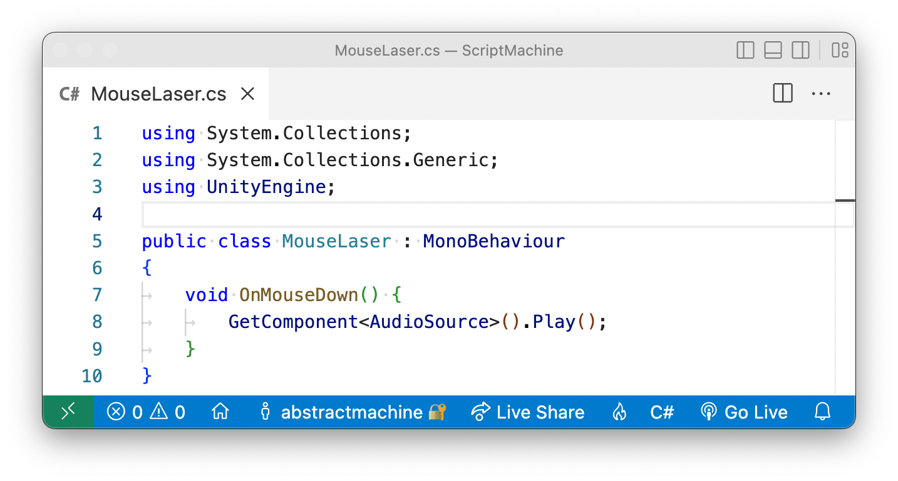
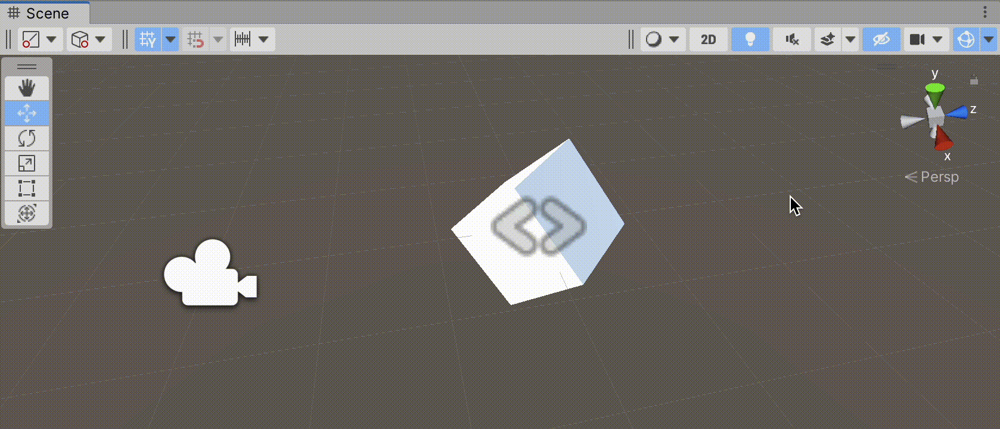

Let's add interactivity. Our world is animated, but these animations are predetermined. We can move our disembodied head around inside of it, with a full 360° view, but moving your head around isn't all that much interactivity.

So let's move beyond predetermined animations and make our world react in real-time to events, as well as teach this world to react to us as we interact with it. To do this, we need to create behaviors for our world: our world has to act, react, and interact with its various elements, as well as with the player moving and acting inside of it. These *behaviors* are called `Scripts`.


### Scripts
The use of the word `Script` should be no surprise to you. Unity uses language inherited from cinema to describe its universe: there are `Scenes` with a `Camera` on a `Stage` that shows us objects made visible by `Lights`. So it should come as no surprise to learn that actors in this world would have `Scripts` attached to them that tell them how to behave. In fact, everything that you see in the heirarchy — yes, *everything*! — can have a specialized `Script` attached to it. For example, a `Camera` can have a script telling it to follow a player's gaze as they move their head around: the (tutorial:XR Rig link:unity-vr?lesson=3) is an example of just such a script. A `Light` can have a script telling it to change the angle of the sunlight throughout the day. And a `Game Object` can have a `Script` — even *multiple* scripts — telling it how to behave based on how we interact with the game.

### Programming
These *behaviors*, these `Scripts` are also known under another name that unfortunately scares people: these behaviors can also be called "programs". *Ah, programming — that vast infamous universe, always just outside of your reach*. Let's be clear: programming is cool, programming is even (lexicon:fun). But let's also be honest: people are often scared of it — often rightfully so, because many programming languages are needlessly obtuse. If you try to follow a programming tutorial on the Internet or some random YouTube channel, you often find yourself quickly sinking into a verbose soup of overly complicated terminology. Hopefully not here. Let's see if we can keep it simple.

So *deep breaths*. Yes, we are going to enter the world of *the scary monster known as programming*. And yes we can definitely slay this monster.

### Visual Scripts | C# Scripts
There are two principle types of "scripts" used in Unity: `Visual Scripts` and `C# Scripts`. As its name suggests, `Visual Scripts` are scripts that you layout visually, by connecting up visual diagrams of blocks, otherwise known as *nodes* or *units*. These visual `Script Nodes` are fairly new to Unity, and were added by default starting with `Unity 2021.1`. These scripts are fairly easy to learn once you know the basics of how they work.


The above "visual" script reacts to mouse clicks on a specific `Game Object` and plays an `AudioSource`, also placed on that `GameObject`. If you look inside the `Inspector` of the `Cube`, you will see a `LaserShoot` sound attached to its `AudioSource`. So when I click on the cube, the script attached to that cube detects this *mouse-just-clicked-on-me* `Event` (`OnMouseDown`) and subsequently plays the `LaserShoot` sound. And finally, when I click outside of the cube, nothing happens because there are no scripts attached to the background.

By following the diagram and its arrow we see a very simple *cause and effect* chain of consequence: *when* (`On`) *the* `Mouse` *clicks* `Down` on `This` object → `Play` the *sound* (`AudioSource`). As you can see in the illustration, one of the advantages of visual scripts is that they animate this behavior inside the Unity Editor while the game plays, allowing you to better understand how the script reacts to the mouse.

The other, more traditional method for creating behavior in Unity is by writing out `C#` scripts (pronounced *"see sharp"*) using code. These scripts are harder to learn, and are the principle type of scripts you will find on the Internet — including a whole plethora of overly complicated scripts that will needlessly confuse beginners.

Here is the exact same behavior as before, only written out using `C#` code:



As you can see from the above illustration, this second example written in `C#` is a lot more complex, with all sorts of complicated terms such as `using System.Collections;` or `public class MouseLaser : MonoBehavior` or `void`. There are a gazillion brackets, periods, and semicolons. [And what the #@%$ is the meaning here of the word void](https://marktconard.com/2014/05/07/nietzsche-and-the-importance-of-translation/)!?

Indeed, this is the difficulty of learning `C#` when you are a beginner: you will have to get used to a lot of terminology. That said, in the above example, Unity actually wrote most of the code for me automatically so it wasn't really all that hard. I only wrote the actual *behavior* part of the script, which is the middle part:

```
void OnMouseDown()
{
	GetComponent<AudioSource>().Play();
}
```

Even if you don't know how to read code, this `C# Script` should still be somewhat readable to you: *when the player clicks down on this object, get that object's* `AudioSource` *component* (cf. `Inspector`) *and play the sound*. For some people (myself included), `C#` scripts are actually *easier* to read, and can often require less effort. There are trade-offs for either approach, and we will avoid wading into the endless (and pointless) debate here over which is "better". Each approach has its advantage.

We will not be using `C#` scripts for this tutorial. There are plenty of `C#` tutorials on the Internet. Instead we will be using the easier-to-learn method of "visual scripting", in order to reduce complexity down to its bare minimum. But once you have mastered the basics of this visual approach, you will have also learned a lot of the fundamentals that will help you to learn `C# Scripts`.

### New Project
Let's start with a new (highlight:fuchsia text:`Core 3D`) empty project. I called mine (highlight:orange text:`ScriptMachine`) but you can call it whatever you like. I am using (highlight:green text:`Unity 2021.3`) on a Mac with `Apple Silicon`. I will purposefully keep this tutorial fairly general, so hopefully these instructions will work over several versions without need for an update. Unfortunately Unity is always a moving target for tutorials. Whatever the case, you will need at least `Unity 2021.1` (or later) for `Visual Scripts` to be included by default.


Once your Unity project has loaded, create two new folders `Materials` and `Scripts` inside your project folder. Note the capital `M`, the capital `S` and the plural `s` and the end of these folders. This is a Unity naming convention that will help you keep your `Project` folder organised.

Inside your `Materials` folder, (highlight:red text:`create`) two new `Materials` with two colors. I've called my colors `Hot` and `Cold`, but you can call them whatever you want and give them whatever color you want.


Now create a standard Cube in your scene via `Hierarchy` → (highlight:purple text:`+`) → `3D Object` → `Cube`. Note that I've not only rotated it (highlight:yellow text:`45°`) on the (highlight:yellow text:`X`) and (highlight:yellow text:`Y`) axes, but I have also brought the main (highlight:brown text:`Camera`) closer on the `Z` axis position (`-3`). I am leaving the `Default-Material` on this `Cube`: we will see how to change this material in a moment, through scripts.


### Script Machine
Our scene is ready. Select the `Cube`. Press `Add Component` and find `Visual Scripts` → `Script Machine` component inside of that list. Select it to add it to your `Cube`.


A `Script Machine` is a component that attaches "visual" instructions to your `Cube`. This `Script Graph` is the visual diagram of how the object should behave and how it should react to us and to the world.

Note: the `Script Machine` is not the script itself, but instead the `Machine` that executes the `Script`'s instructions. While this distinction might be a little overkill, I mention it nevertheless to clarify what Unity means by `Script Machine`.

In the above example, you can also see that all `Script Machines` automatically add a `Variables` component to your `Cube`. This is perfectly normal: `Scripts` often require special values, called `Variables`, as we will see in a later tutorial. The `Script Machine` merely anticipates this future need and automatically adds this `Variables` component for you so as to avoid any future errors.

You might also notice that in your `Scene` view, your `Cube` has a new icon `<>` layered on top. This indicates that the `Cube` contains this new `Variables` component. If you find this distracting, you can hide or show it in the `Scene`'s `Gizmos` options.



Ok, we have a `Cube` and a `Script Machine` ready to execute a script but it doesn't really do anything. Great. So what?

### Script Graph
Indeed, so what. We need to create an actual set of instructions. We need to create a `Script` for this `Script Machine` to do something to our `Cube`. Let's do that now. The fastest way to add a `Script` to your `Script Machine` is to select the `Source` → `Embed` option and click on `Edit Graph`. This should open up your first `Script Graph` with two `Script Nodes` already added for you by default: `On Update` and `On Start`.
