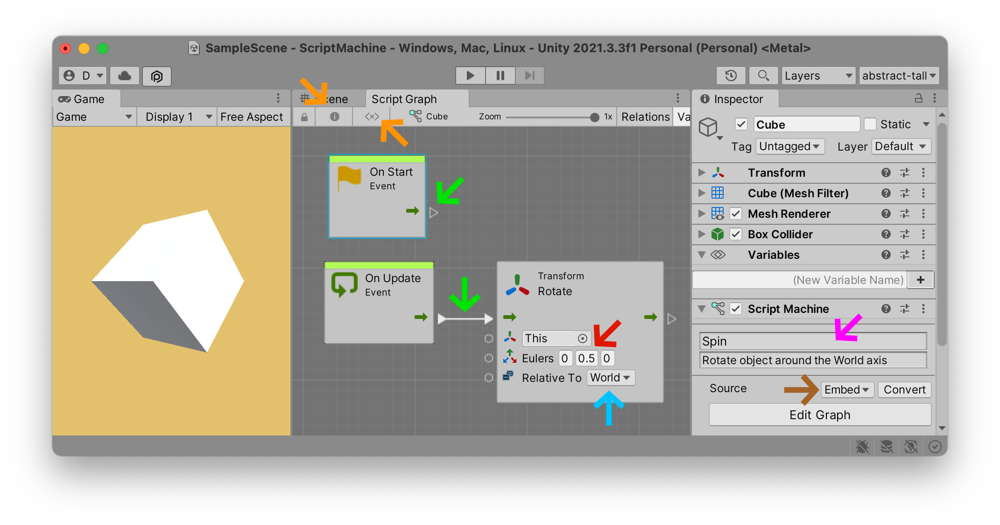
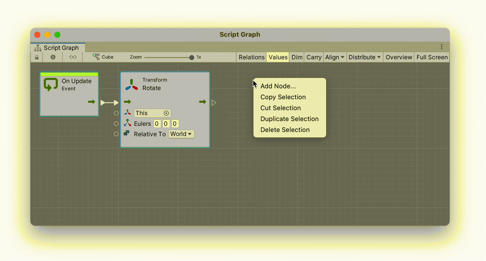
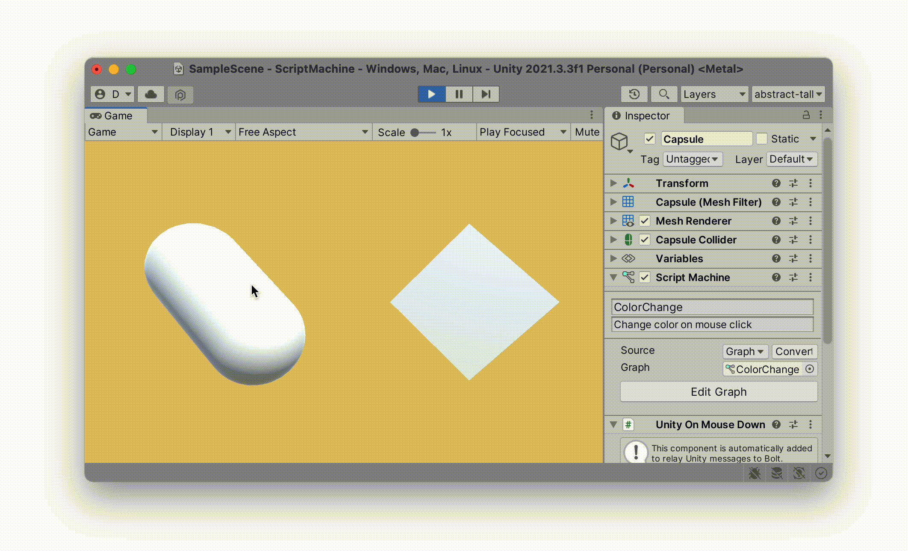

Ajoutons l'interactivité. Notre monde est animé, mais ces animations sont prédéterminées. Nous pouvons déplacer notre tête désincarnée à l'intérieur, avec une vue complète à 360 °, mais bouger la tête n'est pas tellement interactif.

Allons donc au-delà des animations prédéterminées et faisons réagir notre monde en temps réel aux événements, et apprenons à ce monde à réagir lorsque nous interagissons avec lui. Pour ce faire, nous devons créer des comportements pour notre monde : notre monde doit agir, réagir et interagir avec ses différents éléments, ainsi qu'avec le joueur qui se déplace et agit à l'intérieur de celui-ci. Ces *comportements* sont appelés `Scripts`.


### Scripts
L'utilisation du mot "Script" en anglais ne devrait pas vous surprendre. Unity utilise un langage hérité du cinéma pour décrire son univers : il y a des `Scenes` avec une `Camera` sur une `Stage` qui nous montre des objets rendus visibles par des `Lights`. Il ne devrait donc pas être surprenant d'apprendre que les acteurs de ce monde auraient des "scripts" attachés à eux qui leur disent comment se comporter. En fait, tout ce que vous voyez dans la hiérarchie — oui, *tout* ! — peut être associé à un "script" spécialisé. Par exemple, une `caméra` peut avoir un script lui disant de suivre le regard d'un joueur lorsqu'il bouge sa tête : le (tutorial:XR Rig link:unity-vr?lesson=3) est un exemple d'un tel script. Une "lumière" peut avoir un script lui disant de changer l'angle de la lumière du soleil tout au long de la journée. Et un `Game Object` peut avoir un `Script` - même * plusieurs * scripts - lui indiquant comment se comporter en fonction de la façon dont nous interagissons avec le jeu.

### Programmation
Ces *comportements*, ces `Scripts` sont aussi connus sous un autre nom qui fait malheureusement peur aux gens : ces comportements peuvent aussi être appelés "programmes". *Ah, la programmation - ce vaste univers infâme, toujours juste hors de votre portée*. Soyons clairs : programmer c'est cool, programmer c'est encore (lexicon:fun). Mais soyons aussi honnêtes: les gens en ont souvent peur, souvent à juste titre, car de nombreux langages de programmation sont inutilement obtus. Si vous essayez de suivre un didacticiel de programmation sur Internet ou sur une chaîne YouTube au hasard, vous vous retrouvez souvent rapidement plongé dans une soupe verbeuse de terminologie trop compliquée. J'espère pas ici. Voyons si nous pouvons faire simple.

Alors *respirez profondément*. Oui, nous allons entrer dans le monde du *monstre effrayant connu sous le nom de programmation*. Et oui, nous pouvons certainement tuer ce monstre.

### Scripts visuels | Scripts C# 
Il existe deux principaux types de "scripts" utilisés dans Unity : les `Visual Scripts` et les `C# Scripts`. Comme son nom l'indique, les "scripts visuels" sont des scripts que vous agencez visuellement, en connectant des diagrammes visuels de blocs, autrement appelés *nœuds* ou *unités*. Ces  nœuds de `Visual Scripts` sont relativement nouveaux dans Unity et ont été ajoutés par défaut à partir de `Unity 2021.1`. Ces scripts sont assez faciles à apprendre une fois que vous connaissez les bases de leur fonctionnement.


Le script "visuel" ci-dessus réagit aux clics de souris sur un `Game Object` spécifique et lit une `AudioSource`, également placée sur ce `GameObject`. Si vous regardez à l'intérieur de l'`Inspector` du `Cube`, vous verrez un son `LaserShoot` attaché à son `AudioSource`. Ainsi, lorsque je clique sur le cube, le script attaché à ce cube détecte cet "événement" *la-souris-vient-de-me-cliquer-dessus* (`OnMouseDown`) et joue ensuite le son `LaserShoot`. Et enfin, lorsque je clique en dehors du cube, rien ne se passe car il n'y a pas de scripts attachés à l'arrière-plan.

En suivant le diagramme et sa flèche, nous voyons une chaîne de conséquences très simple *de cause à effet* : *quand* (`On`) *la sours* (`Mouse`) *clique* (`Down`) sur cet objet (`This`) → *joue* (`Play`) le *son* (`AudioSource`). Comme vous pouvez le voir sur l'illustration, l'un des avantages des scripts visuels est qu'ils animent ce comportement dans l'éditeur Unity pendant le jeu, ce qui vous permet de mieux comprendre comment le script réagit à la souris.

L'autre méthode, plus traditionnelle, pour créer un comportement dans Unity consiste à écrire des scripts `C#` (prononcé *« see sharp »*) à l'aide de code. Ces scripts sont plus difficiles à apprendre et constituent le principal type de scripts que vous trouverez sur Internet, y compris toute une pléthore de scripts trop compliqués qui confondront inutilement les débutants.

Voici exactement le même comportement qu'avant, uniquement écrit en utilisant le code `C#` :


Comme vous pouvez le voir sur l'illustration ci-dessus, ce deuxième exemple écrit en `C#` est beaucoup plus complexe, avec toutes sortes de termes compliqués tels que `using System.Collections;` ou `public class MouseLaser : MonoBehavior` ou `void` . Il y a un million de parenthèses, de points et de points-virgules. [Et quelle est la #@%$ signification ici du mot vide](https://marktconard.com/2014/05/07/nietzsche-and-the-importance-of-translation/) !?

En effet, c'est toute la difficulté d'apprendre le `C#` quand on est débutant : il va falloir s'habituer à beaucoup de terminologie. Cela dit, dans l'exemple ci-dessus, Unity a en fait écrit automatiquement la majeure partie du code pour moi, donc ce n'était pas vraiment si difficile. J'ai seulement écrit la partie *comportement* réelle du script, qui est la partie centrale :

```
void OnMouseDown()
{
	GetComponent<AudioSource>().Play();
}
```

Même si vous ne savez pas comment lire le code, ce `Script C#` devrait quand même être quelque peu lisible pour vous : *lorsque le lecteur clique sur cet objet, obtenez le *composant* `AudioSource` de cet objet* (cf. `Inspector `) *et jouer le son*. Pour certaines personnes (moi y compris), les scripts `C#` sont en fait *plus faciles* à lire et peuvent souvent nécessiter moins d'efforts. Il y a des compromis pour l'une ou l'autre approche, et nous éviterons de nous perdre dans le débat sans fin (et inutile) ici sur ce qui est "meilleur". Chaque approche a son avantage.

Nous n'utiliserons pas de scripts `C #` pour ce didacticiel. Il existe de nombreux tutoriels `C#` sur Internet. Au lieu de cela, nous utiliserons la méthode plus facile à apprendre du "script visuel", afin de réduire la complexité à son strict minimum. Mais une fois que vous aurez maîtrisé les bases de cette approche visuelle, vous aurez également appris beaucoup de principes fondamentaux qui vous aideront à apprendre les scripts `C#`.

### Programmation visuelle
Si vous avez expérimenté des logiciels interactifs, ce concept de "script visuel" peut vous sembler familier. Il existe une longue histoire d'outils de performance interactifs et en temps réel qui utilisent une approche de programmation basée sur des nœuds similaire ; cf. [TouchDesigner](https://derivative.ca), [vvvv](https://vvvv.org), [Unreal](https://docs.unrealengine.com/5.0/en-US/blueprints-visual-scripting-in-unreal-engine/), [Max](https://cycling74.com/products/max) ou [PureData](http://puredata.info). Il existe de nombreux outils pédagogiques de script visuel tels que [Scratch](https://scratch.mit.edu/projects/editor/?tutorial=getStarted) qui peuvent également être utilisés comme moteurs de jeu — ceux-ci sont souvent spécifiquement préférés par débutants précisément parce qu'ils ne nécessitent pas d'apprendre à coder : [Construct](https://scratch.mit.edu/projects/editor/?tutorial=getStarted), [GB Studio](https://www.gbstudio.dev ), et [Godot](https://docs.godotengine.org/en/stable/tutorials/scripting/visual_script/getting_started.html) sont d'autres outils populaires utilisés pour créer des jeux. Il semble également qu'à chaque fois que je recherche des outils de réalité virtuelle, un million de nouvelles solutions de script visuel apparaissent ; un exemple récent est [Patches](https://patches.vizor.io).

(youtube:gMntf6PmGCg)

Des logiciels de modélisation 3D tels que [Blender](https://blender./org) ont progressivement ajouté des [Nodes](https://docs.blender.org/manual/en/3.0/interface/controls/nodes/introduction.html) à ses différents outils (cf. [Blender Geometry and Material Nodes](https://www.youtube.com/watch?v=DlwII4kBMr8)), et des logiciels de CAO 3D comme [Rhino](https://www.rhino3d.com) utilise depuis longtemps des nœuds via le plugin [Grasshopper](https://www.grasshopper3d.com) pour concevoir [l'architecture paramétrique](https://www.youtube.com/watch?v=Pe1UP4U3RGI). Il existe même des outils de développement Web tels que [Nodes.io](https://nodes.io) pour créer des scripts visuels de projets JavaScript. Et dans Unity lui-même, il existe maintenant plusieurs outils basés sur des nœuds similaires à ce système de nœuds « Visual Script »: cf. [Shader Graph](https://unity.com/fr/features/shader-graph), [Visual Effect Graph](https://unity.com/fr/visual-effect-graph), et [Animator]( https://docs.unity3d.com/Manual/class-Animator.html).

### Nouveau projet
Allons-y. Créons un `Visual Script`. Nous allons commencer avec un nouveau projet vide (highlight:fuchsia text:`Core 3D`). J'ai appelé le mien (highlight:orange text:`ScriptMachine`) mais vous pouvez l'appeler comme vous voulez. J'utilise (highlight:green text:`Unity 2021.3`) sur un Mac avec un processeur `Apple Silicon`. Je vais délibérément garder ce didacticiel assez général, donc j'espère que ces instructions fonctionneront sur plusieurs versions sans avoir besoin d'une mise à jour. Malheureusement, Unity est toujours une cible mouvante pour les tutoriels. Dans tous les cas, vous aurez besoin d'au moins `Unity 2021.1` (ou version ultérieure) pour que `Visual Scripts` soit inclus par défaut.


Créez maintenant un cube standard dans votre scène via `Hiérarchie` → (highlight:purple text:` + `) → `Objet 3D` → `Cube`. Notez que je l'ai fait pivoter (highlight:yellow text:`45°`) sur les axes (highlight:yellow text:`X`) et (highlight:yellow text:`Y`). Vous ne pouvez pas le voir ici, mais j'ai également rapproché le principal (highlight:brown text:`Camera`) sur l'axe `Z` en changeant sa valeur `Z` en `-3`.


Pour l'instant, je quitte le `Cube`'s (highlight:blue text:`Default-Material`): nous verrons comment modifier ce matériau dans un instant, via des scripts.

### Script intégré
Si nous appuyons sur le bouton `Play` maintenant, notre `Cube` ne fera rien. Changeons cela. Ajoutons un `Script` et voyons à quelle vitesse nous arrivons à lui faire faire quelque chose. Sélectionnez le "Cube". Appuyez sur (highlight:red text:`Add Component`) et recherchez le composant `Visual Scripts` → `Script Machine` dans cette liste. Sélectionnez-le afin de l'ajouter à votre `Cube`.

Cette `Script Machine` n'est pas le script lui-même, mais plutôt la `Machine` qui exécute les instructions du `Script`. Considérez la `Script Machine` comme le cerveau : elle a toujours besoin d'un `Script` pour lui dire comment penser et quoi faire. Le moyen le plus rapide d'ajouter un `Script` réel à cette `Script Machine` est de sélectionner l'option `Source` : `Embed` et de cliquer sur `Edit Graph`. Cela devrait ouvrir votre premier `Script Graph` avec deux `Script Nodes` déjà ajoutés pour vous par défaut : `On Update` et `On Start`. Ce `Script Graph` est le diagramme visuel du comportement de votre objet.


Comme vous pouvez le voir sur l'illustration ci-dessus, avec les scripts (highlight:brown text:`Embed`), vous pouvez assez rapidement appliquer des comportement sur vos `Game Objects` dans Unity. Vous pouvez même faire glisser les composants que vous souhaitez contrôler directement dans la fenêtre et Unity vous donnera une liste de toutes les actions, options et valeurs pouvant être manipulées sur ce composant. Ici, j'ai fait glisser le composant `Transform` et Unity m'a donné la liste de toutes les différentes façons dont je peux tourner (`Rotate(...)`) mon objet `Cube`. J'ai opté pour la version de `Rotate` qui utilise la notation (highlight:mud text:`Eulers`): ce qui signifie que j'ai pu définir la direction et la vitesse de ma rotation dans (highlight:mud text:`X`), (highlight :mud text:`Y`), et (highlight:mud text:`Z`) degrés. J'ai également choisi l'option (highlight:sky text:`Relative To`), ce qui signifie que j'ai déterminé si la rotation avait lieu par rapport au monde ((highlight:sky text:`World`)), ou par rapport à l'orientation actuelle de l'objet lui-même (c'est-à-dire (highlight:sky text:`Self`)).



Notez que pour garder mon interface propre, j'ai caché les fenêtres (highlight:orange text:`Variables`) et (highlight:orange text:`Inspector`) à l'intérieur du graphique. Vous pouvez toujours les réactiver avec les deux boutons en haut à gauche de l'onglet (highlight: orange text: `Script Graph`). Je lui ai aussi donné un (highlight:fuchsia text:`nom`) et une (highlight:fuchsia text:`description`) courte pour que je puisse me rappeler plus tard dans mon projet ce que j'essayais de faire.

### Couler
Comme vous pouvez le voir dans l'illustration ci-dessus, il y a une (highlight:green text: `connexion sortante`) partant de la flèche verte sur `On Update` et qui (highlight:green text: `rentre`) dans la flèche verte du nœud `Transform Rotation`. Il y a aussi une flèche verte similaire, prête à (highlight:green text: `sortir`) du nœud `On Start`, mais rien n'y est connecté. En fait, vous pouvez entièrement supprimer ce nœud si vous n'allez pas connecter son *flux* à quoi que ce soit.

Chaque fois que vous voyez une flèche verte comme celle-ci, cela représente le « flux » du `Script Graph`. Il peut y avoir de nombreux flux différents. Ces "flux" sont les moments réels où quelque chose s'actionne. « Flux (flow) » signifie ici « faire quelque chose maintenant » ou « faire quelque chose quand », selon le contexte. Dans d'autres environnements de programmation visuels comme [Max](https://cycling74.com/products/max) ou [PureData](http://puredata.info), cette flèche de flux s'appelle un « bang », c'est-à-dire « faites quelque chose maintenant », et se déclenche comme si quelqu'un venait d'appuyer sur la gâchette d'une arme à feu. Si vous appuyez sur le bouton "Play", Unity animera (approximativement) pour vous la nature constante de ce flux : le flux "On Update" s'écoulera à environ 60 images par seconde, tandis que le flux "On Start" ne s'activera qu'une seule fois, lorsque la `Script Machine` de cet objet apparaît dans la `Scene` pour la toute première fois, c'est-à-dire au « moment de départ » chaque fois que cet objet apparaît.

### Événement
Vous avez peut-être remarqué que nos deux *nœuds* par défaut sont appelés "Événements". Ces événements peuvent être "lorsque le jeu démarre", "lorsque quelqu'un clique sur cet objet", "lorsque le joueur appuie sur un bouton ou une touche", "lorsque cet objet entre en collision avec un autre objet", etc. L'une des principales différences entre Unity et les environnements de codage créatifs tels que (tutoriel:lien de traitement:stratifications) est que dans Unity, vous développerez souvent votre jeu en *réagissant* aux événements, au lieu de les *générer*. Dans [Processing](https://processing.org), vous construisez votre monde visuel à partir de zéro, en commençant par les formes les plus élémentaires, puis multipliez ces formes par mille, dix mille ou tout autre processus évolutif que vous souhaitez explorer. Dans Unity, vous avez tendance à construire votre monde, puis à attendre des événements auxquels vous pouvez ensuite réagir.

Ajoutons deux événements à notre `Cube` afin d'illustrer ce concept.



Dans l'exemple ci-dessus, j'ai sélectionné le `Script Graph` du `Cube`, cliqué avec le bouton droit de la souris sur l'arrière-plan pour ouvrir ce qu'on appelle le `Fuzzy Finder` et sélectionné dans cette liste les événements `On Mouse Down`, puis `On Mouse Up`. Chacun de ces nœuds enverra une impulsion à partir de leurs sorties vertes lorsque le joueur appuie sur * bas * et appuie sur * haut * sur notre `Cube`.

Changeons de matériaux pour rendre visible cette interaction.

Créez un nouveau dossier nommé (surbrillance : texte violet : "Matériaux") dans votre dossier "Projet". Notez le "M" majuscule et le "s" pluriel ainsi que la fin de ce dossier. Il s'agit d'une convention de dénomination Unity qui vous aidera à organiser votre dossier "Project".

Dans votre dossier (highlight:purple text:`Materials`), (highlight:red text:`create`) deux nouveaux `Materials` avec deux couleurs. J'ai appelé mes couleurs (highlight:yellow text:`Hot`) et (highlight:yellow text:`Cold`), mais vous pouvez les appeler comme vous voulez et leur donner (highlight:green text:`whatever color`) tu veux. Ces deux couleurs seront utilisées chaque fois que nous cliquons *vers le bas* ou *vers le haut* sur le `Cube` avec notre souris.


Comme vous pouvez le voir dans l'exemple ci-dessous, le composant à l'intérieur de notre `Cube` que nous voulons changer s'appelle le `Mesh Renderer`. Actuellement, le `Mesh Renderer` du `Cube` a le `Default-Material` répertorié comme son premier et unique `Material`. Cette valeur peut changer pendant la lecture de la scène. Nous pouvons le modifier via notre `Script Graph` chaque fois qu'un `Event` de souris a lieu de manière interactive.


Comme nous l'avons fait précédemment avec le composant `Transform`, cette fois, faites glisser le `Mesh Renderer` de l'`Inspector` de votre `Cube` directement dans votre `Script Graph`. Vous recevrez une liste de choix possibles. Celui que vous recherchez est `Set Material`. Dupliquez ce nœud de changement de "Matériel" et connectez chacun à leurs événements respectifs "On Mouse Down" et "On Mouse Up". Chacun de ces nœuds devrait temporairement virer à l'orange, car nous ne lui avons pas encore dit quel "matériau" utiliser. Faites donc glisser vos nouveaux `Materials` de votre fenêtre `Project` sur chacun des nœuds : dans mon exemple, j'ai défini le `Material` sur `Hot` lorsque vous cliquez *bas* sur la souris, et sur `Cold` lorsque vous cliquez vers le haut .

### ~~Embeded~~ vs Graph
Les `Embedded Script Graphs` sont bons pour prototyper rapidement des idées mais ce sont des choses fragiles : ils n'existent que sur ce seul `Game Object` et donc si vous supprimez ce `Cube` de la scène, votre `Script Graph` sera supprimé avec lui . Nous devrions vraiment enregistrer son graphique en tant qu'entité indépendante dans la fenêtre "Projet".

Pour ce faire, sélectionnez le composant `Script Machine` de votre `Cube` dans `Inspector` et appuyez sur le bouton (highlight:fuchsia text:`Convertir`). Cela convertira votre graphique en un `Script Graph` que vous pourrez enregistrer indépendamment dans votre dossier `Project`. J'ai créé un dossier (highlight:blue text:`Scripts`) et enregistré mon script converti dans ce dossier avec le nom (highlight:orange text:`ColorChange`).


Maintenant que mon script est indépendant de mon `Cube`, je peux créer un deuxième `Game Object` dans ma `Scene` `Hierarchy` et utiliser également ce même `Script Graph` dessus. Ici, j'ai créé un nouveau (highlight:green text:`Capsule`) dans la `Hierarchy` et y ai ajouté un composant (highlight:brown text:`Script Machine`). Il ne reste plus qu'à (highlight:mud text:`drag`) mon script converti (highlight:mud text:`ColorChange`) dans ce composant. Notez que mon (highlight:purple text:`Source`) n'est plus listé dans `Embeded`, mais est maintenant listé comme (highlight:purple text:`Graph`).


Maintenant, lorsque j'appuie sur `Play`, le script s'applique aux deux `Game Objects`, mais indépendamment, grâce au mot-clé `This` qui permet à chaque objet de comprendre que les modifications de `Material` ne s'appliquent qu'à l'objet lui-même, indépendamment de l'autre .

