Let's add interactivity. Our world is animated, but these animations are predetermined. We can move our disembodied head around inside of it, with a full 360° view, but moving your head around isn't all that much interactivity.

So let's move beyond predetermined animations and make our world react in real-time to events, as well as teach this world to react to us as we interact with it. To do this, we need to create behaviors for our world: our world has to act, react, and interact with its various elements, as well as with the player moving and acting inside of it. These *behaviors* are called `Scripts`.

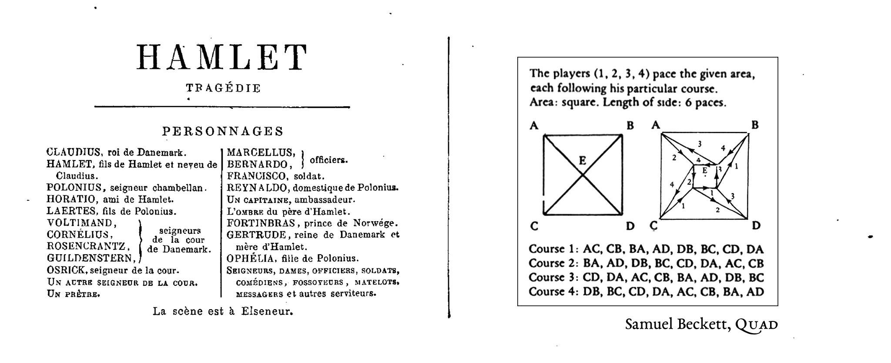

### Scripts
The use of the word `Script` should be no surprise to you. Unity uses language inherited from cinema to describe its universe: there are `Scenes` with a `Camera` on a `Stage` that shows us objects made visible by `Lights`. So it should come as no surprise to learn that actors in this world would have `Scripts` attached to them that tell them how to behave. In fact, everything that you see in the heirarchy — yes, *everything*! — can have a specialized `Script` attached to it. For example, a `Camera` can have a script telling it to follow a player's gaze as they move their head around: the (tutorial:XR Rig link:unity-vr?lesson=3) is an example of just such a script. A `Light` can have a script telling it to change the angle of the sunlight throughout the day. And a `Game Object` can have a `Script` — even *multiple* scripts — telling it how to behave based on how we interact with the game.
### Programming

These *behaviors*, these `Scripts` are also known under another name that unfortunately scares people: these behaviors can also be called "programs". *Ah, programming — that vast infamous universe, always just outside of your reach*. Let's be clear: programming is cool, programming is even (lexicon:fun). But let's also be honest: people are often scared of it — often rightfully so, because many programming languages are needlessly obtuse. If you try to follow a programming tutorial on the Internet or some random YouTube channel, you often find yourself quickly sinking into a verbose soup of overly complicated terminology. Hopefully not here. Let's see if we can keep it simple.

So *deep breaths*. Yes, we are going to enter the world of *the scary monster known as programming*. And yes we can definitely slay this monster.

### Visual Scripts | C# Scripts
There are two principle types of "scripts" used in Unity: `Visual Scripts` and `C# Scripts`. As its name suggests, `Visual Scripts` are scripts that you layout visually, by connecting up visual diagrams of blocks, otherwise known as *nodes* or *units*. These visual `Script Nodes` are fairly new to Unity, and were added by default starting with `Unity 2021.1`. These scripts are fairly easy to learn once you know the basics of how they work.

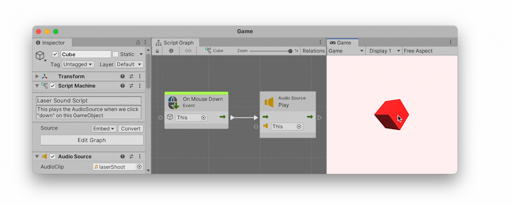

The above "visual" script reacts to mouse clicks on a specific `Game Object` and plays an `AudioSource`, also placed on that `GameObject`. If you look inside the `Inspector` of the `Cube`, you will see a `LaserShoot` sound attached to its `AudioSource`. So when I click on the cube, the script attached to that cube detects this *mouse-just-clicked-on-me* `Event` (`OnMouseDown`) and subsequently plays the `LaserShoot` sound. And finally, when I click outside of the cube, nothing happens because there are no scripts attached to the background.

By following the diagram and its arrow we see a very simple *cause and effect* chain of consequence: *when* (`On`) *the* `Mouse` *clicks* `Down` on `This` object → `Play` the *sound* (`AudioSource`). As you can see in the illustration, one of the advantages of visual scripts is that they animate this behavior inside the Unity Editor while the game plays, allowing you to better understand how the script reacts to the mouse.

The other, more traditional method for creating behavior in Unity is by writing out `C#` scripts (pronounced *"see sharp"*) using code. These scripts are harder to learn, and are the principle type of scripts you will find on the Internet — including a whole plethora of overly complicated scripts that will needlessly confuse beginners.

Here is the exact same behavior as before, only written out using `C#` code:

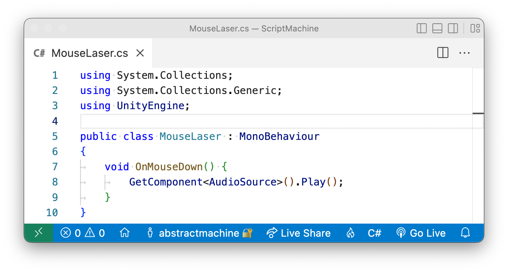

As you can see from the above illustration, this second example written in `C#` is a lot more complex, with all sorts of complicated terms such as `using System.Collections;` or `public class MouseLaser : MonoBehavior` or `void`. There are a gazillion brackets, periods, and semicolons. [And what the #@%$ is the meaning here of the word void](https://marktconard.com/2014/05/07/nietzsche-and-the-importance-of-translation/)!?

Indeed, this is the difficulty of learning `C#` when you are a beginner: you will have to get used to a lot of terminology. That said, in the above example, Unity actually wrote most of the code for me automatically so it wasn't really all that hard. I only wrote the actual *behavior* part of the script, which is the middle part:

```
void OnMouseDown()
{
	GetComponent<AudioSource>().Play();
}
```

Even if you don't know how to read code, this `C# Script` should still be somewhat readable to you: *when the player clicks down on this object, get that object's* `AudioSource` *component* (cf. `Inspector`) *and play the sound*. For some people (myself included), `C#` scripts are actually *easier* to read, and can often require less effort. There are trade-offs for either approach, and we will avoid wading into the endless (and pointless) debate here over which is "better". Each approach has its advantage.

We will not be using `C#` scripts for this tutorial. There are plenty of `C#` tutorials on the Internet. Instead we will be using the easier-to-learn method of "visual scripting", in order to reduce complexity down to its bare minimum. But once you have mastered the basics of this visual approach, you will have also learned a lot of the fundamentals that will help you to learn `C# Scripts`.

### Visual Programming
If you have experimented with interactive software, this `Visual Script` concept might seem familiar to you. There is a long history of interactive and real-time performance tools that use a similar node-based programming approach; cf. [TouchDesigner](https://derivative.ca), [vvvv](https://vvvv.org), [Quartz Composer](https://en.wikipedia.org/wiki/Quartz_Composer), [Unreal](https://docs.unrealengine.com/5.0/en-US/blueprints-visual-scripting-in-unreal-engine/), [Max](https://cycling74.com/products/max) or [PureData](http://puredata.info). There are a lot of visual-scripting pedagogical tools such as [Scratch](https://scratch.mit.edu/projects/editor/?tutorial=getStarted) that can also be used as game engines — these are often specifically prefered by beginners precisely because they do not require learning how to code: [Construct](https://scratch.mit.edu/projects/editor/?tutorial=getStarted), [GB Studio](https://www.gbstudio.dev), and [Godot](https://docs.godotengine.org/en/stable/tutorials/scripting/visual_script/getting_started.html) are some other popular tools used to make games.

It also seems like every time I search for VR tools, a gazillion new visual-scripting solutions pop up: one recent example is [Patches](https://patches.vizor.io). [Notch](https://www.notch.one/products/notch-builder/) is yet another.

(youtube:gMntf6PmGCg)

3D modelling software such as [Blender](https://blender./org) has been progressively adding [Nodes](https://docs.blender.org/manual/en/3.0/interface/controls/nodes/introduction.html) to its various tools (cf. [Blender Geometry and Material Nodes](https://www.youtube.com/watch?v=DlwII4kBMr8)), and 3D CAD software such as [Rhino](https://www.rhino3d.com) has long used nodes via the [Grasshopper](https://www.grasshopper3d.com) plugin for designing [parametric architecture](https://www.youtube.com/watch?v=Pe1UP4U3RGI). There are even web-based development tools such as [Nodes.io](https://nodes.io) for visually scripting JavaScript projects. And within Unity itself, there are now several node-based tools similar to this `Visual Script` node system: cf. [Shader Graph](https://unity.com/fr/features/shader-graph), [Visual Effect Graph](https://unity.com/fr/visual-effect-graph), and [Animator](https://docs.unity3d.com/Manual/class-Animator.html).

### New Project
Ok. Let's make a `Visual Script`. We'll start with a new (highlight:fuchsia text:`Core 3D`) empty project. I called mine (highlight:orange text:`ScriptMachine`) but you can call it whatever you like. I am using (highlight:green text:`Unity 2021.3`) on a Mac with `Apple Silicon`. I will purposefully keep this tutorial fairly general, so hopefully these instructions will work over several versions without need for an update. Unfortunately Unity is always a moving target for tutorials. Whatever the case, you will need at least `Unity 2021.1` (or later) for `Visual Scripts` to be included by default.

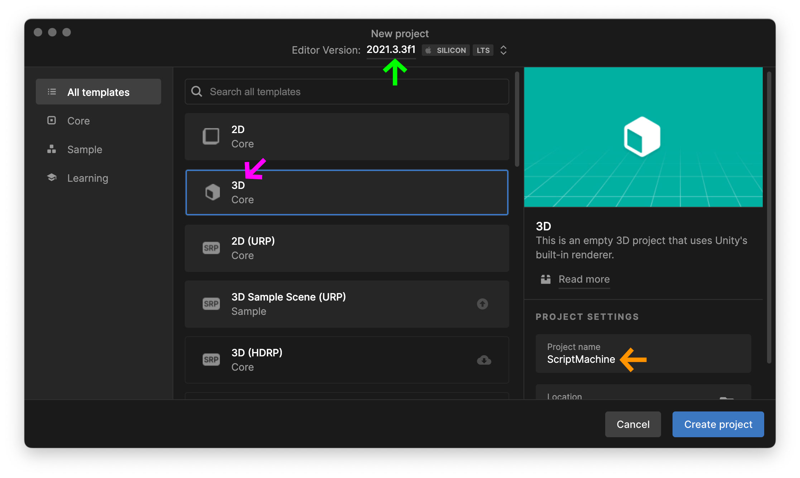

Now create a standard Cube in your scene via `Hierarchy` → (highlight:purple text:` + `) → `3D Object` → `Cube`. Note that I've rotated it (highlight:yellow text:`45°`) on the (highlight:yellow text:`X`) and (highlight:yellow text:`Y`) axes. You can't see it here, but I have also brought the main (highlight:brown text:`Camera`) closer on the `Z` axis by changing its `Z` value to `-3`.

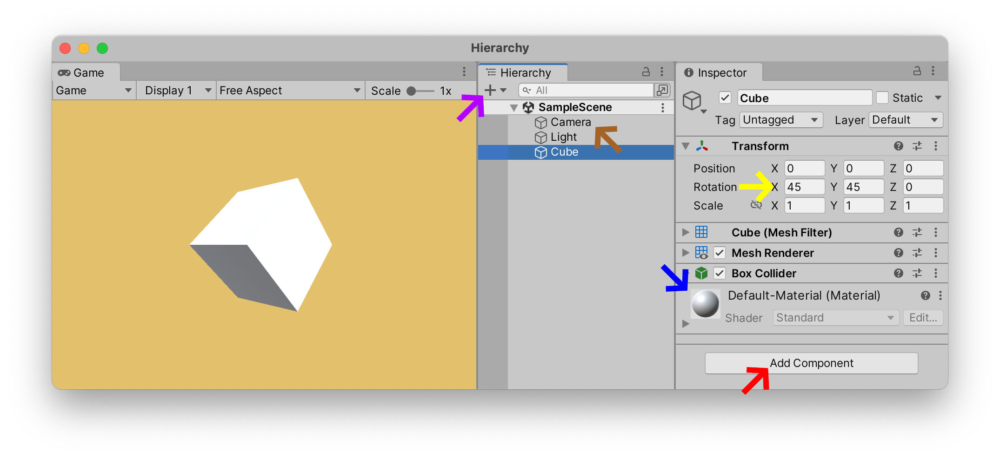

For now, I am leaving the `Cube`'s (highlight:blue text:`Default-Material`): we will see how to change this material in a moment, through scripts.

### Embeded Script
If we press the `Play` button now, our `Cube` won't do anything. Let's change that. Let's add a `Script` and see how quickly we can get it to do something. Select the `Cube`. Press (highlight:red text:`Add Component`) and find the `Visual Scripts` → `Script Machine` component inside of that list. Select it in order to add it to your `Cube`.

This `Script Machine` is not the script itself, but instead the `Machine` that executes the `Script`'s instructions. Think of the `Script Machine` as the brain: it still needs a `Script` to tell it how to think and what to do. The fastest way to add an actual `Script` to this `Script Machine` is to select the `Source`: `Embed` option. An `Embedded` script means that a script will be applied directly to our object, and in fact, specifically to this object alone. Click on `Edit Graph`, which should open up your first `Script Graph` with two `Script Nodes` already added for you by default: `On Update` and `On Start`. This `Script Graph` is the visual diagram of how your object will behave.


As you can see from the above illustration, with (highlight:brown text:`Embeded`) scripts you can pretty quickly get your `Game Objects` to do all sorts of things in Unity. You can even drag the components you wish to control directly into the window and Unity will give you a list of all the actions, options, and values that can be manipulated on that component. Here I have dragged the `Transform` component, and Unity gave me the list of all the various ways in which I can `Rotate(...)` my `Cube` object. I opted to `Rotate` using the (highlight:mud text:`Eulers`) notation, meaning that I was able to define the direction and speed of my rotation in (highlight:mud text:`X`), (highlight:mud text:`Y`), and (highlight:mud text:`Z`) degrees. I also chose the (highlight:sky text:`Relative To`) option, meaning that I determined if the rotation took place in relation to the (highlight:sky text:`World`), or in relation to this object's current orientation (i.e. (highlight:sky text:`Self`)).

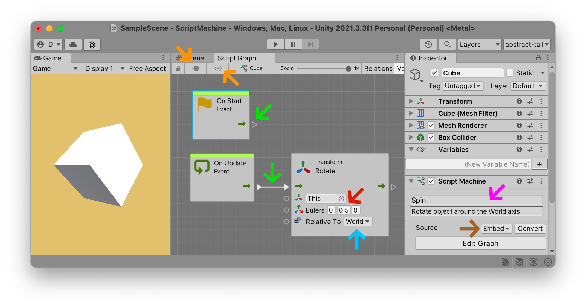

Note that in order to keep my interface clean, I hid the (highlight:orange text:`Variables`) and (highlight:orange text:`Inspector`) windows inside the graph. You can always reactivate them with the two buttons in the top left of the  (highlight:orange text:`Script Graph`) tab. I also gave it a (highlight:fuchsia text:`name`) and a short (highlight:fuchsia text:`description`) so that I can remember later on in my project what I was trying to do.

### Flow
As you can see in the above illustration, there is a (highlight:green text:`connection flowing out`) of the green arrow output of `On Update` and into the (highlight:green text:`green arrow input`) of the `Transform Rotate` node. There is also a similar green arrow ready to (highlight:green text:`flow out`) of the `On Start` node, but nothing is connected to it. In fact you can entirely remove this node if you are not going to connect its *flow* into anything.

Each time you see a green arrow like this, it represents the "flow" of the `Script Graph`. There can be many different flows. These "flows" are the actual moments when something gets done. "Flow" means "do something now" or "do something when", depending on the context. In other nodal programming environments like [Max](https://cycling74.com/products/max) or [PureData](http://puredata.info) this flow arrow is called a "bang", i.e. "do something now" is triggered as if someone just pulled the trigger of a gun. If you press the `Play` button, Unity will (approximately) animate for you the constant nature of this flow: the `On Update` will flow out at approximately 60 frames per second, whereas the `On Start` flow will only activate once, when the `Script Machine` of this object appears in the `Scene` for the very first time, i.e. at the "starting moment" whenever it is that this object comes-into-being.

### Event
You might have noticed that our two default *nodes* are called `Events`. These events can be "when the game starts", "when someone clicks on this object", "when the player pushes down on a button or a key", "when this object collides with another object", and so on. One of the major differences between Unity and creative coding environments such as (tutorial:processing link:stratifications) is that in Unity you will often develop your game by *reacting* to events, as opposed to *generating* them. In [Processing](https://processing.org) you build your visual world up from scratch, starting with the most basic shapes, and then multiply those shapes by a thousand, ten thousand, or whatever evolutive process you want to explore. In Unity, you tend to build your world, and then wait for events that you can then react to.

Let's add two events to our `Cube` in order to illustrate this concept.

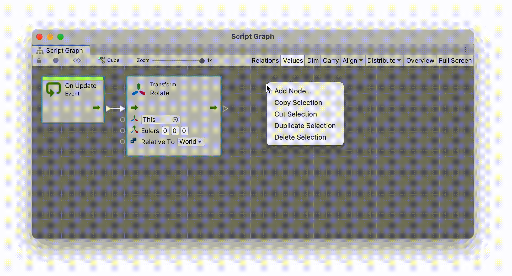

In the above example I have selected the `Cube`'s `Script Graph`, right-clicked on the background to open what is called the `Fuzzy Finder` and selected from this list the `On Mouse Down` and `On Mouse Up` events. Each of these nodes will send out an impulse from their green outputs when the player presses *down* and presses *up* on our `Cube`.

Let's change materials to make this interaction visible.

Create a new folder named (highlight:purple text:`Materials`) inside your `Project` folder. Note the capital `M` and the plural `s` and the end of this folder. This is a Unity naming convention that will help you keep your `Project` folder organised.

Inside your (highlight:purple text:`Materials`) folder, (highlight:red text:`create`) two new `Materials` with two colors. I've called my colors (highlight:yellow text:`Hot`) and (highlight:yellow text:`Cold`), but you can call them whatever you want and give them (highlight:green text:`whatever color`) you want. These two colors will be used whenever we click *down* or *up* on the `Cube` with our mouse. 

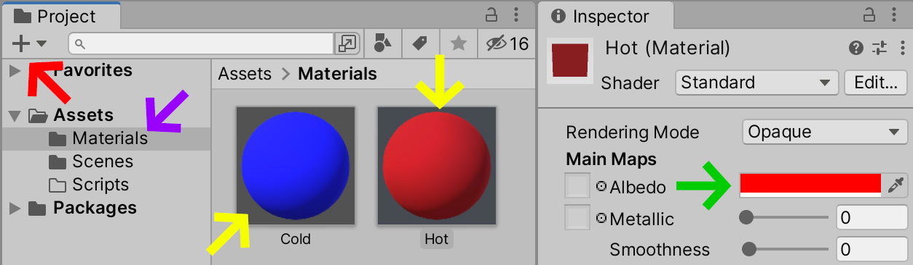

As you can see in the example below, the component inside of our `Cube` that we want to change is called the `Mesh Renderer`. Currently the `Cube`'s `Mesh Renderer` has the `Default-Material` listed as its first and only `Material`. This value can change while the scene plays. We can modify it via our `Script Graph` whenever a mouse `Event` takes place interactively.


As we did before with the `Transform` component, this time drag the `Mesh Renderer` from your `Cube`'s `Inspector` directly into your `Script Graph`. You will be given a list of possible choices. The one you are looking for is `Set Material`. Duplicate this `Material` change node and connect each one up to their respective `On Mouse Down` and `On Mouse Up` events. Each of these nodes should temporarily turn orange, as we have not told it yet which `Material` to use. So drag your new `Materials` from your `Project` window onto each of the nodes: in my example I have set the `Material` to `Hot` when clicking *down* on the mouse, and to `Cold` when clicking up.

### ~~Embeded~~ vs Graph
`Embedded Script Graphs` are good for quickly prototyping ideas but they are fragile things: they only exist on this single `Game Object` and therefore if you delete this `Cube` from the scene, your `Script Graph` will be deleted with it. We should really save it's graph as an independent entity in the `Project` window.

To do this, select your `Cube`'s `Script Machine` component in the `Inspector`, and press the (highlight:fuchsia text:`Convert`) button. This will convert your graph into a `Script Graph` that you can independently save into your `Project` folder. I have created a (highlight:blue text:`Scripts`) folder and saved my converted script into this folder with the name (highlight:orange text:`ColorChange`).

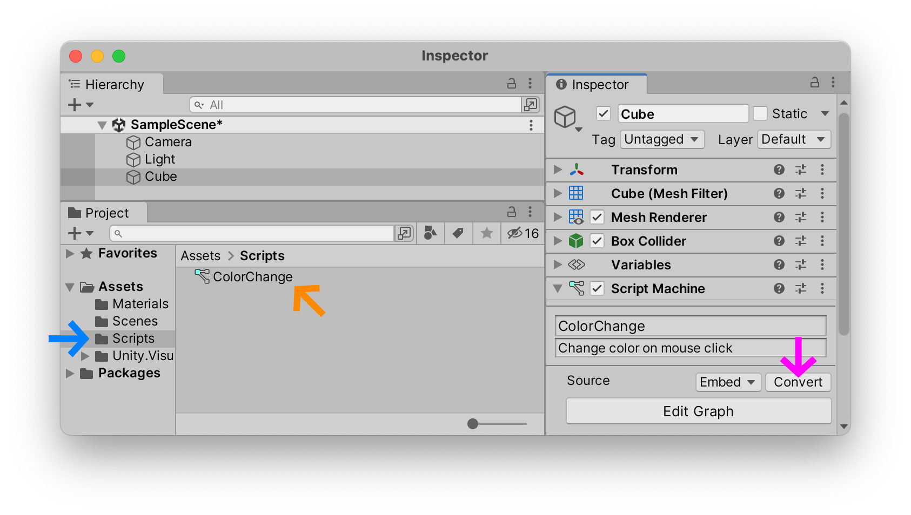

Now that my script is independent from my `Cube`, I can create a second `Game Object` in my `Scene` `Hierarchy` and use this same `Script Graph` on it as well. Here I have created a new (highlight:green text:`Capsule`) in the `Hierarchy` and added a (highlight:brown text:`Script Machine`) component to it. All that remains is to (highlight:mud text:`drag`) my converted  (highlight:mud text:`ColorChange`) script into this component. Note that my (highlight:purple text:`Source`) is no longer listed at `Embeded`, but is now listed as (highlight:purple text:`Graph`). 

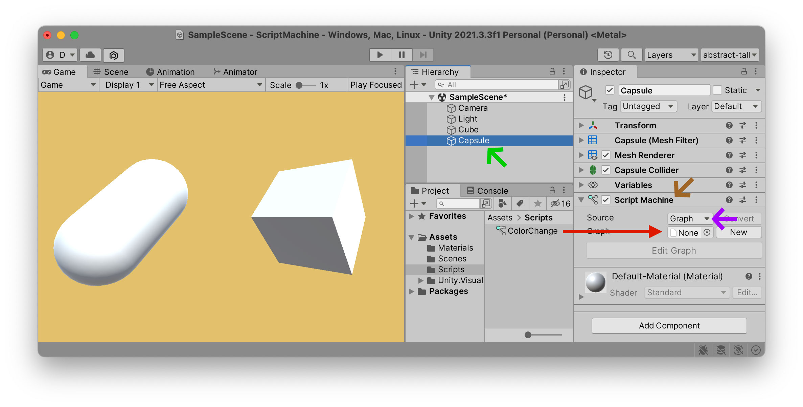

Now when I press `Play` the script applies to both `Game Objects`, but independently, thanks to the `This` keyword which allows each object to understand that the `Material` changes only apply to the object iteself, independently of the other.

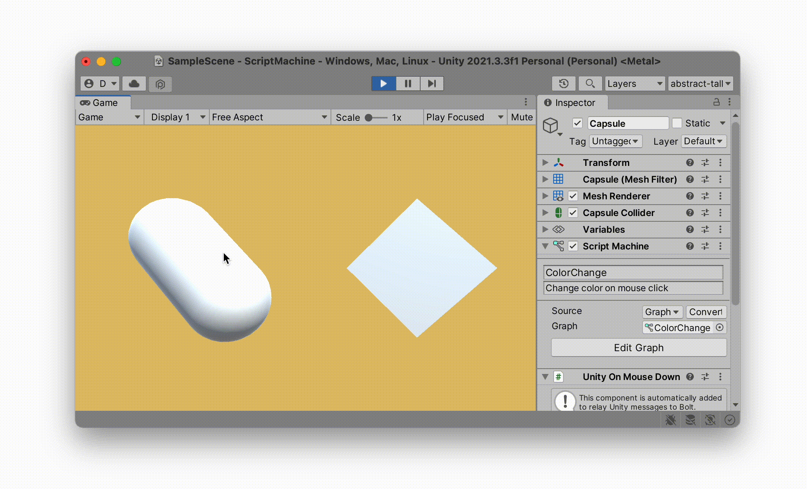