### Gaze
L'une des formes d'interaction les plus évidentes avec lesquelles nous pouvons concevoir nos expériences VR est le regard : nous portons déjà un casque, ce qui signifie qu'il y a par défaut un regard implicite. Compte tenu de l'offre actuelle d'expériences VR, je dirais que le regard est un mode d'interaction sous-développé. Ce didacticiel explorera donc la détection de l'endroit où nous regardons - au moins dans un sens général - dans notre champ visuel immersif à 360°.

*Attention* : concevoir des interactions autour du regard de la joueuse peut être problématique. D'une part, il y a un large champ de vision et nos joueuses regardent potentiellement beaucoup de choses différentes à l'intérieur de ce champ de vision. Vous devez être intelligent lorsque vous concevez des interactions autour du regard. Pensez *grandes cibles*. Mais surtout, on ne regarde pas les choses de la même façon qu'on les touche, et fixer un objet des yeux pour l'activer est un geste inélégant, souvent physiquement inconfortable. Lorsque je dois fixer un objet pour l'activer, j'ai rapidement l'impression d'incarner Cameron Vale dans (wikipedia:Scanners language:fr) avec ma tête sur le point d'[exploser](https://www.youtube.com/watch?v=YI3NoBeNwfk).

(youtube: 7zKJQeYhhK0)

Malgré ces problèmes fondamentaux, la détection du regard d'un utilisateur est néanmoins un concept simple à comprendre et souvent un bon point de départ pour concevoir des interactions simples en réalité virtuelle sans s'enliser dans des configurations de contrôleur compliquées. Faites juste attention à ne pas [faire fondre](https://www.youtube.com/watch?v=Np10WlC9iDk) le cerveau de votre joueuse.

Au programme [Media Design Master](https://www.hesge.ch/head/en/programs-research/master-arts-media-design) à la [HEAD – Genève](https://www.hesge.ch/head/en) nous avons construit beaucoup de projets avec VR, AR, XR, et [quelques réalités qui restent encore à déterminer](https://www.youtube.com/watch?v=FVJqeu_HfSA). En 2021, mes collègues [Marion Bareil](https://tourmaline-studio.com/fr#about) et [Pierre Rossel](https://github.com/prossel/) ont développé une série de projets avec nos étudiant•e•s explorant comment vous pourriez interagir uniquement avec votre regard à l'intérieur d'un monde VR : cf. [Imaginer la ville de demain](https://www.hesge.ch/head/en/project/vr-workshop-imagining-city-tomorrow). Le projet suivant d'Alejandra Oros montre une telle interaction utilisant cette modalité.

(vimeo: 568883212 width:500vw height:500vw)

Pour un cours récent que nous avons enseigné ensemble, Pierre Rossel a adapté cette approche de détection du regard en une série de scripts relativement simples et construits avec des scripts visuels : [VS Gaze Detector](https://github.com/prossel/VS-gaze-detector). Nous allons maintenant utiliser ces scripts pour ajouter des interactions de regard à Unity.

### New Project
Dans mon Unity Hub, j'ai créé un nouveau projet 3D nommé (orange: Gaze) mais vous pouvez appeler le vôtre comme vous voulez. J'utilise (cyan: Unity 2021.3); si vous utilisez une autre version de Unity, ces instructions devraient toujours fonctionner correctement tant que vous utilisez au moins `Unity 2021.1` ou une version ultérieure.

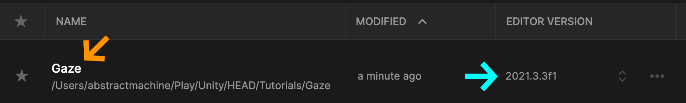

### Nouveaux matériaux
Tout comme pour le tutoriel précédent, j'ai créé un nouveau dossier (purple:`Materials`) et ajouté ((red:  + )) trois nouveaux (yellow: matériaux) à ce dossier. J'ai donné à mes matériaux trois (green: couleurs) distinctes et les ai nommées (yellow: Hot), (yellow: Cold) et (yellow: Default). J'ai également créé un dossier vide nommé (fuchsia: Scripts).

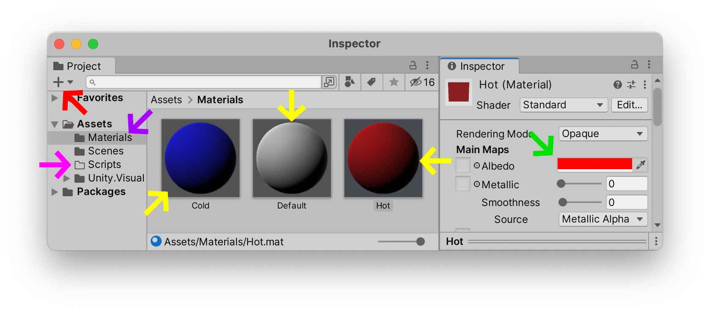

Créons un nouveau ((red:  + )) (sky: Cube) et (blue: appliquons) le matériau (yellow: Default).

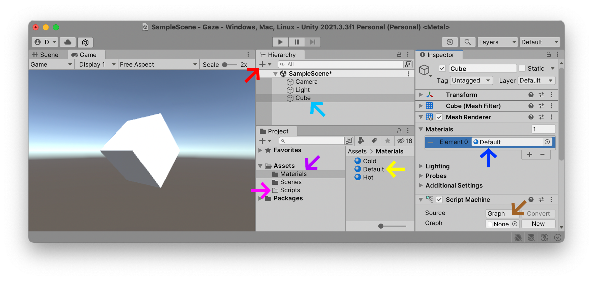

Ajoutez un (brown: Script Machine) à votre (sky: Cube) configuré sur l'option `Graph`, et le champ du `Graph` qui indique `None` (c'est-à-dire vide). Plus tard dans ce tutoriel, ce `Script Machine` se déclenchera à chaque fois que la joueuse regardera le cube - mais pour l'instant, le contenu de ce script restera vide.

Une fois que ce (sky: Cube) est prêt avec un (brown: Script Machine) vide, nous pouvons importer le package `Gaze Detection` pour animer l'objet.

### Import Unity Package
Rendez-vous sur la page [VS Gaze Detector](https://github.com/prossel/VS-gaze-detector) de Pierre Rossel sur Github, et cliquez sur [Latest Release](https://github.com/prossel/VS-gaze-detector/releases/tag/v1.3.0). Sur cette page, trouvez le (mud: VSGazeDetector.unitypackage) et téléchargez le fichier sur votre ordinateur.

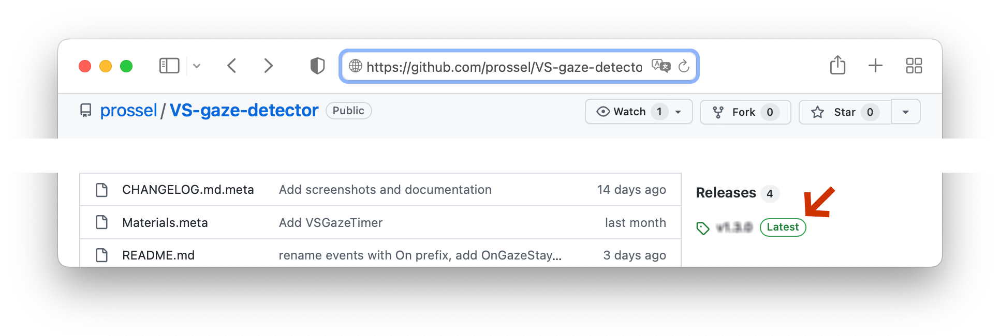

Une fois que vous avez téléchargé ce fichier, vous devriez voir un fichier (mud: VSGazeDetector.unitypackage) prêt à être installé. Tout d'abord, assurez-vous que votre projet Unity est déjà ouvert, puis double-cliquez sur ce package pour lancer le processus d'installation. Vous devriez voir une fenêtre s'ouvrir dans Unity, avec une liste de tous les fichiers qui seront installés dans votre projet. Vous pouvez (green: Importer) tous ces fichiers, y compris une scène de didacticiel très pratique que Pierre a préparée pour vous afin de démontrer son outil. Si vous souhaitez une installation plus minimale, vous pouvez sélectionner uniquement les (pink: scripts requis), comme je l'ai fait dans l'illustration ci-dessous. L'une ou l'autre méthode fonctionnera pour les étapes suivantes.

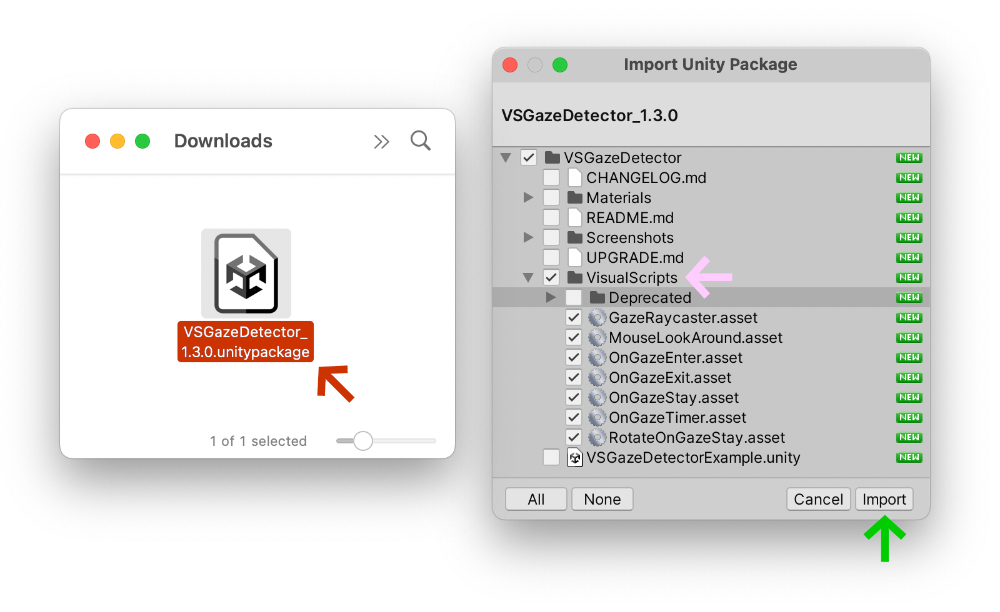

Lorsque Unity a fini d'importer ces scripts, vous devriez maintenant les voir dans votre dossier (orange: Project).

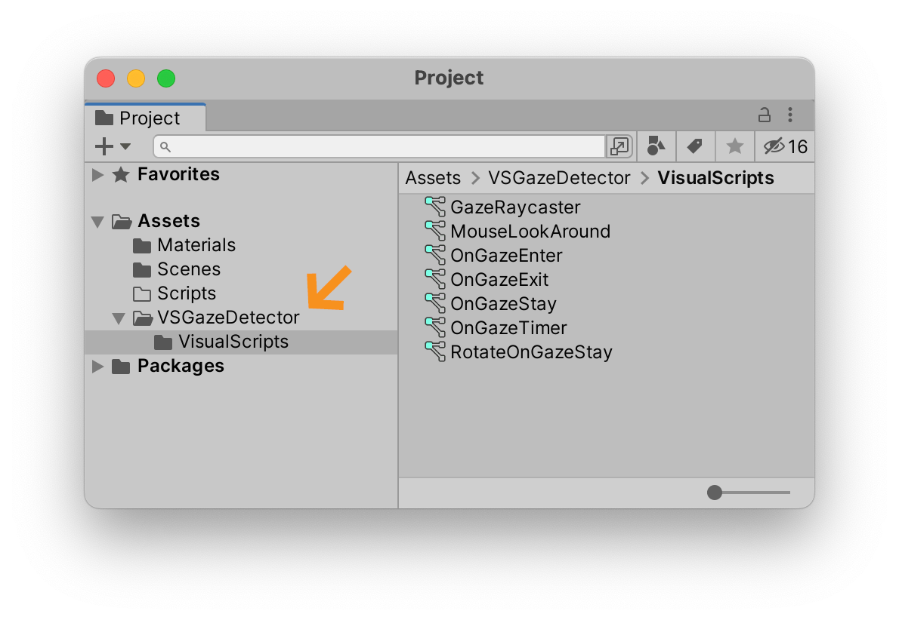

Nous sommes maintenant prêt•e•s à commencer à utiliser ces scripts dans notre projet.

### Caméra Raycast
Dans un moteur de jeu 3D comme Unity, un (fuchsia: Ray) est une ligne droite invisible qui jaillit dans l'espace 3D. La principale raison pour laquelle cette ligne existe est pour détecter s'il y a des objets qui entrent en collision avec elle. Les collisions peuvent avoir lieu n'importe où le long de ce chemin (fuchsia: Ray). Les raycasts peuvent donc être utilisés pour détecter si un monstre repère notre joueuse : par exemple, chaque fois que nous franchissons cette ligne invisible, le dragon géant se lèvera et commencera à tirer dans notre direction. Nous pouvons également attacher l'un de ces rayons invisibles au centre de notre (red: Camera) et détecter si un objet entre dans notre « regard ».

Dans l'illustration ci-dessous, vous pouvez voir plusieurs lignes blanches sortir de l'icône de la caméra. Ce cône pyramidal carré décrit ce qu'on appelle le (wikipedia:frustrum language:fr keyword:Tronc_(géométrie)) : il s'agit d'une représentation géométrique du champ de vision de la (red: Camera). Au centre de ce frustrum, nous pouvons voir une ligne blanche plus brillante que les autres. Il s'agit d'un (fuchsia: Ray) qui s'étend sur quelques unités 3D. Dans l'illustration ci-dessous, cette ligne traverse le cube devant lui.

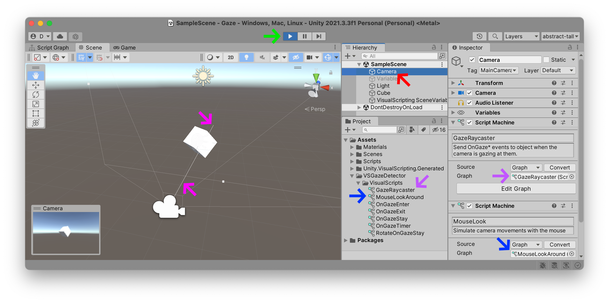

Le [VS Gaze Detector](https://github.com/prossel/VS-gaze-detector) de Pierre Rossel contient un tel objet Raycast que vous pouvez connecter à votre (red: Camera). Ouvrez le dossier `VisualScripts` de (orange: VSGazeDetector) et recherchez les scripts (purple: GazeRaycaster) et (blue: MouseLookAround). Faites glisser ces deux éléments sur votre (red: Camera) principale. Le script (blue: MouseLookAround) est facultatif, mais nous aidera à tester notre script en nous permettant de simuler des mouvements de caméra en utilisant uniquement notre souris.

Appuyez sur (green: Play) et vous devriez maintenant voir un aperçu dans la scène avec un (fuchsia: Ray) qui sort de votre (red: Camera) lorsque vous déplacez votre souris :

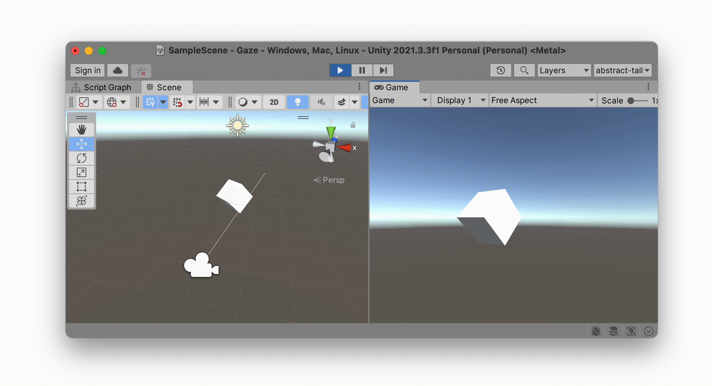

Jusqu'à présent, cela ne fait rien de significatif. Il n'y a actuellement aucune instruction dans notre cube pour décrire comment il doit se comporter chaque fois que ce (fuchsia: Ray) traverse l'objet. Ajoutons ce comportement maintenant.

### Script Graph
Voici une capture d'écran d'un nouveau (blueish: Script Graph) que j'ai ajouté au (pink: Cube). Notez que nous plaçons ce comportement sur le *cube* qui *reçoit* le regard, et non sur la `Camera` qui envoie la sonde (fuchsia: Ray). Cela nous permettra potentiellement d'ajouter de multiples comportements sur des objets de types différents, chacun pouvant interpréter à sa manière ce que signifie recevoir le regard de la joueuse.

Nous avons créé quatre nœuds dans ce graphique, en utilisant nos nouveaux événements que nous avons importés avec le package `VsGazeDetector` ci-dessus.
<<<<<<< HEAD
- L'événement (mud: OnGazeEnter) est déclenché chaque fois que le `Ray` entre en collision avec notre (pink: Cube). Chaque fois que cette interaction se produit, le (blueish: Script Graph) définit le `Material` du Cube sur le matériau `Cold` que nous avons créé plus tôt dans ce didacticiel. Comme vous pouvez voir dans l'illustration ci-dessous, cette interaction rend le cube bleu.
- L'événement (brown: OnGazeExit) est déclenché chaque fois que ce `Ray` sort en collision avec notre (pink: Cube). Cela change le `Material` de l'objet à `Default`.
- L'événement (yellow: OnGazeStay) est déclenché de manière répétitive tant que nous continuons à interagir avec notre (pink: Cube). Ce concept de `Stay` (*rester*) signifie "tant que ce rayon reste en interaction avec cet objet". Cette action `Stay` déclenche l'action `Rotation` et se répète constamment, pour chaque « *frame* », c'est-à-dire environ soixante fois par seconde tant que nous continuons à regarder l'objet.
- L'événement (sky: OnGazeTimer) est très pratique et se déclenche chaque fois que nous restons à regarder cet objet plus longtemps qu'un nombre défini de secondes. Ici, nous avons défini cette valeur (sky: Duration) sur (sky: 2) secondes. Lorsque cette action se déclenche, nous remplaçons le `Material` du (pink: Cube) par la couleur `Hot` créée plus tôt dans ce didacticiel. Dans l'illustration ci-dessous, le cube devient rouge chaque fois que la joueuse le regarde pendant plus de `2` secondes. Comme nous n'avons pas besoin de changer constamment cette couleur, nous avons laissé son option `Repeat` décochée.
=======
- L'événement (mud: OnGazeEnter) est déclenché chaque fois que le `Ray` entre en collision avec notre (pink: Cube). Chaque fois que cette interaction se produit, le (blueish: Script Graph) définit le `Material` du Cube sur le matériau `Cold` que nous avons créé plus tôt dans ce didacticiel. Comme vous pouvez voir dans l'illustration ci-dessous, cette interaction rend le cube bleu.
- L'événement (brown: OnGazeExit) est déclenché chaque fois que ce `Ray` sort en collision avec notre (pink: Cube). Cela change le `Material` de l'objet à `Default`.
- L'événement (yellow: OnGazeStay) est déclenché de manière répétitive tant que nous continuons à interagir avec notre (pink: Cube). Ce concept de `Stay` (*rester*) signifie "tant que ce rayon reste en interaction avec cet objet". Cette action `Stay` déclenche l'action `Rotation` et se répète constamment, pour chaque « *frame* », c'est-à-dire environ soixante fois par seconde tant que nous continuons à regarder l'objet.
- L'événement (sky: OnGazeTimer) est très pratique et se déclenche chaque fois que nous restons à regarder cet objet plus longtemps qu'un nombre défini de secondes. Ici, nous avons défini cette valeur (sky: Duration) sur (sky: 2) secondes. Lorsque cette action se déclenche, nous remplaçons le `Material` du (pink: Cube) par la couleur `Hot` créée plus tôt dans ce didacticiel. Dans l'illustration ci-dessous, le cube devient rouge chaque fois que la joueuse le regarde pendant plus de `2` secondes. Comme nous n'avons pas besoin de changer constamment cette couleur, nous avons laissé son option `Repeat` décochée.
>>>>>>> 36299d3

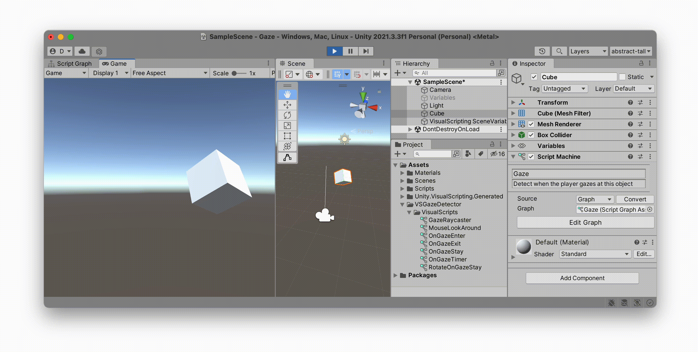

### XR Rig
Jusqu'à présent, nous simulions la détection du regard du joueur à l'aide de la souris. Le [VS Gaze Detector](https://github.com/prossel/VS-gaze-detector) contenait un script nommé (blue: MouseLookAround) que vous placez sur votre `Camera` pour simuler le fait de regarder autour de vous 360°. Mais ce que nous voulons vraiment, c'est pouvoir regarder tout autour tout en portant un casque VR. Convertissons donc notre interaction de projet basée sur la souris en une interaction de casque VR en activant le "mode de réalité virtuelle".

En suivant les instructions (tutorial:XR Plugin link:unity-vr/xr), ouvrez le menu `Edit` > `Project Settings`, trouvez la section (blue: XR Plugin Management) et sélectionnez (orange: Install XR Plugin Management).

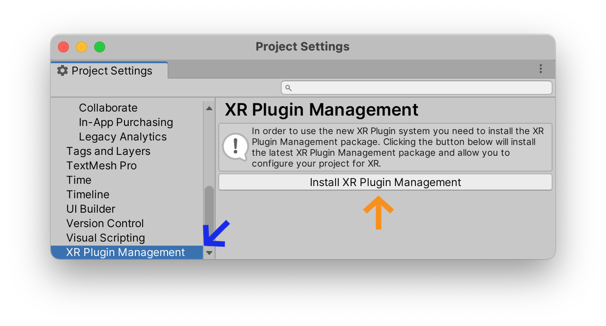

Si vous utilisez un casque Oculus, sélectionnez l'onglet (green: Android) (cf. icône du petit robot) dans cet outil et activez l'option (sky: Oculus).

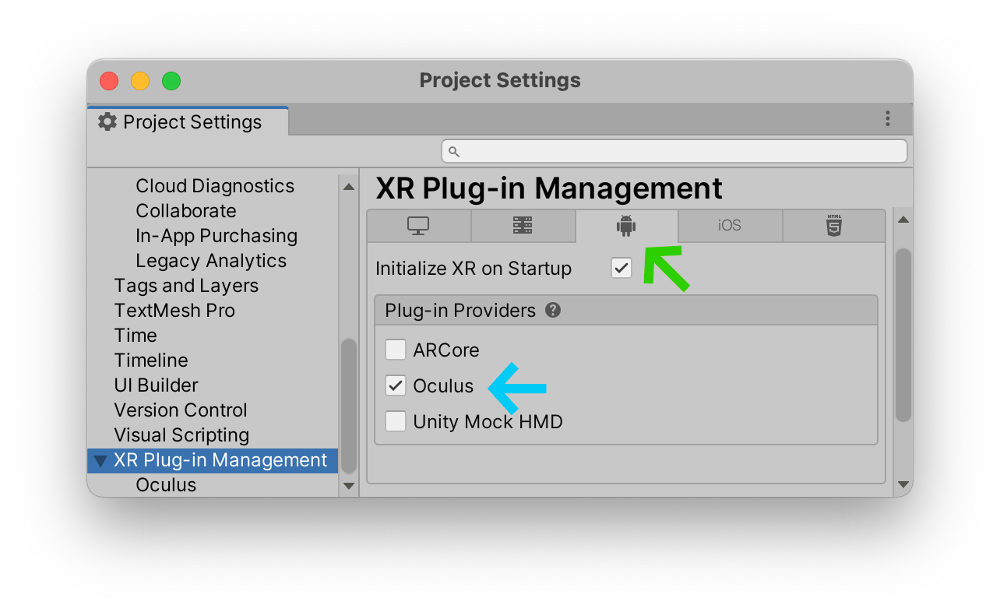

Nous pouvons maintenant *convertir* la caméra "principale" du cyclope borgne par défaut en un « rig » compatible avec un casque VR binoculaire : sélectionnez le bouton (fuchsia: +), choisissez (red: XR) > (red: Convert Main Camera to XR Rig) (c'est-à-dire « convertir la caméra principale en XR Rig »).

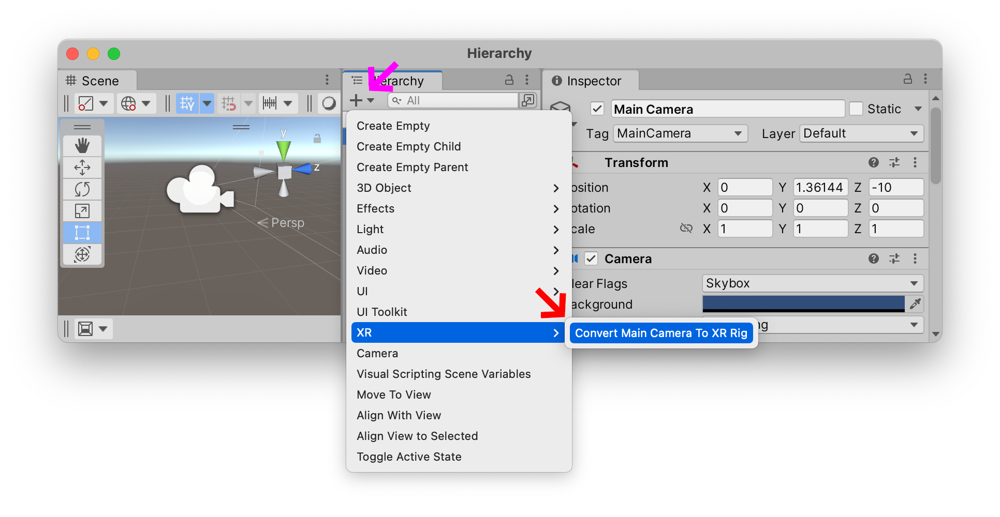

Vous pouvez maintenant télécharger votre projet sur votre casque VR et interagir avec le cube en le fixant avec le centre de votre regard.

Si vous avez converti votre `Camera` en un (red: XR Rig) à partir des étapes précédentes de ce didacticiel, tous vos scripts sur votre caméra devraient être restés intacts. Si c'est le cas, appuyez sur le bouton (brown: Play) : vous devriez toujours pouvoir simuler le déplacement autour de votre casque à l'aide de la souris ou du trackpad de votre ordinateur.

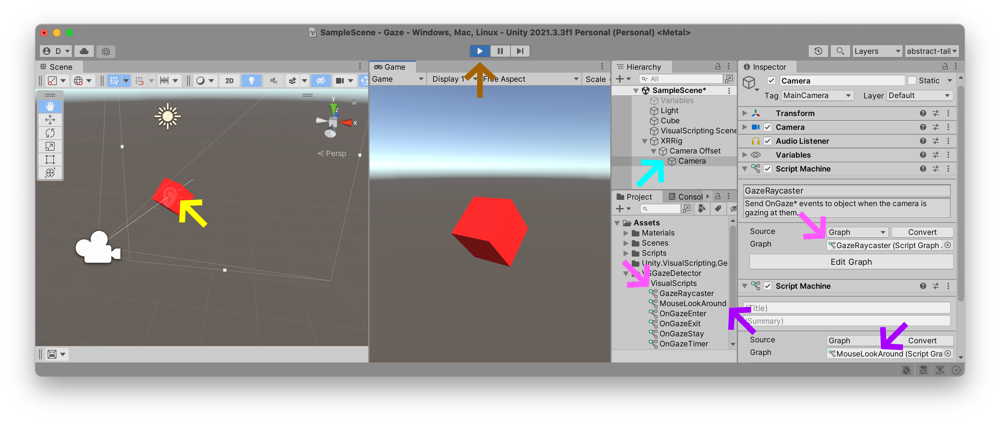

<<<<<<< HEAD
Si, pour une raison quelconque, vous avez commencé à zéro avec une scène vide, ouvrez la nouvelle (cyan: Camera) et chercher son (cyan: XR Rig), puis faites glisser les scripts (pink: GazeRaycaster) et (purple: MouseLookAround) dans l'`Inspector` de cette (cyan: Camera).
=======
Si, pour une raison quelconque, vous avez commencé à zéro avec une scène vide, ouvrez la nouvelle (cyan: Camera) et chercher son (cyan: XR Rig), puis faites glisser les scripts (pink: GazeRaycaster) et (purple: MouseLookAround) dans l'`Inspector` de cette (cyan: Camera).
>>>>>>> 36299d3
