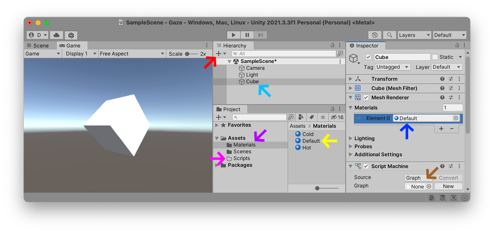
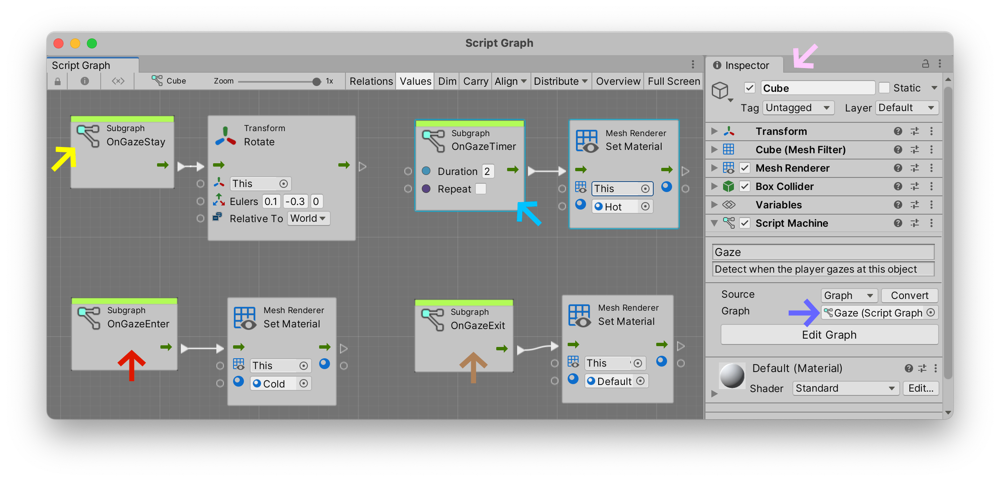
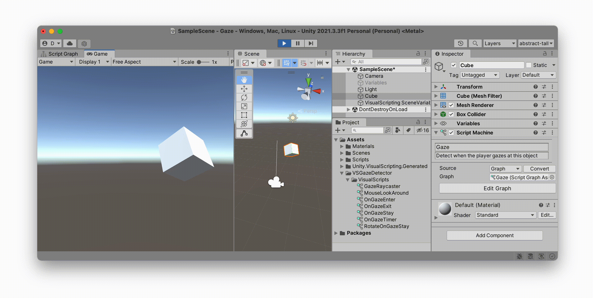
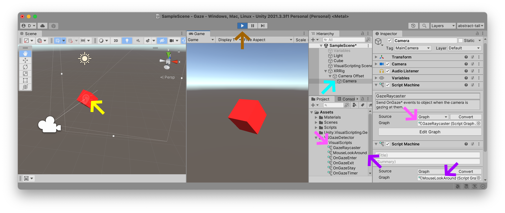

### Gaze
One of the most obvious forms of interaction we can design with in VR is the gaze: we are already wearing a headset, meaning that there is by default an implicit gaze. Given the current offering of VR experiences, I would argue that the gaze is an underdeveloped mode of interaction. This tutorial will therefore explore detecting where we are gazing — in a general sense at least — within our immersive 360° visual field.

*Warning*: designing interactions around the player's gaze is a mixed bag. For one, there is a wide field of view and our players are potentially looking at many different things inside of this field of view. You need to be smart when you are designing interactions around the gaze. Think *big targets*. But more importantly, we do not look at things the same way we touch things, and fixing your eyes on an object in order to activate it is an inelegant, often physically uncomfortable, gesture. When I have to stare at an object to activate it, it can quickly feel like I'm embodying Cameron Vale in (wikipedia:Scanners) with my head about to [explode](https://www.youtube.com/watch?v=YI3NoBeNwfk).

(youtube: 7zKJQeYhhK0)

Despite these fundamental problems, detecting a users’ gaze is nevertheless a simple concept to understand and often a good starting point for designing simple interactions in virtual reality without getting bogged down by complicated controller setups. Just be careful not to [melt](https://www.youtube.com/watch?v=Np10WlC9iDk) your player's brain.

At the [Media Design Master](https://www.hesge.ch/head/en/programs-research/master-arts-media-design) program at the [HEAD – Genève](https://www.hesge.ch/head/en) we have built a lot of projects with VR, AR, XR, and [whatever realities](https://www.youtube.com/watch?v=FVJqeu_HfSA) you want to add to that list. In 2021, my colleagues [Marion Bareil](https://tourmaline-studio.com/fr#about) and [Pierre Rossel](https://github.com/prossel/) developped a series of projects with our students exploring how you could interact solely with your gaze inside of a VR world: cf. [Imagining the City of Tomorrow](https://www.hesge.ch/head/en/project/vr-workshop-imagining-city-tomorrow). The following project by Alejandra Oros shows one such interaction using this modality.

(vimeo: 568883212 width:500vw height:500vw)

For a recent class we taught together, Pierre Rossel adapted this gaze-detection approach into a simple series of scripts built with visual scripting: [VS Gaze Detector](https://github.com/prossel/VS-gaze-detector). We will now use these scripts to add gaze interactions to Unity.

### New Project
In my Unity Hub, I've created a new 3D project named (highlight:orange text:`Gaze`) but you can call yours whatever you want. I'm using (highlight:cyan text:`Unity 2021.3`); if you are using another version of Unity, these instructions should still work fine as long as you are using at least `Unity 2021.1` or later.

### New Materials
Similar to the last tutorial, I've created a new (highlight:purple text:`Materials`) folder, and added ((highlight:red text:` + `)) three new (highlight:yellow text:`Materials`) to this folder. I have given my materials three distinct (highlight:green text:`colors`) and named them (highlight:yellow text:`Hot`), (highlight:yellow text:`Cold`), and (highlight:yellow text:`Default`). I have also created an empty (highlight:fuchsia text:`Scripts`) folder.

Let's create a new ((highlight:red text:` + `)) (highlight:sky text:`Cube`) and (highlight:blue text:`apply`) the (highlight:yellow text:`Default`) material to it.

Add an empty (highlight:brown text:`Script Machine`) to your (highlight:sky text:`Cube`) set to `Graph`. In the future, this `Script Machine` will detect whenever the player is looking at it — but for now its contents will remain empty. Once this (highlight:sky text:`Cube`) is ready with an empty (highlight:brown text:`Script Machine`) graph, we can import the `Gaze Detection` package to animate the object.

### Import Unity Package
Go to Pierre Rossel's [VS Gaze Detector](https://github.com/prossel/VS-gaze-detector) page on Github, and click on the [Latest Release](https://github.com/prossel/VS-gaze-detector/releases/tag/v1.3.0) button. On this page, find the (highlight:mud text:`VSGazeDetector.unitypackage`) and download the file onto your computer.

Once you have downloaded this file, you should see a (highlight:mud text:`VSGazeDetector.unitypackage`) file ready for installation. First, make sure your Unity project is already open, then double-click on this package to begin the installation process. You should see a window open up inside of Unity, with a list of all the files that will be installed into your project. You can (highlight:green text:`Import`) all of these files, including a handy tutorial scene that Pierre has prepared for you to demonstrate his tool. If you want a more minimal installation, you can select just the (highlight:pink text:`required scripts`), as I have done in the illustration below. Either method will work for the following steps.

When Unity has finished importing these scripts, you should now see them inside your (highlight:orange text:`Project`) folder.

We are now ready to start using these scripts in our project.

### Camera Raycast
In a 3D game engine like Unity, a (highlight:fuchsia text:`Ray`) is an invisible straight line that shoots out into the 3D space. The principle reason this line exists is to detect if there are any objects colliding with it. Collisions can take place anywhere along the path of this (highlight:fuchsia text:`Ray`). Raycasts can therefore be used to detect if a monster spots our player: for example, whenever we cross this invisible line the giant dragon will rise up and start shooting fire in our direction. We can also attach one of these invisible rays to the center of our (highlight:red text:`Camera`) and detect if an object enters into our "gaze".

In the illustration below, you can see several white lines expanding out from the camera. This square pyramidal cone describes what is called the (wikipedia:frustrum): this is a geometrical representation of the camera's field of view and expands outwards from the perspective of the (highlight:red text:`Camera`). At the center of this frustrum we can see a brighter single white (highlight:fuchsia text:`Ray`) expanding out several units, and in the illustration below is currently intersecting the cube in front of it.

Pierre Rossel's [VS Gaze Detector](https://github.com/prossel/VS-gaze-detector) contains just such a Raycast object that you can connect to your (highlight:red text:`Camera`). Open up the (highlight:orange text:`VSGazeDetector`)'s `VisualScripts` folder and look for the (highlight:purple text:`GazeRaycaster`) and (highlight:blue text:`MouseLookAround`) scripts. Drag both of these onto your (highlight:red text:`Main Camera`). The (highlight:blue text:`MouseLookAround`) script is optional, but will help us to test our script by allowing you to simulate camera movements using just your mouse.

Press (highlight:green text:`Play`) and you should now see a preview in the scene view of a (highlight:fuchsia text:`Ray`) shooting out of your camera as you move your mouse around:

So far this doesn't do anything significant. There are currently no instructions in our cube to describe how it should behave whenever this (highlight:fuchsia text:`Ray`) intersects. Let's add that behavior now.

### Script Graph
Here is a screenshot of a new (highlight:blueish text:`Script Graph`) that I added to the (highlight:pink text:`Cube`). Note that we are placing this behavior on the *cube* that *receives* the gaze, and not on the `Camera` that sends out the (highlight:fuchsia text:`Ray`) probe. This will potentially allow us to add multiple behaviors on objects of differing ilk, each being able to intepret in their own way what it means to receive the player's gaze.

We have created four nodes in this graph, using our new events that we imported with the `VsGazeDetector` package above.
- The (highlight:mud text:`OnGazeEnter`) event is fired whenever the `Ray` enters into collision with our (highlight:pink text:`Cube`). Whenever this interaction happens, the (highlight:blueish text:`Script Graph`) sets the Cube's `Material` to the `Cold` material which we created earlier in this tutorial. As you can see in the illustration below, this interaction turns the cube blue. 
- The (highlight:brown text:`OnGazeExit`) event is fired whenever this `Ray` exits collision with our (highlight:pink text:`Cube`). This changes the object's `Material` back to `Default`.
- The (highlight:yellow text:`OnGazeStay`) event is fired repetitively as long as we remain interacting with our (highlight:pink text:`Cube`). This concept of "stay" means "as long as this ray stays interacting with this object". This `Stay` action fires the `Rotation` action and is repeated constantly, for each frame, approximately sixty times per second as long as we continue to gaze at the object.
- The (highlight:sky text:`OnGazeTimer`) event is very handy and fires whenever we remain gazing at this object longer than a definable number of seconds. Here we have set this (highlight:sky text:`Delay`) value to (highlight:sky text:`2`) seconds. When this action fires, we change the (highlight:pink text:`Cube`)'s `Material` to the `Hot` color created earlier in this tutorial. In the illustration below, the cube turns red whenever the player stares at it for over `2` seconds. Since we do not need to constantly change this color, we have left its `Repeat` option unchecked.

### XR Rig
Up until now, we have been simulating detecting the player's gaze using the mouse. The [VS Gaze Detector](https://github.com/prossel/VS-gaze-detector) contained a script named (highlight:blue text:`MouseLookAround`) that you place on your `Camera` to simulate looking around in 360°. But what we really want is to be able to look all around while wearing a VR headset. So let's convert our mouse-based project interaction into a VR headset interaction by activating the "virtual reality mode".

Following the (tutorial:XR Plugin link:unity-vr/xr) instructions, open the menu `Edit` > `Project Settings`, find the (highlight:blue text:`XR Plugin Management`) section and select (highlight:orange text:`Install XR Plugin Management`).

If you are using an Oculus headset, select the (highlight:green text:`Android`) (cf. little robot icon) tab inside this tool and activate the (highlight:sky text:`Oculus`) option.

We can now *convert* the default one-eyed-cyclops `Main` camera to a binocular VR-headset compatible "rig": select the (highlight:fuchsia text:`+`) button, choose (highlight:red text:`XR`) > (highlight:red text:`Convert Main Camera to XR Rig`).

If you converted your `Camera` to an (highlight:red text:`XR Rig`) starting from the previous steps of this tutorial, all of your scripts on your camera should have remained intact. If this is the case, press the (highlight:brown text:`Play`) button: you should still be able to simulate moving around your headset using the mouse or trackpad of your computer.

If for whatever reason you started from scratch with an empty scene, open up the new (highlight:cyan text:`Camera`) and find its (highlight:cyan text:`XR Rig`), then just drag the (highlight:pink text:`GazeRaycaster`) and (highlight:purple text:`MouseLookAround`) scripts onto your new (highlight:cyan text:`Camera`).