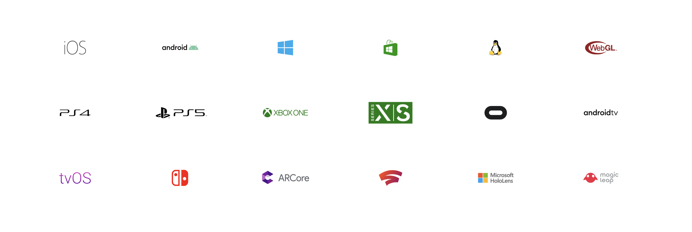

This tutorial for building a Unity + Oculus project from scratch was created for the [Master Media Media](https://www.hesge.ch/head/en/programs-research/master-arts-media-design), HEAD – Genève.

- [Introduction](#Game-Engine)
- [Examples](#Examples)
- [Installation](00_installation)
- [Bonjour Editor](02_hello-editor)
- [Bonjour XR](03_hello-xr)
- [Bonjour World](04_hello-world)

This tutorial is available on both on the [abstractmachine website tutorials](https://abstractmachine.net/tutorials) and the [abstractmachine GitHub repository](https://github.com/abstractmachine/head-media-design-oculus).

### Game Engine

[Unity](https://unity.com/) is a "game engine", used for making 2D, 3D, augmented reality, and virtual reality games — as well as interactive experiences in general. Its closest competitors are [Unreal Engine](https://www.unrealengine.com/en-US/), and the more modest open-source project [Godot](https://godotengine.org).

Game engines are tools and/or collections of code that have been designed to make it easier to make a game than to code it on your own from scratch. Game engines have already solved all the technical basics necessary for importing and manipulating images, 3D models, animations, rigs, textures, materials, sounds, and other assets that make up your game. Game engines also solve the problem of how to develop the behavior and logic of the game, often by implementing various code-based and visual-based scripting solutions for the interactive behavior and storytelling aspects of a game. They also make it easier to prepare your game for complex world distributing your games via all the various App Stores.

While a game engine requires you to learn the engine itself, it shields you from much of the hassle of learning development on all the myriad platforms where you would like to install your game. Here, for example, are some of the platforms where you can deploy/distribute a game made with Unity:

As you can see, the list is long and probably inclused some platforms you've never heard of. So the idea is that instead of having to learn each and every one of these platforms, all you need to make your game is to learn Unity and the tool will take care of the rest.

### Get Started
Below I have listed some examples. If you want to jump directly into working with Unity and VR, you can skip this section and move directly to (tutorial:installing Unity link:unity-vr/installation).

### Examples

The list of games made with Unity is almost infinite. Here are a few Unity showreels of games made with the tool, as well as the trailers for a few of the more famous games made with this tool.

- [Unity GDC 2021 Showcase](https://www.youtube.com/watch?v=na7EMenl2lY)
- [Unity AR & VR Games Showreel 2019](https://www.youtube.com/watch?v=zNMlglRyRSo)
- [Unity GDC 2016 Showreel](https://www.youtube.com/watch?v=8lWpnvNxs8k)
- [Beat Saber](https://www.youtube.com/watch?v=vL39Sg2AqWg)
- [Superhot](https://www.youtube.com/watch?v=A1jothqmqHw)
- [Return of the Obra Dinn](https://www.youtube.com/watch?v=ILolesm8kFY)
- [Firewatch](https://www.youtube.com/watch?v=HdUYYnfRdl8)
- [Monument Valley](https://www.youtube.com/watch?v=tW2KUxyq8Vg)
- [Inside](https://www.youtube.com/watch?v=op4G1--kb-g)
- [Cuphead](https://www.youtube.com/watch?v=NN-9SQXoi50)
- [Far: Lone Sails](https://www.youtube.com/watch?v=_QiC8pNfYl4)
- [Sayonara Wild Hearts](https://www.youtube.com/watch?v=F-RyxYcxSQ4)
- [Kids](https://www.youtube.com/watch?v=GAyvZ22AxNw)
- [Night In The Woods](https://www.youtube.com/watch?v=Aj_rrFIWpnI)
- [Donut County](https://www.youtube.com/watch?v=NWt1GPkfzkM)
- [Reigns](https://www.youtube.com/watch?v=lcOYlTbl-as)
- [Untitled Goose Game](https://www.youtube.com/watch?v=9LL2AtHo1gk)

### Virtual Reality
Virtual reality as a concept is an old dream, and like most of the other contempory computer interfaces we use today, Ivan Sutherland built a prototype of it in the 1960s, entitled [The Sword of Damocles](https://en.wikipedia.org/wiki/The_Sword_of_Damocles_(virtual_reality)).

(youtube: 43mA_ypfwKg)

There have been many iterations in between The Sword of Damocles and the Oculus Quest, with an important stop in the 1980s and [VPL Research](https://en.wikipedia.org/wiki/VPL_Research), as seen here via the 1992 oddity [Lawnmower Man](https://en.wikipedia.org/wiki/The_Lawnmower_Man_(film)) where you will also see their other famous invention, the "data glove":

(youtube: zTrgHXNAs24)

We should also cite Char Davis' 1995 installation/experience [Osmose](http://www.medienkunstnetz.de/works/osmose/) which was the first immersive experience that gave us a fuller sense of what virtual reality could be as an fully-integrated, functioning poetic experience:

(youtube: 54O4VP3tCoY)

But the artist that has truly shown us the way of virtual reality (both with and without headsets), as well as augmented reality, and a whole bunch of other realities that still have yet to be fully understood is [Jeffrey Shaw](https://en.wikipedia.org/wiki/Jeffrey_Shaw). If ever there was a successor to the throne of Ivan Sutherland, it would be Jeffrey Shaw. Do yourself a favor and learn everything you can about Jeffrey Shaw and his work:

(vimeo: https://vimeo.com/442537219)

Since these early experiments, there have been many headsets, many failures, and many iterations of fully immersive virtual reality. The most famous, and yet brilliant, failure to making a virtual reality headset was [Gunpei Yokoi](https://en.wikipedia.org/wiki/Gunpei_Yokoi)'s [Virtual Boy](https://en.wikipedia.org/wiki/Virtual_Boy) system:

(youtube: Jjz4bls_gPs)

### Oculus
Around 2010, [a duct-tape demo](https://arstechnica.com/gaming/2012/09/virtual-realitys-time-to-shine-hands-on-with-the-oculus-rift/) named the "Oculus Rift" started making the rounds that integrated a lot of these earlier ideas into a smaller, potentially commercializable package.

(youtube: uzCwczY1jTM)

Long story short, Facebook quickly bought up Oculus and their prototype, the founder Palmer Luckey transformed himself into both [a barefoot VR dork meme](https://knowyourmeme.com/memes/times-virtual-reality-magazine-cover) as well as a [pro-Trump troll factory financeer](https://www.theverge.com/2016/9/23/13025422/palmer-luckey-oculus-founder-funding-donald-trump-trolls) — oh yeah and [Mark Zuckerberg high-fived the avatar of his colleague Rachel Franklin](https://www.theverge.com/2017/10/9/16450346/zuckerberg-facebook-spaces-puerto-rico-virtual-reality-hurricane) inside of a live virtual reality feed of Puerto Rica and the distaster left behind by Hurricane Maria. Several thousand people died in that disaster, and the idea was that you could better empathize with them if somehow you could just insert your head into their suffering. Good times.

At the writing of this tutorial, `Facebook` has recently changed the name of their entire company to `Meta`, accompagnied by a cringeworthy video explaining their vision of the future as passing through the 'Metaverse'.

(youtube: gElfIo6uw4g)

#### Untitled Goose Game
(youtube: 9LL2AtHo1gk)

#### World of Yoho
(youtube: TMwueafxS6Y)

#### Oniri Islands
(youtube: VsC9u8bVpN0)

### Oculus Quest
This tutorial uses the [Oculus Quest](https://www.oculus.com/quest-2/) 1 & 2 headsets as our platform for exploring virtual reality, and Unity 2021.2 for building the interactive world inside these headsets. While the Oculus Quest is not the be-all and end-all headset of virtual reality — we are still waiting for someone to solve the myriad design and technological constraints of virtual reality — it does have the advantage of packaging all the basics of circa 2020 virtual reality into one entirely self-contained headset. With the Oculus Quest, you simply put the device on your head and it just works; making it an ideal device for public exhibitions of virtual reality.

(youtube: g1bq32kjOKo)

### Virtual Haiku & The City of Tomorrow
Starting during the 2020 confinement, my colleagues Marion Bareil and Pierre Rossel designed a series of courses ([Virtual Haiku](https://www.hesge.ch/head/en/project/master-media-design-virtual-haiku) & [The City of Tomorrow](https://www.hesge.ch/head/en/project/vr-workshop-imagining-city-tomorrow)) around virtual reality headsets using the players' gaze as the primary mode of interaction. Here are a few projects from that course:

(vimeo: 465320477 width:500vw height:500vw)

(vimeo: 465315601 width:500vw height:500vw)

(vimeo: 465314621 width:500vw height:500vw)

(vimeo: 568886317 width:500vw height:500vw)

(vimeo: 568883212 width:500vw height:500vw)

(vimeo: 568885645 width:500vw height:500vw)

(vimeo: 568885456 width:500vw height:500vw)

(vimeo: 568884516 width:500vw height:500vw)

(vimeo: 465320377 width:500vw height:500vw)

(vimeo: 465320217 width:500vw height:500vw)

(vimeo: 465320316 width:500vw height:500vw)

And here are a few other projects from our [Master Media Design](https://www.hesge.ch/head/en/programs-research/master-arts-media-design) that showcase the use of virtual reality headsets:

(vimeo: 210307366)
